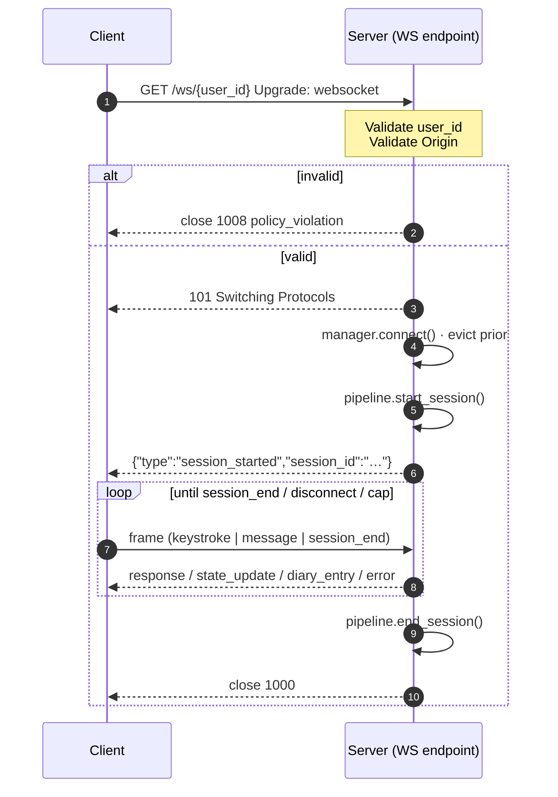

# WebSocket API

Every connected client gets a persistent WebSocket that buffers keystroke
events, processes completed messages through the full I³ pipeline, and
streams back responses, live state updates, and diary entries.

!!! warning "Origin allow-list is mandatory"
    CORS **does not** protect WebSockets. The server therefore checks the
    `Origin` header against an allow-list inside the handler. See
    [Security controls](#security) and `server/websocket.py`.

## Endpoint { #endpoint }

```
ws://{host}:{port}/ws/{user_id}
```

| Parameter | Type | Pattern | Notes |
|:----------|:-----|:--------|:------|
| `user_id` | `str` | `^[a-zA-Z0-9_-]{1,64}$` | Anchored regex; `/`, `.`, whitespace rejected |

Invalid ids are rejected **before the WebSocket upgrade is accepted** —
the handshake never completes.

## Connection lifecycle { #lifecycle }



Any unexpected error closes with `1011 internal_error` and a server-side
log line — no internal details leak to the client.

## Hard security limits { #limits }

| Limit | Value | Enforced in |
|:------|:------|:------------|
| Max inbound frame                  | 64 KiB | `_recv_bounded` |
| Max message text                   | 8 KiB | on `message` handler |
| Max messages per session           | 1,000 | counter |
| Max session wall-clock             | 60 min | monotonic guard |
| Max keystroke buffer               | 2,000 events (oldest dropped) | |
| Max int field (client-supplied)    | 10⁹ | `_safe_int` |
| Max float field (client-supplied)  | 10¹⁵ | `_safe_float` — rejects NaN / inf |
| Rate limit                         | 600 msg / min / user | shared with REST |

Violating any limit closes the socket with `1008 policy_violation` or
`1009 message_too_big`. Frames are size-checked **before** JSON decoding.

## Frame contract { #frames }

### Client → server { #c2s }

All client frames are JSON objects with a required `"type"` field. Binary
frames are rejected.

#### `keystroke` { #c2s-keystroke }

Buffered for later aggregation on the next `message`.

```json
{
  "type": "keystroke",
  "timestamp": 1712534401.324,
  "key_type": "char",
  "inter_key_interval_ms": 142.5
}
```

| Field | Type | Validation |
|:------|:-----|:-----------|
| `timestamp`             | `float` | finite, bounded by 10¹⁵ |
| `key_type`              | `str`   | first 16 chars kept |
| `inter_key_interval_ms` | `float` | finite, `≥ 0`, bounded |

#### `message` { #c2s-message }

Run the full pipeline.

```json
{
  "type": "message",
  "text": "Can you explain how TCNs work?",
  "timestamp": 1712534402.900,
  "composition_time_ms": 7400,
  "edit_count": 2,
  "pause_before_send_ms": 850
}
```

| Field | Type | Validation |
|:------|:-----|:-----------|
| `text`                 | `str`   | non-empty after strip; max 8 KiB chars |
| `timestamp`            | `float` | finite; bounded |
| `composition_time_ms`  | `float` | `≥ 0`; finite |
| `edit_count`           | `int`   | `≥ 0`; bounded |
| `pause_before_send_ms` | `float` | `≥ 0`; finite |

#### `session_end` { #c2s-session-end }

Idempotent — duplicate `session_end` is ignored, not an error.

```json
{"type": "session_end"}
```

### Server → client { #s2c }

#### `session_started` { #s2c-started }

```json
{
  "type": "session_started",
  "session_id": "3b1b9d18-…",
  "user_id": "alice",
  "protocol_version": "1.0"
}
```

#### `response` { #s2c-response }

```json
{
  "type": "response",
  "text": "A TCN's receptive field grows geometrically…",
  "route": "local",
  "latency_ms": 148,
  "timestamp": 1712534403.312
}
```

#### `state_update` { #s2c-state }

Emitted once per `message`, after `response`.

```json
{
  "type": "state_update",
  "user_state_embedding_2d": [0.32, -0.18],
  "adaptation": {
    "cognitive_load": 0.74,
    "style_mirror": {"formality": 0.55, "verbosity": 0.63, "emotionality": 0.42, "directness": 0.58},
    "emotional_tone": 0.40,
    "accessibility": 0.20
  },
  "engagement_score": 0.81,
  "deviation_from_baseline": 1.12,
  "routing_confidence": 0.78,
  "messages_in_session": 3,
  "baseline_established": true
}
```

#### `diary_entry` { #s2c-diary }

Emitted when the pipeline commits a diary record.

```json
{
  "type": "diary_entry",
  "entry": {
    "entry_id": "018f…",
    "topics_tfidf": [["tcn", 0.42], ["receptive", 0.31]],
    "route": "local",
    "latency_ms": 148
  }
}
```

!!! note "No raw text in diary frames either"
    The `entry` object carries only topic keywords, metrics, and ids —
    never message text.

#### `error` { #s2c-error }

```json
{"type": "error", "code": 429, "detail": "rate_limited"}
```

`detail` is always from a small vocabulary: `rate_limited`,
`frame_too_large`, `invalid_json`, `policy_violation`.

## Close codes { #close-codes }

| Code | Meaning | Triggers |
|:----:|:--------|:---------|
| `1000` | Normal closure | `session_end`, graceful shutdown |
| `1001` | Going away | Prior socket for same `user_id` evicted |
| `1008` | Policy violation | Invalid `user_id`, origin, frame type, unknown `type`, rate limit, session cap |
| `1009` | Message too big | Frame > 64 KiB or text > 8 KiB |
| `1011` | Internal error | Unhandled exception; details logged server-side only |

## Security controls { #security }

All enforced by `server/websocket.py`:

- **Origin allow-list** — CORS does not cover WebSockets; this is mandatory.
- **`user_id` regex** — anchored, no path traversal.
- **Frame size ceiling measured before decode** — uses raw ASGI
  `receive()` so we check bytes **before** materialising a Python `str`.
- **Bounded numeric coercion** — rejects `NaN`, `inf`, and absurd
  magnitudes (`_safe_int` / `_safe_float`).
- **Race-free connection eviction** — the evicted handler's `finally`
  cleanup checks socket identity before touching the slot, so it cannot
  wipe out a freshly installed connection for the same `user_id`.
- **Idempotent `end_session`** — duplicate client `session_end` cannot
  double-free the pipeline session.
- **Rate limiter** — shared with REST.
- **Session caps** — 1,000 messages and 60 minutes.

## Reference client { #reference-client }

`web/js/websocket.js` in the repository is a full reference client with
exponential-backoff reconnect. Minimal browser snippet:

```javascript title="minimal_client.js"
const ws = new WebSocket("ws://127.0.0.1:8000/ws/alice");

ws.onopen = () => {
  console.log("connected");
};

ws.onmessage = (ev) => {
  const frame = JSON.parse(ev.data);
  console.log(frame.type, frame);
};

function sendKeystroke(intervalMs) {
  ws.send(JSON.stringify({
    type: "keystroke",
    timestamp: Date.now() / 1000,
    key_type: "char",
    inter_key_interval_ms: intervalMs,
  }));
}

function sendMessage(text) {
  ws.send(JSON.stringify({
    type: "message",
    text,
    timestamp: Date.now() / 1000,
    composition_time_ms: 0,
    edit_count: 0,
    pause_before_send_ms: 0,
  }));
}
```

## Further reading { #further }

- [REST API](rest.md)
- [Python SDK](python.md)
- [`server/websocket.py`](https://github.com/abailey81/implicit-interaction-intelligence/blob/main/server/websocket.py) — the source of truth
- [SECURITY.md](https://github.com/abailey81/implicit-interaction-intelligence/blob/main/SECURITY.md)
