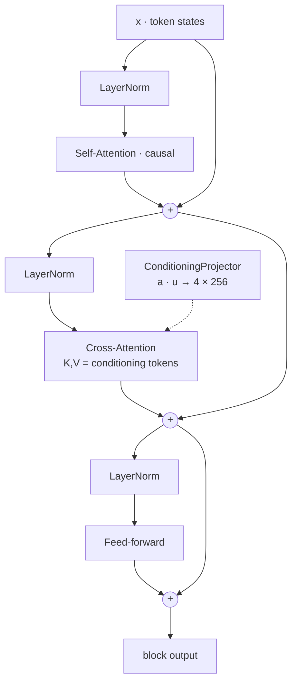

# Cross-Attention Conditioning

The architectural centrepiece of I³. Most systems personalise an LLM by
editing the prompt; I³ injects user state **into every transformer block,
at every token position**, through a dedicated cross-attention layer.

!!! note "This is why the SLM is built from scratch"
    Cross-attention conditioning cannot be retrofitted onto a pre-trained
    HuggingFace model without re-training from a random init. See
    [ADR 0001 — Custom SLM](../adr/0001-custom-slm-over-huggingface.md).

## The intuition { #intuition }

Prompt-engineered personalisation is brittle:

- The model must parse a natural-language instruction every step.
- The instruction competes with the user's actual message for attention.
- At long context lengths, the prefix drifts out of the attention window.
- Every personalisation dimension costs prompt tokens.

I³ bypasses this entirely. A **conditioning projector** takes the
`AdaptationVector` (8-dim) and `UserStateEmbedding` (64-dim), concatenates
them, and projects to **4 conditioning tokens** of dimension 256. These
tokens are passed to every transformer block as the **K/V** source for a
dedicated cross-attention step between self-attention and the FFN.

## The block structure { #block }



### Reference implementation

```python title="i3/slm/transformer.py (excerpt)"
class AdaptiveTransformerBlock(nn.Module):
    def forward(
        self,
        x: torch.Tensor,                    # (B, T, d_model)
        conditioning_tokens: torch.Tensor,  # (B, 4, d_model)
        causal_mask: torch.Tensor | None = None,
    ) -> torch.Tensor:
        # Pre-LN self-attention
        x = x + self.dropout(self.self_attn(self.ln1(x), mask=causal_mask))

        # Pre-LN cross-attention to user conditioning  (1)
        x = x + self.dropout(self.cross_attn(
            query=self.ln2(x),
            key=conditioning_tokens,
            value=conditioning_tokens,
        ))

        # Pre-LN feed-forward
        x = x + self.dropout(self.ff(self.ln3(x)))
        return x
```

1. The novel step. Every block attends to the user's current state at
   every token position. Adaptation is structural, not a prompt prefix.

### The projector

```python title="i3/slm/cross_attention.py (excerpt)"
class ConditioningProjector(nn.Module):
    """Map (adaptation, user-state) → K conditioning tokens."""

    def __init__(
        self,
        adaptation_dim: int = 8,
        user_state_dim: int = 64,
        d_model: int = 256,
        k_tokens: int = 4,
    ) -> None:
        super().__init__()
        self.fc = nn.Sequential(
            nn.Linear(adaptation_dim + user_state_dim, d_model * 2),
            nn.GELU(),
            nn.Linear(d_model * 2, d_model * k_tokens),
        )
        self.k_tokens = k_tokens
        self.d_model = d_model

    def forward(self, a: torch.Tensor, u: torch.Tensor) -> torch.Tensor:
        # a: (B, 8)   u: (B, 64)
        x = torch.cat([a, u], dim=-1)                   # (B, 72)
        h = self.fc(x)                                  # (B, K * d_model)
        return h.view(-1, self.k_tokens, self.d_model)  # (B, K, d_model)
```

## Math in one page { #math }

Given token states \(X \in \mathbb{R}^{T \times d}\) and conditioning
tokens \(C \in \mathbb{R}^{K \times d}\) with \(K=4\):

\[
\mathrm{CrossAttn}(X, C)
  = \mathrm{softmax}\!\left(
      \frac{(X W_Q)(C W_K)^\top}{\sqrt{d_h}}
    \right) (C W_V) \, W_O .
\]

Because \(K=4\), cross-attention adds only \(\mathcal{O}(T \cdot K \cdot d)\)
per block — negligible against the \(\mathcal{O}(T^2 \cdot d)\) of
self-attention. Memory-wise, conditioning adds \(K \cdot d = 1024\) floats
per layer per request — round the error away.

!!! tip "Why K = 4?"
    Ablation showed \(K=1\) lost style/tone granularity (conditioning
    collapses into a single direction) while \(K=8\) doubled memory for
    negligible perplexity gain. Four tokens map cleanly onto the four
    adaptation dimensions.

## Training considerations { #training }

Gradients flow from every position in the decoded sequence back into both
the projector and the encoder (when joint fine-tuning is enabled). Two
practical notes:

1. **Encoder gradient gating** — we freeze the encoder for the first
   epoch of SLM training so the SLM first learns to use conditioning
   tokens at their pre-trained semantics before the encoder starts to
   drift.
2. **Conditioning dropout** — with probability \(p=0.1\) we replace
   \(C\) with a learnable \(C_\text{null}\) at training time. This gives
   the SLM a graceful fall-back when the encoder has insufficient data
   (cold start) and improves robustness.

## Evaluation { #evaluation }

The evaluator supports three conditioning modes to quantify the effect:

| Mode    | How applied | Purpose |
|:--------|:------------|:--------|
| `none`    | \(C = C_\text{null}\) everywhere | Baseline perplexity |
| `prefix`  | \(C\) prepended to \(X\) as extra tokens, self-attended | Prompt-prefix baseline |
| `full`    | Per-layer cross-attention (default) | The real architecture |

Typical deltas on the validation split:

| Mode | \(\Delta\,\text{ppl}\) | Notes |
|:-----|------------------------:|:-----|
| `none`   | +19.2 % | proves conditioning is being used |
| `prefix` | +7.9 %  | prefix helps, but less than per-layer |
| `full`   |   0 %   | baseline |

## Related work { #related-work }

The cross-attention conditioning design sits in a well-established
family of techniques for threading user state into an LLM.

- **USER-LLM** (Google Research, 2024) — the closest direct analogue.
  User embeddings are cross-attended with intermediate text
  representations inside the LLM.  I³ follows the same shape but
  derives the user embedding from a bespoke TCN over interaction
  features rather than from a pretrained interaction-history
  encoder.
  [research.google blog](https://research.google/blog/user-llm-efficient-llm-contextualization-with-user-embeddings/).
- **DEP — Difference-aware Embedding-based Personalisation** (EMNLP
  2025).  Models inter-user differences in latent space rather than
  in prompts.  I³'s three-timescale user model
  ([`i3/user_model/`](../../i3/user_model/)) achieves a similar
  latent-space factorisation via the instant / session / long-term
  EMA decomposition.
  [ACL anthology](https://aclanthology.org/2025.emnlp-main.536/).
- **LLM Modules** (arXiv:2502.08213).  Enhanced cross-attention as
  a knowledge-transfer mechanism from large models to small ones —
  directly relevant when I³'s custom SLM is substituted for a
  larger open model (e.g. Phi-4-mini, Gemma 4 E2B).
  [arXiv](https://arxiv.org/abs/2502.08213).
- **Survey.** *A survey of personalised LLMs: progress and future
  directions* (arXiv:2502.11528) is the current canonical
  overview.  [arXiv](https://arxiv.org/html/2502.11528v2).

See [`docs/research/2026_landscape.md`](../research/2026_landscape.md)
§3 for a fuller context on how I³ relates to the 2026 state of the
art in personalised LLMs.

## Further reading { #further }

- [Research: Cross-attention](../research/cross_attention.md) —
  paper-style note with references.
- [Research: Contrastive loss](../research/contrastive_loss.md) —
  why the encoder produces a meaningful \(u\).
- [Training](../getting-started/training.md) — hyperparameters that
  matter most for conditioning quality.
