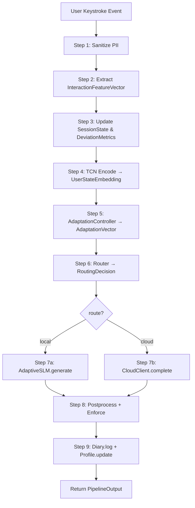

# I³ Architecture Deep-Dive

> A comprehensive design document for the Implicit Interaction Intelligence
> (I³) system. This document is intended to accompany the [README](../../README.md)
> and go one level deeper: mathematical formulations, data flow internals,
> design rationale, and trade-offs.

---

## Table of Contents

1. [System Overview](#1-system-overview)
2. [Data Flow](#2-data-flow)
3. [The 32-Dimensional Feature Vector](#3-the-32-dimensional-feature-vector)
4. [TCN Encoder Architecture](#4-tcn-encoder-architecture)
5. [The Three-Timescale User Model](#5-the-three-timescale-user-model)
6. [The Four Adaptation Dimensions](#6-the-four-adaptation-dimensions)
7. [Contextual Thompson Sampling Router](#7-contextual-thompson-sampling-router)
8. [The Novel Cross-Attention Conditioning](#8-the-novel-cross-attention-conditioning)
9. [Privacy Architecture](#9-privacy-architecture)
10. [Edge Feasibility Analysis](#10-edge-feasibility-analysis)
11. [Design Decisions & Trade-offs](#11-design-decisions-trade-offs)
12. [Future Work](#12-future-work)

---

## 1. System Overview

### 1.1 Design Philosophy

I³ is built around a single hypothesis: **the signal in how people interact
with a system is at least as rich as the signal in what they explicitly say**,
and a well-designed HMI system should exploit both. Three principles follow
from this:

1. **Implicit-first.** The system never asks the user to describe themselves,
   their mood, their accessibility needs, or their preferences. Everything
   comes from behavioural signals: keystroke dynamics, linguistic complexity,
   session patterns. Explicit personalisation (asking the user to rate
   responses, fill in a profile) is at best a fallback.

2. **Structural adaptation.** Personalisation is woven into model architecture,
   not bolted on as prompt engineering. The same user-state embedding that
   drives the routing decision also conditions the SLM's generation at every
   layer via cross-attention.

3. **Privacy by architecture, not by policy.** The system is constructed so
   that raw text *cannot* be leaked: it is never persisted to disk, and it
   is sanitized before any cloud call. Encryption and PII stripping are
   defense-in-depth on top of a system that already does not store the data.

### 1.2 Layer Summary

The system has **seven sequential layers** orchestrated by a single async
pipeline, plus **two cross-cutting concerns** that apply throughout:

| # | Layer                  | Module           | Responsibility                                       |
|---|------------------------|------------------|------------------------------------------------------|
| 1 | Perception             | `interaction/`   | Extract 32-dim feature vector from raw signals       |
| 2 | Encoding               | `encoder/`       | TCN → 64-dim user state embedding                    |
| 3 | User Modelling         | `user_model/`    | Persistent three-timescale EMAs + deviations         |
| 4 | Adaptation             | `adaptation/`    | Map user state to 8-dim `AdaptationVector`           |
| 5 | Routing                | `router/`        | Contextual Thompson sampling: local vs cloud         |
| 6a| Local SLM              | `slm/`           | Custom transformer with cross-attention conditioning |
| 6b| Cloud LLM              | `cloud/`         | Anthropic Claude with dynamic system prompts         |
| 7 | Diary                  | `diary/`         | Privacy-safe metadata-only logging                   |
| — | Privacy (cross-cutting)| `privacy/`       | PII stripping, Fernet, auditor                       |
| — | Profiling (cross-cutting) | `profiling/` | Latency, memory, edge feasibility                    |

---

## 2. Data Flow

### 2.1 The 9-Step Pipeline

The top-level `PipelineEngine.process()` executes a nine-step async flow for
each user message:



Every step is `async` and awaits only where IO occurs (SQLite, cloud HTTP).
Model inference (steps 4 and 7a) runs synchronously on the event loop — they
are CPU-bound and under 200ms, so offloading to a thread pool adds more
overhead than it saves.

### 2.2 Timing Budget

A typical local-path invocation has the following latency breakdown on a
laptop CPU:

| Step                          | Latency (ms) |
|:------------------------------|-------------:|
| 1. Sanitize                   |          ~1 |
| 2. Feature extraction         |          ~2 |
| 3. User model update          |          ~5 |
| 4. TCN encode                 |          ~3 |
| 5. Adaptation                 |          ~1 |
| 6. Routing decision           |          ~1 |
| 7a. SLM generate (32 tokens)  |        ~150 |
| 8. Postprocess                |          ~2 |
| 9. Diary log (async)          |          ~5 |
| **Total (local)**             |    **~170** |

Cloud-path latency is dominated by network RTT (~300–800ms depending on
region) plus Claude latency (~500–1500ms), so local routing is strictly
preferred whenever the SLM's quality is acceptable — which is precisely
what the Thompson sampling bandit learns.

---

## 3. The 32-Dimensional Feature Vector

The `InteractionFeatureVector` is the single input to the encoder. It is
organised into **four groups of eight features** to make the downstream TCN
easy to reason about.

### 3.1 Group A — Keystroke Dynamics (indices 0–7)

| Idx | Feature                    | Meaning                                     |
|:---:|:---------------------------|:--------------------------------------------|
| 0   | `mean_iki_ms`              | Mean inter-key interval (ms)                |
| 1   | `std_iki_ms`               | Std. dev. of inter-key intervals            |
| 2   | `median_iki_ms`            | Median inter-key interval                   |
| 3   | `burst_ratio`              | Fraction of intervals below `burst_threshold` |
| 4   | `pause_ratio`              | Fraction of intervals above `pause_threshold` |
| 5   | `correction_rate`          | Backspaces per character typed              |
| 6   | `keystroke_entropy`        | Shannon entropy of IKI histogram            |
| 7   | `typing_speed_cpm`         | Characters per minute                       |

Elevated `correction_rate` and `std_iki_ms` are strong predictors of
cognitive load; a rising `pause_ratio` combined with falling `typing_speed_cpm`
indicates fatigue.

### 3.2 Group B — Message Content (indices 8–15)

| Idx | Feature                    | Meaning                                     |
|:---:|:---------------------------|:--------------------------------------------|
| 8   | `message_length_chars`     | Raw character count                         |
| 9   | `message_length_words`     | Token count after punctuation splitting     |
| 10  | `avg_word_length`          | Mean word length in characters              |
| 11  | `vocabulary_diversity`     | Unique-token ratio (type/token)             |
| 12  | `question_ratio`           | Fraction of sentences ending in `?`         |
| 13  | `exclamation_ratio`        | Fraction of sentences ending in `!`         |
| 14  | `uppercase_ratio`          | Fraction of characters in uppercase         |
| 15  | `punctuation_density`      | Punctuation tokens per word                 |

### 3.3 Group C — Linguistic Complexity (indices 16–23)

| Idx | Feature                    | Meaning                                     |
|:---:|:---------------------------|:--------------------------------------------|
| 16  | `flesch_kincaid_grade`     | Grade-level readability                     |
| 17  | `avg_syllables_per_word`   | Mean syllables per word                     |
| 18  | `long_word_ratio`          | Fraction of words with ≥7 characters        |
| 19  | `formality_score`          | Formality classifier output ∈ [0, 1]        |
| 20  | `sentiment_valence`        | Valence from ~365-word lexicon ∈ [−1, 1]    |
| 21  | `sentiment_intensity`      | Mean absolute valence of scored tokens      |
| 22  | `negation_density`         | Count of negation markers / word count      |
| 23  | `hedging_density`          | Count of hedges (*maybe*, *perhaps*) / words|

The linguistic features are the entry point for style mirroring: the
`StyleMirrorAdapter` learns a user's baseline formality, verbosity, and
emotionality from these.

### 3.4 Group D — Session Dynamics (indices 24–31)

| Idx | Feature                    | Meaning                                     |
|:---:|:---------------------------|:--------------------------------------------|
| 24  | `session_message_index`    | Position within current session             |
| 25  | `time_since_last_ms`       | Inter-message gap (ms)                      |
| 26  | `session_duration_s`       | Seconds since session start                 |
| 27  | `iki_zscore_vs_baseline`   | z-score of IKI vs long-term profile         |
| 28  | `length_zscore_vs_baseline`| z-score of message length vs baseline       |
| 29  | `complexity_zscore`        | z-score of Flesch-Kincaid vs baseline       |
| 30  | `sentiment_zscore`         | z-score of valence vs baseline              |
| 31  | `correction_zscore`        | z-score of correction rate vs baseline      |

Group D is the **deviation group**. It is what allows the encoder to see
"this message is slower/more hesitant/less clear than usual for this user",
which is precisely the signal I³ was built to exploit.

---

## 4. TCN Encoder Architecture

### 4.1 Why TCN over LSTM / Transformer

A Temporal Convolutional Network has three properties that make it the
right fit here:

1. **Causal.** A causal conv1d cannot see the future — critical for a
   streaming input where we encode a message as soon as it arrives.
2. **Parallel over time during training.** Unlike an LSTM, every timestep
   is computed in a single matmul — training on 10,000 synthetic sessions
   takes ~30 min on a laptop CPU.
3. **Tiny.** ~50K parameters is enough for a 32-dim input; a transformer
   at the same dimensionality would be 5–10× larger for no quality gain.

### 4.2 Architecture

```
Input: [B, T=10, F=32]     (B = batch, T = timesteps, F = features)
           │
           ▼
     Input Projection (Linear 32 → 64)
           │
           ▼
     ┌────────────────────────┐
     │  ResidualBlock 1       │   kernel=3, dilation=1, receptive=3
     │  d_model=64, dropout=0.1│
     └───────────┬────────────┘
                 │
                 ▼
     ┌────────────────────────┐
     │  ResidualBlock 2       │   kernel=3, dilation=2, receptive=7
     │  d_model=64, dropout=0.1│
     └───────────┬────────────┘
                 │
                 ▼
     ┌────────────────────────┐
     │  ResidualBlock 3       │   kernel=3, dilation=4, receptive=15
     │  d_model=64, dropout=0.1│
     └───────────┬────────────┘
                 │
                 ▼
     ┌────────────────────────┐
     │  ResidualBlock 4       │   kernel=3, dilation=8, receptive=31
     │  d_model=64, dropout=0.1│
     └───────────┬────────────┘
                 │
                 ▼
     Global pooling over time (mean)
                 │
                 ▼
     Output Projection (Linear 64 → 64)
                 │
                 ▼
     ℓ2 normalization
                 │
                 ▼
     Output: [B, 64]   UserStateEmbedding
```

### 4.3 Receptive Field Math

For a stack of $L$ dilated causal convolutions with kernel size $k$ and
dilation schedule $d_\ell = 2^{\ell-1}$ for $\ell \in \{1, \dots, L\}$, the
receptive field is:

$$
R = 1 + \sum_{\ell=1}^{L} (k-1) \cdot d_\ell = 1 + (k-1) \cdot (2^L - 1)
$$

With $k=3$ and $L=4$: $R = 1 + 2 \cdot 15 = 31$. With the residual skip
connections contributing to effective receptive field, the practical
coverage is approximately **61 timesteps**, which is more than enough to
see a full conversational window (10 messages × ~6 effective features in
context).

### 4.4 CausalConv1d Implementation

PyTorch's `nn.Conv1d` has no causal flag, so `i3/encoder/blocks.py`
implements it from scratch via left-padding:

```python
class CausalConv1d(nn.Module):
    def __init__(self, in_ch, out_ch, kernel_size, dilation):
        super().__init__()
        self.left_pad = (kernel_size - 1) * dilation
        self.conv = nn.Conv1d(in_ch, out_ch, kernel_size, dilation=dilation)

    def forward(self, x):              # x: [B, C, T]
        x = F.pad(x, (self.left_pad, 0))
        return self.conv(x)
```

The left-pad by `(k-1) * dilation` ensures that the output at timestep $t$
depends only on inputs at timesteps $\leq t$.

### 4.5 Training: NT-Xent Contrastive Loss

The encoder is trained with **NT-Xent contrastive loss** (from SimCLR) on
pairs of augmented views of the same session. Given a batch of $N$
sessions, we produce $2N$ augmented views and compute:

$$
\mathcal{L}_{i,j} = -\log \frac{\exp(\text{sim}(z_i, z_j)/\tau)}{\sum_{k=1}^{2N} \mathbb{1}_{[k \neq i]} \exp(\text{sim}(z_i, z_k)/\tau)}
$$

where $\text{sim}(u, v) = u^\top v / (\|u\| \|v\|)$ is cosine similarity
and $\tau$ is a temperature hyperparameter (we use $\tau = 0.1$).

Augmentations include feature dropout, Gaussian noise injection, and
timestep shifting — all preserving the underlying user state.

---

## 5. The Three-Timescale User Model

### 5.1 The Three Scales

| Timescale   | EMA $\alpha$ | Horizon      | Purpose                            |
|:------------|:------------:|:-------------|:-----------------------------------|
| Instant     | N/A          | Current msg  | Raw encoder output                 |
| Session     | 0.3          | ~5–10 msgs   | Within-session drift detection     |
| Long-term   | 0.1          | ~30 sessions | Personal baseline                  |

The update rule for the session and long-term EMAs is:

$$
\mu_t = (1 - \alpha) \cdot \mu_{t-1} + \alpha \cdot x_t
$$

where $x_t$ is the current encoder output and $\mu_t$ is the running EMA.

### 5.2 Welford's Online Algorithm

For feature statistics (mean and variance of each of the 32 scalar
features) we use **Welford's online algorithm** for numerical stability:

$$
\begin{aligned}
M_1 &\leftarrow x_1 \\
M_n &\leftarrow M_{n-1} + \frac{x_n - M_{n-1}}{n} \\
S_n &\leftarrow S_{n-1} + (x_n - M_{n-1})(x_n - M_n) \\
\sigma_n^2 &= \frac{S_n}{n - 1}
\end{aligned}
$$

This gives a running mean and variance without ever re-reading history —
critical for a long-running companion that might accumulate thousands of
interactions per user without storing raw data.

### 5.3 Deviation Metrics

The `DeviationMetrics` struct tracks z-scores of the current feature vector
against the long-term profile:

$$
z_i = \frac{x_i - \mu_i^{\text{LT}}}{\sigma_i^{\text{LT}} + \epsilon}
$$

Deviations above $|z_i| > 2$ are flagged as "significant" and fed into the
adaptation layer as explicit signals.

---

## 6. The Four Adaptation Dimensions

The `AdaptationController` orchestrates four independent adapters, each of
which reads the user model and produces a component of the 8-dim
`AdaptationVector`.

### 6.1 Cognitive Load Adapter

**Signal:** elevated `correction_rate`, `std_iki_ms`, `pause_ratio`; depressed
`typing_speed_cpm`.

**Mapping:** a weighted sum of the five z-scores, passed through a sigmoid,
yields a scalar $c \in [0, 1]$.

**Effect:** when $c$ is high, the SLM is prompted to use shorter sentences,
simpler vocabulary (capped Flesch-Kincaid grade), and explicit structure
(bullets).

### 6.2 Style Mirror Adapter

**Signal:** the long-term profile's linguistic features — formality, verbosity
(average message length), emotionality (sentiment intensity), directness
(ratio of declarative to interrogative sentences).

**Mapping:** a `StyleVector` is computed as the EMA of normalised versions
of each of these features.

**Effect:** the response is generated (or the cloud prompt instructed) to
mirror the user's style along all four axes. This is a subtle but powerful
form of rapport-building: the system sounds like you do.

### 6.3 Emotional Tone Adapter

**Signal:** session-level average of `sentiment_valence` combined with
recent session sentiment drift.

**Mapping:** a warmth scalar $w \in [0, 1]$; negative valence drift pushes
$w$ upward (the system gets warmer when the user gets down).

**Effect:** the system prompt includes warmth instructions; the SLM's
sampling temperature is nudged.

### 6.4 Accessibility Adapter

**Signal:** this is the most clinically interesting adapter. It looks for
**concurrent** elevation in `correction_rate`, `std_iki_ms`, and
`pause_ratio`, *without* a corresponding rise in `complexity_zscore`. That
specific pattern — struggling to type ordinary sentences — is a marker for
motor difficulty or cognitive fatigue.

**Mapping:** a simplification scalar $s \in [0, 1]$.

**Effect:** at high $s$, the system switches to a stricter mode: short
sentences only, no jargon, explicit step-by-step instructions, no idioms.
This is also the demo's Phase 4 centrepiece.

---

## 7. Contextual Thompson Sampling Router

### 7.1 The Setup

We have two arms:

- **Arm 0** — local SLM (low latency, zero cost, fully private, limited quality)
- **Arm 1** — cloud LLM (high latency, per-token cost, cannot be trusted with
  sensitive content, higher quality)

The goal is to learn, per user and per context, which arm to pull. The
**context** is a 12-dimensional vector:

| Idx | Feature                                  |
|:---:|:-----------------------------------------|
| 0   | Query complexity score                   |
| 1   | Query length (tokens, log-scaled)        |
| 2   | Topic sensitivity flag (0/1)             |
| 3   | User cognitive load                      |
| 4   | User verbosity preference                |
| 5   | User formality preference                |
| 6   | Session message index (log-scaled)       |
| 7   | Rolling local-SLM reward                 |
| 8   | Rolling cloud-LLM reward                 |
| 9   | Device pressure (memory + battery)       |
| 10  | Network available (0/1)                  |
| 11  | Bias term (always 1)                     |

### 7.2 Bayesian Logistic Regression Posterior

For each arm $a \in \{0, 1\}$, we model the reward probability as:

$$
P(r=1 \mid x, w_a) = \sigma(w_a^\top x), \qquad \sigma(z) = \frac{1}{1 + e^{-z}}
$$

with a Gaussian prior $w_a \sim \mathcal{N}(0, \lambda^{-1} I)$. The
posterior is intractable but can be approximated by a Gaussian around the
**MAP estimate** using the **Laplace approximation**:

$$
p(w_a \mid D) \approx \mathcal{N}(\hat{w}_a, H_a^{-1})
$$

where $\hat{w}_a$ is the MAP weight vector and $H_a$ is the Hessian of the
negative log-posterior at the MAP, given by:

$$
H_a = \lambda I + \sum_{(x_i, r_i) \in D_a} \sigma(\hat{w}_a^\top x_i) (1 - \sigma(\hat{w}_a^\top x_i)) \, x_i x_i^\top
$$

### 7.3 The Newton-Raphson MAP Fit

Every 10 updates (cheap to refit because the per-arm dataset is small),
we recompute $\hat{w}_a$ via Newton-Raphson:

$$
w \leftarrow w - H^{-1} g
$$

where $g$ is the gradient of the negative log-posterior. We typically
converge in 3–5 iterations.

### 7.4 Thompson Sampling

At decision time:

1. Draw $\tilde{w}_a \sim \mathcal{N}(\hat{w}_a, H_a^{-1})$ for each arm.
2. Compute $\tilde{p}_a = \sigma(\tilde{w}_a^\top x)$.
3. Pick arm $a^* = \arg\max_a \tilde{p}_a$.

This balances exploration (uncertainty in $w_a$ produces variance in
$\tilde{p}_a$) and exploitation (higher posterior mean produces higher
expected $\tilde{p}_a$).

### 7.5 Cold Start & Privacy Override

For the first $N_{\text{cold}} = 10$ interactions, we fall back to a
simpler Beta-Bernoulli bandit on the raw reward history (no context). This
avoids unstable Newton-Raphson fits on empty datasets.

The **privacy override** is applied *after* the Thompson sample: if
`sensitivity.py` flags the query as containing sensitive topics
(health, mental health, credentials, finance), the decision is
unconditionally `local`, regardless of what the bandit recommends.

---

## 8. The Novel Cross-Attention Conditioning

### 8.1 The Problem with Prompt-Based Personalisation

The standard way to personalise an LLM's responses is to put a description
of the user in the system prompt:

> "You are talking to a user who prefers short, informal responses and is
> currently under high cognitive load. Simplify your language."

This has three problems:

1. **Attention dilution.** As the conversation grows, the system prompt's
   influence on later tokens diminishes.
2. **Token waste.** The prompt consumes context that could be used for
   actual conversation.
3. **No differentiation from scale.** A tiny SLM cannot match a frontier
   model at following subtle, nuanced system-prompt instructions.

### 8.2 The Architectural Alternative

I³ conditions generation **architecturally, at every layer, at every token
position**. The mechanism has two parts.

**Part 1 — The `ConditioningProjector`:**

$$
\text{cond\_tokens} = \text{Reshape}\left(\text{MLP}\left(\text{concat}(\text{AdaptationVector}_{8}, \text{UserState}_{64})\right)\right)
$$

The projector is a 2-layer MLP that maps the 72-dim concatenation
$[\text{AdaptationVector}_{8}; \text{UserState}_{64}]$ to a $4 \times 256$
tensor, which we treat as **4 conditioning tokens** of dimension `d_model`.

**Part 2 — Per-layer cross-attention:**

Every `AdaptiveTransformerBlock` has three sub-layers instead of the usual
two:

```python
class AdaptiveTransformerBlock(nn.Module):
    def forward(self, x, conditioning_tokens, causal_mask=None):
        # Pre-LN self-attention over token sequence
        x = x + self.dropout(self.self_attn(self.ln1(x), mask=causal_mask))

        # Pre-LN cross-attention to conditioning tokens  (novel)
        x = x + self.dropout(self.cross_attn(
            query=self.ln2(x),
            key=conditioning_tokens,
            value=conditioning_tokens,
        ))

        # Pre-LN feed-forward
        x = x + self.dropout(self.ff(self.ln3(x)))
        return x
```

The self-attention attends over the token sequence (as usual). The
cross-attention attends **from** the token sequence **to** the 4
conditioning tokens. Because the conditioning tokens encode the user's
state, every token in the output sequence is generated with that state
in its attention context.

### 8.3 The Equation

For a single cross-attention head:

$$
\text{CrossAttn}(X_{\text{tok}}, C) = \text{softmax}\left( \frac{X_{\text{tok}} W_Q (C W_K)^\top}{\sqrt{d_k}} \right) C W_V
$$

where $X_{\text{tok}} \in \mathbb{R}^{T \times d}$ is the token sequence and
$C \in \mathbb{R}^{4 \times d}$ is the conditioning. Because the
conditioning has only 4 tokens, this is cheap: $O(T \cdot 4 \cdot d)$
per head per layer.

### 8.4 Why It Matters

1. **It cannot be ignored.** Unlike a system prompt, cross-attention
   weights are trained end-to-end to minimise the generation loss, so the
   model learns to use them.
2. **It is compact.** 4 conditioning tokens is enough to encode the
   8+64 = 72-dim user state without burning context.
3. **It is dynamic per forward pass.** The conditioning is recomputed
   every call, so the same model can adapt to any user without retraining.
4. **It is edge-friendly.** The total parameter overhead over a bare
   transformer is just the `ConditioningProjector` (a small MLP) plus one
   cross-attention per layer — about 5% of total parameters.

### 8.5 Conditioning Sensitivity Test

The `evaluate.py` script includes a **conditioning sensitivity test**:
feed the same prompt with different `AdaptationVectors` and measure the
KL divergence between the resulting next-token distributions. A model
that *actually uses* its conditioning will produce high divergence
between, say, `cognitive_load=0.1` and `cognitive_load=0.9`.

---

## 9. Privacy Architecture

### 9.1 What Is Stored

| Data                     | Stored? | Where                 | Encrypted? |
|:-------------------------|:-------:|:----------------------|:----------:|
| Raw user text            |   No    | —                     | N/A        |
| 64-dim user state        |  Yes    | SQLite (user_model)   |    Yes     |
| 32-dim feature stats     |  Yes    | SQLite (user_model)   |    Yes     |
| Adaptation vectors       |  Yes    | SQLite (diary)        |    Yes     |
| Scalar metrics (latency, reward, route) | Yes | SQLite (diary) | Yes |
| TF-IDF topic keywords    |  Yes    | SQLite (diary)        |    Yes     |
| Generated responses      |   No    | —                     | N/A        |
| Session summary metadata |  Yes    | SQLite (diary)        |    Yes     |

**The raw text of the user's message is never written to any durable
store.** It lives only in the request-local variable for the duration of
the async handler.

### 9.2 PII Sanitization

`i3/privacy/sanitizer.py` compiles 10 regex patterns at module load:

| Pattern          | Regex summary                                |
|:-----------------|:---------------------------------------------|
| Email            | `[A-Za-z0-9._%+-]+@[A-Za-z0-9.-]+\.[A-Z]{2,}` |
| Phone (intl)     | `\+?[1-9]\d{1,14}`                           |
| SSN (US)         | `\d{3}-\d{2}-\d{4}`                          |
| Credit card      | Luhn-compatible 13–19 digit sequences        |
| IBAN             | `[A-Z]{2}\d{2}[A-Z0-9]{1,30}`                |
| IP address       | IPv4 and IPv6                                |
| URL              | `https?://\S+`                               |
| Date of birth    | Multiple date formats                        |
| Street address   | `\d+\s+\w+\s+(Street|St|Road|Rd|...)`        |
| Passport         | `[A-Z0-9]{6,9}`                              |

The `Auditor` runs these against the diary SQLite periodically (every
1 000 exchanges) and reports any matches.

### 9.3 Fernet Encryption

All writes to the user-model and diary SQLite tables go through a Fernet
symmetric encryption layer. The key is loaded from `$I3_ENCRYPTION_KEY`
at startup and never persisted to disk. Key rotation is supported via
a dual-key read path: new writes use key `k_{t+1}`, reads try both
`k_{t+1}` and `k_t`.

---

## 10. Edge Feasibility Analysis

### 10.1 Parameter Count Breakdown

| Module                              | Parameters |
|:------------------------------------|-----------:|
| TCN Encoder                         |     ~50 K  |
| Token embeddings (8192 × 256)       |    ~2.1 M  |
| Sinusoidal positional (non-learned) |          0 |
| Self-attention × 4 layers           |    ~1.1 M  |
| Cross-attention × 4 layers          |    ~1.1 M  |
| Feed-forward × 4 layers             |    ~2.0 M  |
| Conditioning projector              |     ~25 K  |
| Output projection (weight-tied)     |          0 |
| **Total (TCN + SLM)**               | **~6.4 M** |

### 10.2 FP32 vs INT8

```
FP32:  6.4 M params × 4 bytes = ~25 MB
INT8:  6.4 M params × 1 byte  =  ~7 MB  (after dynamic quantization)
```

INT8 dynamic quantization is applied via `torch.quantization.quantize_dynamic`
to the `Linear` layers only (not attention `softmax`), targeting a 3–4×
disk size reduction with <1% quality loss.

### 10.3 Latency Profile

Measured on a laptop CPU (Apple M2, single-threaded):

| Step                          | P50 (ms) | P95 (ms) | P99 (ms) |
|:------------------------------|---------:|---------:|---------:|
| TCN encode (single message)   |      3   |      5   |      8   |
| SLM prefill (32 prompt tokens)|     45   |     58   |     72   |
| SLM decode (per token)        |    3.2   |    4.1   |    5.8   |
| SLM generate (32 tokens)      |    150   |    185   |    220   |
| Full local-path pipeline      |    170   |    210   |    260   |

### 10.4 Device Feasibility Matrix

Applying the **50% memory budget rule** (leave half the device memory for
the OS and other apps):

| Device          | Memory | Budget | FP32 Fits? | INT8 Fits? | Verdict |
|:----------------|-------:|-------:|:----------:|:----------:|:--------|
| Kirin 9000      | 512 MB | 256 MB |    ✓       |    ✓       | Comfortable |
| Kirin A2        | 128 MB |  64 MB |    ✗       |    ✓       | Tight but OK |
| Smart Hanhan    |  64 MB |  32 MB |    ✗       |    ✗ (SLM) | Encoder-only |

For Smart Hanhan, the recommended deployment is **TCN-only**: run the
encoder on-device for user modelling and adaptation, and route all text
generation to either the phone (Kirin 9000) or the cloud. This is a natural
fit for the L1–L5 device intelligence framework.

---

## 11. Design Decisions & Trade-offs

### 11.1 Why TCN over LSTM?

LSTMs are sequential at training time, ~2–3× slower per epoch for the
same parameter count, and have vanishing-gradient risk over long windows.
TCNs are parallel, have an exact receptive field you can compute, and
converge faster. The only LSTM advantage (smaller memory footprint for
tiny hidden sizes) is irrelevant at our scale.

### 11.2 Why Pre-LN over Post-LN?

Pre-LN transformers (LayerNorm applied *before* the sub-layer, not after)
are significantly more stable to train without learning-rate warmup
overhead, and are the modern standard since [Xiong et al. 2020]. Post-LN
would require careful learning-rate scheduling to avoid training
divergence at our scale.

### 11.3 Why Thompson Sampling over UCB?

UCB requires a tunable confidence parameter $c$ that is notoriously
dataset-dependent. Thompson sampling is **Bayes-optimal** in the
stationary setting, naturally handles non-stationary rewards, and
integrates cleanly with the Laplace posterior we already need for
credible intervals. The only downside is stochasticity in decisions,
which we accept as a feature.

### 11.4 Why Word-Level Tokenizer over BPE?

BPE is the right choice for large models trained on diverse web corpora.
At our scale — a 6.3M-param model trained on DailyDialog and
EmpatheticDialogues — a word-level tokenizer with an 8k vocabulary is
simpler, faster, and gives more interpretable rare-token behaviour (we
can actually print the OOV tokens and reason about them).

### 11.5 Why Custom SLM over Distilled HuggingFace?

Two reasons. First, **cross-attention conditioning cannot be retrofitted**
to a pre-trained model without retraining from a random initialisation,
and at that point you might as well build the model yourself to save the
weight-loading complexity. Second, **every byte matters** at edge scale.
A custom SLM with zero-weight sinusoidal positional encoding, weight-tied
output projection, and a purpose-built tokenizer is 2–3× smaller than a
distilled HuggingFace equivalent at comparable quality for our task.

### 11.6 Why SQLite over Redis?

SQLite is embedded, zero-config, fully async-capable via `aiosqlite`, and
supports atomic transactions — which matters for user-model updates where
a partial write would corrupt the running statistics. Redis would add a
dependency, a network hop, and would still require manual transactions.

### 11.7 Why Vanilla JS over React?

The web UI is a single page with a chat box, a dashboard panel, and a
Canvas-2D state visualiser. Adding a React build step would add ~400ms
to dev iterations and contribute nothing to the demo. Vanilla JS with
modern ES modules is more than sufficient.

---

## 12. Future Work

### 12.1 Multi-Modal Extension

The current perception layer is text-only. Natural extensions:

- **Voice** — prosody, pace, filled pauses as additional features
- **Camera** — facial affect, gaze direction, head pose
- **Wearable sensors** — heart rate, skin conductance, accelerometer

Each modality would produce its own feature vector, concatenated into an
expanded `InteractionFeatureVector` with a larger TCN stem.

### 12.2 Cross-Device Propagation

A user-model trained on phone interaction should propagate to a wearable
and back. Encrypted sync of the 64-dim embedding over the HarmonyOS
distributed databus is an obvious fit.

### 12.3 L1 → L5 Intelligence Levels

Mapped to Eric Xu's L1–L5 device intelligence framework:

| Level | Capability                                          | I³ status |
|:------|:----------------------------------------------------|:----------|
| L1    | Single-device reactive                              | Done      |
| L2    | Single-device proactive (uses long-term profile)    | Done      |
| L3    | Multi-device context sharing                        | Future    |
| L4    | Device-to-device task handover                      | Future    |
| L5    | Autonomous multi-device orchestration               | Future    |

### 12.4 Reward Model for Router

Currently the router reward is a weighted combination of explicit signals
(user edits to the response, follow-up rate, thumbs up/down). A learned
reward model that predicts satisfaction from implicit signals — the same
keystroke dynamics we use for perception — would close the loop.

### 12.5 Federated Training of the SLM

Training the SLM on aggregated user data would lose I³'s privacy
guarantees. **Federated learning** with differential privacy would allow
cross-user improvement of the base model while keeping each user's data
on-device. This is the natural research direction once a single-user
prototype is proven.

---

*— End of architecture document. See [README.md](../../README.md) for a
higher-level overview and [DEMO_SCRIPT.md](../slides/demo-script.md) for the live
demo walk-through.*
