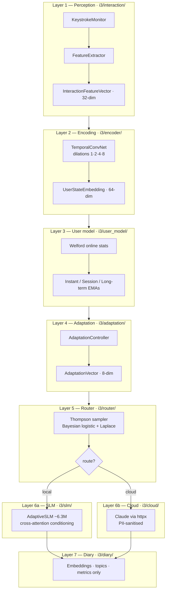
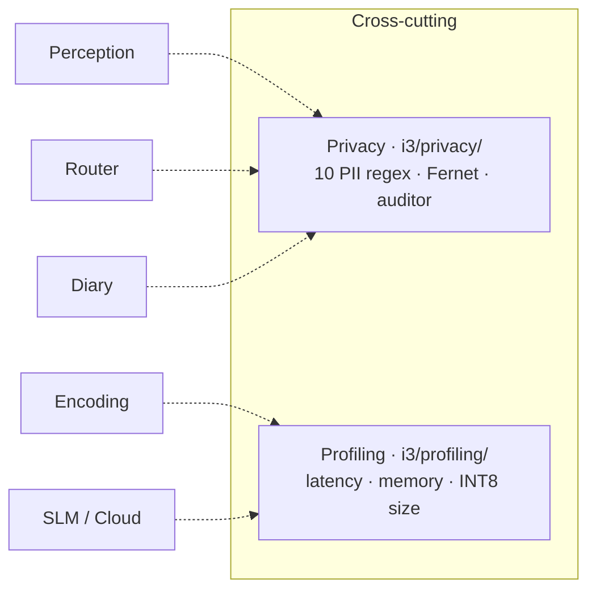
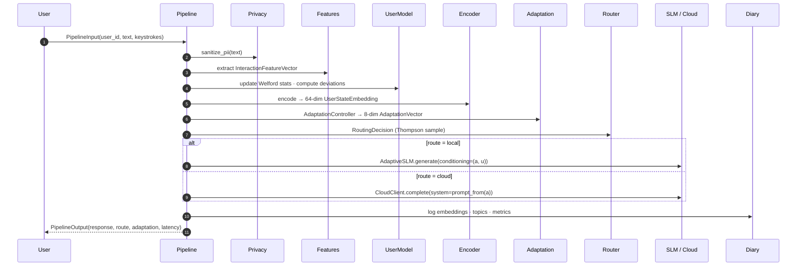

# Architecture Overview

A bird's-eye view of the I³ system: its seven sequential layers, its two
cross-cutting concerns, and the contracts between them.

!!! tip "Deep dive available"
    The canonical, maths-heavy reference is
    [`docs/ARCHITECTURE.md`](https://github.com/abailey81/implicit-interaction-intelligence/blob/main/docs/ARCHITECTURE.md).
    This page links to it heavily and complements it with Mermaid diagrams
    and the Material navigation.

## The seven layers { #layers }

Each layer is a small Python package with a typed, immutable data contract
on both ends. See [Layers](layers.md) for per-layer deep-dives.

## The two cross-cutting concerns { #cross-cutting }

!!! note "Why cross-cutting, not a layer?"
    Privacy and profiling are concerns that every layer depends on, but
    neither produces the primary data output. They are implemented as
    thin libraries consumed by the numbered layers — see
    [Privacy](privacy.md) and
    [ADR 0004 — Privacy by architecture](../adr/0004-privacy-by-architecture.md).

## The 9-step pipeline { #pipeline }

The central `PipelineEngine.process()` awaits a fixed sequence:

All inter-layer IO is `async` and typed with `pydantic.BaseModel` /
`@dataclass(frozen=True)` so data cannot be accidentally mutated in flight.

## Data contracts at a glance { #contracts }

| Layer | Input | Output |
|:------|:------|:-------|
| 1 Perception       | `KeystrokeEvent` stream, raw text      | `InteractionFeatureVector` (32-dim) |
| 2 Encoding         | feature sequence (variable length)     | `UserStateEmbedding` (64-dim)       |
| 3 User Modelling   | `UserStateEmbedding` + feature vector  | `UserProfile`, `DeviationMetrics`   |
| 4 Adaptation       | `UserProfile`, `SessionState`          | `AdaptationVector` (8-dim)          |
| 5 Routing          | `RoutingContext` (12-dim)              | `RoutingDecision { arm, posterior }` |
| 6a Local SLM       | prompt, `AdaptationVector`, embedding  | decoded tokens                      |
| 6b Cloud LLM       | PII-sanitised prompt, system prompt    | decoded tokens                      |
| 7 Diary            | embeddings, topics, metrics            | persisted `DiaryEntry`              |

## Technology footprint { #tech }

| Concern | Technology | Rationale (ADR) |
|:--------|:-----------|:---------------|
| Encoder              | Custom TCN in PyTorch                   | [ADR 0002](../adr/0002-tcn-over-lstm-transformer.md) |
| Language model       | Custom 6.3M-param transformer           | [ADR 0001](../adr/0001-custom-slm-over-huggingface.md) |
| Router               | Contextual Thompson sampling            | [ADR 0003](../adr/0003-thompson-sampling-over-ucb.md) |
| Web server           | FastAPI 0.115+                          | [ADR 0005](../adr/0005-fastapi-over-flask.md) |
| Observability        | OpenTelemetry + Prometheus              | [ADR 0007](../adr/0007-opentelemetry-for-observability.md) |
| At-rest crypto       | `cryptography` Fernet                   | [ADR 0008](../adr/0008-fernet-over-custom-crypto.md) |
| Persistence          | SQLite (`aiosqlite`)                    | [ADR 0009](../adr/0009-sqlite-over-redis.md) |
| Configuration        | Pydantic v2 (`frozen=True`)             | [ADR 0010](../adr/0010-pydantic-v2-config.md) |
| Packaging            | Poetry 1.8                              | [ADR 0006](../adr/0006-poetry-over-pip-tools.md) |

## Where to go next { #next }

### :material-layers: Layer-by-layer
[Layers](layers.md) breaks every package down with file links, dimensionality,
and responsibility statements.

### :material-brain: The novel part
[Cross-attention conditioning](cross-attention-conditioning.md) — the
architectural centrepiece.

### :material-dice-multiple-outline: The router
[Router](router.md) — Bayesian logistic regression, Laplace approximation,
privacy overrides.

### :material-shield-lock-outline: Privacy
[Privacy](privacy.md) — ten PII patterns, Fernet, the database auditor,
the "no raw text ever" schema constraint.

