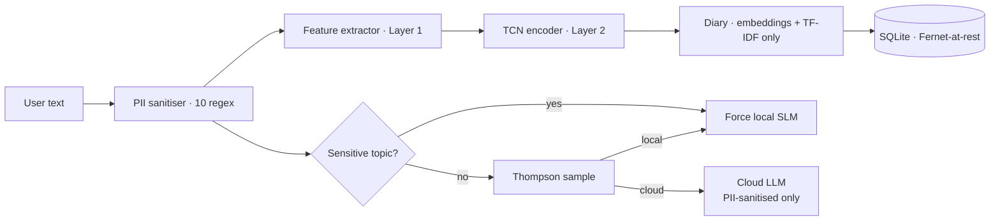

# Privacy Architecture

I³ is privacy-preserving **by construction**. The database schema cannot
hold raw text; the cloud client strips PII before transmission; the router
force-routes sensitive topics to the local SLM. Fernet encryption is
applied on top of all of this as defence in depth.

!!! tip "Related reading"
    [SECURITY.md](https://github.com/abailey81/implicit-interaction-intelligence/blob/main/SECURITY.md),
    [ADR 0004 — Privacy by architecture](../adr/0004-privacy-by-architecture.md),
    [ADR 0008 — Fernet over custom crypto](../adr/0008-fernet-over-custom-crypto.md).

## The guarantee { #guarantee }

> **Raw user text is never written to disk.**
> **Raw user text leaves the device only after PII sanitisation,**
> **and only when the router chooses the cloud arm.**
> **The chosen-arm choice itself is overridden to `local` for any message**
> **that matches a sensitive-topic pattern.**

Each clause is enforced in code, not in policy:



## Sanitisation — 10 PII patterns { #pii }

Implemented in `i3/privacy/sanitizer.py`. Every pattern is a
pre-compiled `re.Pattern` with anchored boundaries:

| # | Category | Pattern summary |
|:-:|:---------|:----------------|
| 1  | Email             | RFC-5322 local/domain |
| 2  | Phone             | E.164 + common national formats |
| 3  | SSN (US)          | `\b\d{3}-\d{2}-\d{4}\b` with Luhn-like exclusions |
| 4  | Credit card       | 13–19 digit run + Luhn checksum |
| 5  | IBAN              | country code + 2 check digits + BBAN |
| 6  | Street address    | number + street-suffix keyword |
| 7  | IP address        | IPv4 and IPv6 |
| 8  | URL               | `https?://`, `ftp://`, mailto |
| 9  | Date of birth     | ISO, US, UK common forms |
| 10 | Passport number   | country-specific length + alphanumeric |

Sanitisation returns the message with each match replaced by a typed
token, e.g. `[REDACTED:email]`. The sanitiser also **returns the list of
redactions**, which the pipeline uses to deny cloud routing when any
sensitive category was redacted (defence in depth).

### Test guarantees

`tests/test_privacy.py` asserts:

- Every pattern has at least one positive and one adversarial negative.
- Luhn checksum is validated for credit cards; mis-checksummed 16-digit
  strings are NOT redacted.
- Unicode homograph attacks (e.g. Cyrillic `а` for Latin `a` in emails)
  are covered.
- Sanitiser is idempotent: sanitising an already-sanitised message is a
  no-op.

## Diary schema — no text columns { #diary }

The `diary` table does not have a column capable of storing a user message
or a model response. It stores **only** non-reversible derived data:

| Column | Type | Purpose |
|:-------|:-----|:--------|
| `entry_id` | `TEXT PK` | UUIDv7 |
| `user_id` | `TEXT` | validated regex |
| `ts` | `REAL` | Unix timestamp |
| `embedding` | `BLOB` | 64-dim float32 user-state embedding |
| `topics_tfidf` | `TEXT` | JSON list of `(term, weight)` pairs |
| `adaptation` | `BLOB` | 8-dim float32 `AdaptationVector` |
| `route` | `TEXT` | `local` / `cloud` |
| `latency_ms` | `INTEGER` | |
| `engagement` | `REAL` | reward proxy |

The privacy auditor (`i3/privacy/sanitizer.py::PrivacyAuditor`) scans the
SQLite file for any TEXT blob that hashes to a substring of the last
N messages. If it finds one, the app fails closed.

## Encryption at rest { #crypto }

`i3/privacy/encryption.py` wraps the `cryptography` library's Fernet
primitive:

- **Algorithm**: AES-128-CBC + HMAC-SHA256, authenticated.
- **Key source**: `I3_ENCRYPTION_KEY` env var (32 url-safe base64 bytes).
- **Scope**: `UserProfile` blobs and `embedding` blobs are Fernet-wrapped.
- **Rotation**: the store supports multi-key unwrap so you can rotate keys
  without re-encrypting historical rows in place. The Fernet `MultiFernet`
  abstraction is used — see
  [cryptography docs](https://cryptography.io/en/latest/fernet/#cryptography.fernet.MultiFernet).

!!! warning "Key loss == total data loss"
    There is intentionally no key-recovery path. Back up `I3_ENCRYPTION_KEY`
    somewhere durable (password manager, secrets vault). The server refuses
    to start without it.

See [ADR 0008](../adr/0008-fernet-over-custom-crypto.md) for why we
chose a vetted AEAD primitive over a bespoke cipher.

## Cloud-bound sanitisation { #cloud-sanitize }

`i3/cloud/client.py` enforces a two-phase send:

1. Run the sanitiser; if any redactions produced, abort with a
   `CloudRouteDenied` unless the policy is `redact-and-send`.
2. Prepend a generic, non-personalised system prompt constructed from the
   `AdaptationVector` only — never from the user profile embedding.

```python title="i3/cloud/client.py (abridged)"
async def complete(self, prompt: str, adaptation: AdaptationVector) -> str:
    sanitised, redactions = sanitize(prompt)
    if redactions and self.policy == "deny-if-redacted":
        raise CloudRouteDenied(redactions)
    system = build_system_prompt(adaptation)   # no user-specific info
    return await self._http_complete(sanitised, system=system)
```

## Session summaries — metadata only { #summaries }

`i3/diary/summarizer.py` builds summaries from the diary's metadata —
the TF-IDF topics, the adaptation trajectory, the routing counts. When
the cloud summariser is used, the prompt is **entirely templated** from
these aggregates. Raw text is never sent.

## Privacy auditor { #auditor }

A background task (`i3/privacy/sanitizer.py::PrivacyAuditor.run`) hashes
recent user messages with SHA-256 into 4-byte prefix trees, then scans
the diary DB for any TEXT blob whose hash collides. Any collision makes
the app exit 1 — a canary for accidental leakage introduced by a future
refactor.

## Verification checklist { #verify }

- [x] `tests/test_privacy.py` — 24 tests, every pattern + auditor
- [x] `bandit` static scan on `i3/privacy/` passes
- [x] `ruff` + `mypy --strict` on `i3/privacy/` passes
- [x] Database schema has no TEXT column capable of holding a message
- [x] Cloud client refuses to send un-sanitised text
- [x] Router privacy override is enforced pre-sampling
- [x] Fernet key is never logged

## Further reading { #further }

- [SECURITY.md](https://github.com/abailey81/implicit-interaction-intelligence/blob/main/SECURITY.md)
- [ADR 0004 — Privacy by architecture](../adr/0004-privacy-by-architecture.md)
- [ADR 0008 — Fernet](../adr/0008-fernet-over-custom-crypto.md)
- [Operations · Runbook](../operations/runbook.md) — privacy-incident playbook.
