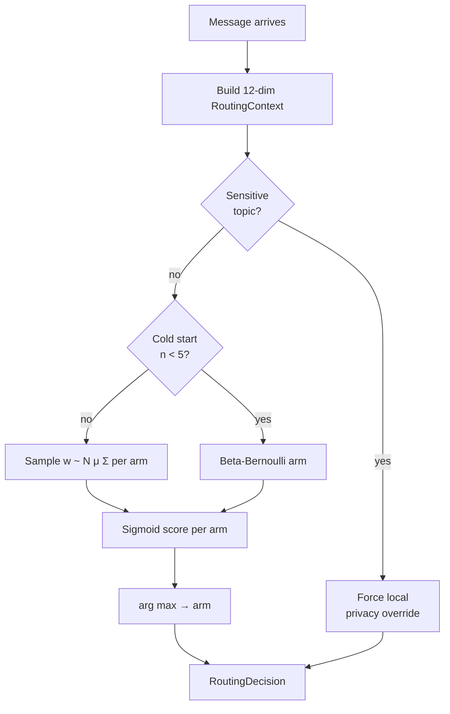

# Router

The router decides, per message, whether to respond with the on-device SLM
or the cloud LLM. It is a **contextual multi-armed bandit** — Bayesian
logistic regression with a Laplace-approximated posterior, sampled via
Thompson sampling, with hard privacy overrides.

!!! tip "Related reading"
    [Research: Bandit theory](../research/bandit_theory.md) develops the
    maths. [ADR 0003](../adr/0003-thompson-sampling-over-ucb.md) records
    why Thompson over UCB.

## Decision flow { #flow }



## The 12-dim context vector { #context }

Built by `i3/router/complexity.py` and `i3/router/sensitivity.py`:

| Index | Feature | Source |
|:-----:|:--------|:-------|
| 0 | Query length (log-scaled) | tokenizer |
| 1 | Rare-word density         | vocabulary |
| 2 | Question-word flag        | regex |
| 3 | Code-like content flag    | regex |
| 4 | Topic: health             | keyword set |
| 5 | Topic: finance            | keyword set |
| 6 | Cognitive-load estimate   | Layer 4 |
| 7 | Accessibility need        | Layer 4 |
| 8 | Session progress (normalised) | Layer 3 |
| 9 | Device pressure (memory / battery) | profiling |
|10 | Recent cloud-latency EMA  | telemetry |
|11 | User's prior local-win rate | router |

All features are squashed to \([-1, 1]\).

## Bayesian logistic regression { #blr }

Per arm \(a \in \{local, cloud\}\), a weight vector
\(w_a \in \mathbb{R}^{12}\) with posterior

\[
p(w_a \mid \mathcal{D}) \;\approx\; \mathcal{N}\!\left(w_a ;\; \mu_a, \Sigma_a\right)
\]

obtained by **Laplace approximation**: we refit \(\mu_a\) with
Newton–Raphson MAP and set

\[
\Sigma_a^{-1} = \Lambda_0 + \sum_i s_i (1 - s_i)\, x_i x_i^\top,
\qquad s_i = \sigma\!\left(\mu_a^\top x_i\right),
\]

where \(\Lambda_0 = \lambda I\) encodes the prior (`router.prior_variance`
in config). The refit cadence is configurable (default every 10 updates)
to cap compute.

## Thompson sampling step { #sampling }

```python
# Per arm, draw a weight sample, score, pick the max.
scores = []
for arm in arms:
    w = np.random.multivariate_normal(mu[arm], cov[arm])
    scores.append(sigmoid(w @ x))
arm_chosen = int(np.argmax(scores))
```

### Cold-start fallback

For the first \(n_0\) observations per arm (default 5) we fall back to
**Beta-Bernoulli** sampling on reward — cheap, model-free, and avoids
bad MAP estimates on tiny data.

## Privacy override { #override }

Before any sampling, the router checks `sensitivity.detect_sensitive(text)`
against a configurable keyword set (health, mental health, financial
credentials, security credentials). If any triggers, the router returns a
`RoutingDecision(arm="local", reason="privacy_override")`, bypassing the
Thompson sample.

!!! warning "The override is mandatory, not advisory"
    Overriding the override from outside the router — e.g. from an A/B test
    harness — is structurally impossible: the router returns a frozen
    dataclass, and the pipeline's typed dispatcher cannot route to cloud
    when `arm == "local"`.

## Reward signal { #reward }

The bandit's reward is a scalar \(\in [0, 1]\) composed of:

\[
r = \underbrace{\alpha_\text{lat}\, \phi(\text{latency})}_{\text{latency bonus}}
  + \underbrace{\alpha_\text{qual}\, q}_{\text{quality proxy}}
  - \underbrace{\alpha_\text{cost}\, c}_{\text{cloud cost}},
\]

with \(q\) derived from conversation continuation signals (did the user
continue within 30 s? did they send a short affirmation? did they
rephrase?) and \(c\) a cost estimate for the cloud call (0 for local).
Defaults: \(\alpha_\text{lat}=0.3, \alpha_\text{qual}=0.6, \alpha_\text{cost}=0.1\).

!!! note "Why online, not offline?"
    Every user drifts — preferences, device state, network cost. An
    offline-trained policy cannot adapt. Thompson naturally balances
    exploration and exploitation in the non-stationary regime.

## Telemetry { #telemetry }

The router emits OpenTelemetry spans (`router.decide`) with attributes:

- `router.arm_chosen`
- `router.privacy_override`
- `router.posterior_mean_local`
- `router.posterior_mean_cloud`
- `router.context_hash` (hash of the 12-dim vector, not the raw values)

and Prometheus counters:

- `i3_router_decisions_total{arm, override}`
- `i3_router_laplace_refit_seconds`
- `i3_router_reward`  (histogram)

See [Observability](../operations/observability.md).

## Testing { #testing }

The unit suite asserts:

- Posterior updates are symmetric and positive-definite.
- Newton–Raphson MAP converges within 15 iterations on synthetic data.
- Beta-Bernoulli cold-start falls back correctly when \(n < n_0\).
- Privacy override fires on every keyword in the set, and on no keyword
  outside it.
- Reward is bounded in \([0, 1]\) under all input combinations.

File: `tests/test_bandit.py` (18 tests).

## Further reading { #further }

- [Research: Bandit theory](../research/bandit_theory.md)
- [ADR 0003 — Thompson sampling over UCB](../adr/0003-thompson-sampling-over-ucb.md)
- [Privacy](privacy.md)
