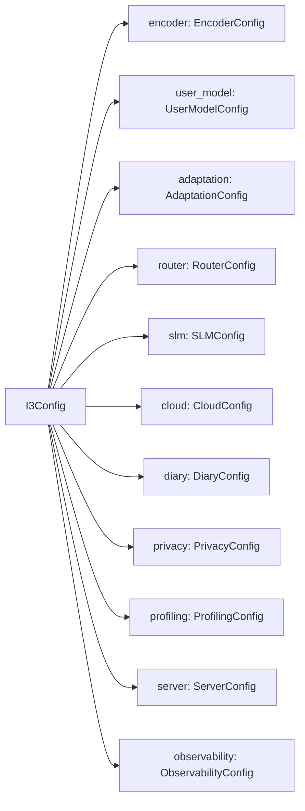

# Configuration

I³ centralises every runtime knob in a single Pydantic v2 config tree. This
page is a tour of the config schema, the overlay mechanism, and the
environment variables that override it.

!!! tip "Related reading"
    [ADR 0010 — Pydantic v2 config](../adr/0010-pydantic-v2-config.md)
    explains why the config is frozen, validated eagerly, and never mutated
    at runtime.

## Config shape { #shape }

The root `I3Config` model (see `i3/config.py`) is composed of 17 nested
submodels. Each submodel has `frozen=True`, field validators, and explicit
min/max bounds:



## Default config { #default }

`configs/default.yaml` is the source of truth. Highlights:

```yaml title="configs/default.yaml (excerpt)"
encoder:
  input_dim: 32
  hidden_dim: 64
  num_blocks: 4
  kernel_size: 3
  dilations: [1, 2, 4, 8]
  dropout: 0.1
  contrastive_tau: 0.07

router:
  n_arms: 2
  context_dim: 12
  prior_variance: 1.0
  laplace_refit_every: 10
  cold_start_n: 5
  sensitive_topics:
    - health
    - mental_health
    - financial_credentials
    - security_credentials

slm:
  vocab_size: 8192
  d_model: 256
  n_heads: 4
  n_layers: 4
  conditioning_tokens: 4
  max_seq_len: 512
  weight_tied: true
  quantize_int8: true

privacy:
  fernet_key_env: I3_ENCRYPTION_KEY
  pii_patterns:
    - email
    - phone
    - ssn
    - credit_card
    - iban
    - street_address
    - ip_address
    - url
    - dob
    - passport
```

See the file for the full schema; every field carries an inline comment.

## Overlay configs { #overlay }

The config loader accepts a primary file plus an optional overlay:

```python
from i3.config import load_config

# Production — full config
config = load_config("configs/default.yaml")

# Demo — overlays shallower models, smaller batch sizes
config = load_config("configs/default.yaml", overlay="configs/demo.yaml")
```

Overlays are deep-merged, not replaced. You can override a single field:

```yaml title="configs/demo.yaml"
slm:
  n_layers: 2
  max_seq_len: 128

profiling:
  latency_budget_ms: 500
```

## Environment variables { #env }

A small number of settings can (and some must) be supplied at runtime:

| Variable | Purpose | Required? |
|:---------|:--------|:---------:|
| `I3_ENCRYPTION_KEY`      | Fernet key for user profiles at rest. 32 url-safe base64 bytes. | Yes |
| `ANTHROPIC_API_KEY`      | Cloud LLM access. If unset, cloud routing returns 503. | Cloud only |
| `I3_CORS_ORIGINS`        | Comma-separated origins allowed for REST + WebSocket. | Yes in prod |
| `I3_DEMO_MODE`           | Enables `/demo/reset` and `/demo/seed`. Default off. | Demo only |
| `I3_CONFIG`              | Path to the primary config file. Default `configs/default.yaml`. | No |
| `I3_CONFIG_OVERLAY`      | Path to an overlay config file. | No |
| `I3_LOG_LEVEL`           | `DEBUG` / `INFO` / `WARNING` / `ERROR`. Default `INFO`. | No |
| `OTEL_EXPORTER_OTLP_ENDPOINT` | OTLP collector URL for traces/metrics. | No |

!!! warning "Secret hygiene"
    Never print or log `I3_ENCRYPTION_KEY` or `ANTHROPIC_API_KEY`. The app
    masks them in structured logs, but ad-hoc `print()` calls in user code
    will not.

## Validation rules { #validation }

A handful of the rules enforced by the config validators:

- `encoder.dilations` must be **monotonically non-decreasing**.
- `slm.d_model` must be divisible by `slm.n_heads`.
- `slm.max_seq_len ≤ 4096` (receptive-field sanity cap).
- `router.sensitive_topics` must be a non-empty subset of a whitelist.
- `server.cors_origins` must each parse as an HTTP(S) URL.
- `privacy.fernet_key_env` must name an environment variable that, at
  load-time, contains a valid Fernet key.

Load failure raises `pydantic.ValidationError` with every offending field,
its path, and an explanation. The server refuses to start on a bad config.

## Mutation discipline { #immutability }

The config is **frozen**: assigning to a field raises `pydantic.ValidationError`.
If you need to experiment, build a new config:

```python
from dataclasses import replace  # does NOT work for frozen Pydantic models

# Correct pattern: rebuild via model_copy + update
tighter = config.model_copy(update={
    "router": config.router.model_copy(update={"laplace_refit_every": 5})
})
```

This guarantees that hot-reload of a worker cannot mid-flight change the
encoder dimensions or the router's Bayesian prior.

## Further reading { #further }

- [Training](training.md) — which hyperparameters most affect model quality.
- [ADR 0010](../adr/0010-pydantic-v2-config.md) — why Pydantic v2 and `frozen=True`.
- [Observability](../operations/observability.md) — `ObservabilityConfig` deep dive.
