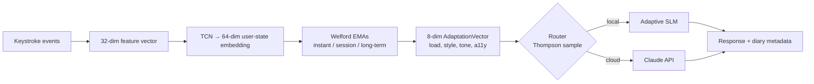

# Quickstart

Five minutes from a clean clone to a running, adapting AI companion in your
browser. No training required — the repository ships with a lightweight demo
checkpoint and pre-seeded user profiles.

!!! tip "Prefer scripting?"
    The Python API is a single `async` call: see
    [Python SDK](../api/python.md) or the `make demo` target below.

## Five-step tour { #five-step }

### 1. Install { #step-1 }

```bash
git clone https://github.com/abailey81/implicit-interaction-intelligence.git
cd implicit-interaction-intelligence
./scripts/setup.sh
```

The setup script runs `poetry install`, copies `.env.example` to `.env`, and
generates a Fernet encryption key. Full details in [Installation](installation.md).

### 2. Launch the demo { #step-2 }

```bash
make demo
```

`make demo` does three things:

1. Seeds the diary with a pre-built user profile (`demo_user`).
2. Starts the FastAPI server on `127.0.0.1:8000`.
3. Opens your default browser to the dark-theme SPA.

### 3. Interact { #step-3 }

Type a message. Anything. The longer you type, the more signal the encoder
has to work with. Try these in sequence:

| # | Message | What to look for |
|:--|:--------|:-----------------|
| 1 | `Hello` | Cold-start baseline — cognitive-load gauge mid-range |
| 2 | `Can you explain how a TCN's receptive field is computed?` | Higher complexity → gauges move, route may stay local |
| 3 | *(type the same question slowly, with lots of corrections)* | Motor-accessibility score rises, response simplifies |
| 4 | `I'm feeling overwhelmed and need something gentle` | Emotional-tone warmth rises; topic sensitivity may trigger |
| 5 | `Can you summarise what I've been talking about?` | Session-summary reply from metadata only |

### 4. Observe { #step-4 }

The dashboard on the right-hand side shows live:



Each response is tagged with:

- **Route** — `local` or `cloud`, chosen by the Thompson sample.
- **Latency** — total pipeline wall-clock time.
- **Adaptation gauges** — cognitive load, style mirror, warmth,
  accessibility.
- **State embedding** — the 64-dim encoder output reduced to 2-D with a
  cached PCA projection.

### 5. Inspect { #step-5 }

```bash
# While the server runs, query any endpoint:
curl -s http://127.0.0.1:8000/user/demo_user/stats | jq
curl -s http://127.0.0.1:8000/profiling/report | jq
```

See [REST API](../api/rest.md) for the full endpoint catalogue.

## Using the Python SDK directly { #python-sdk }

```python title="examples/hello.py" linenums="1"
import asyncio

from i3.config import load_config
from i3.pipeline.engine import PipelineEngine
from i3.pipeline.types import PipelineInput


async def main() -> None:
    config = load_config("configs/default.yaml")
    engine = await PipelineEngine.create(config)

    out = await engine.process(PipelineInput(
        user_id="alice",
        message="Can you explain how TCNs work?",
        keystroke_intervals_ms=[120, 145, 98, 210, 88, 112, 155, 95],
        timestamp=1712534400.0,
    ))

    print(f"Route:       {out.route}")
    print(f"Latency:     {out.latency_ms:.1f} ms")
    print(f"Cog. load:   {out.adaptation.cognitive_load:.2f}")
    print(f"Response:    {out.response}")


asyncio.run(main())
```

Run it:

```bash
poetry run python examples/hello.py
```

## What to try next { #next }

<div class="i3-grid" markdown>

<div class="i3-card" markdown>
### :material-tune-vertical: Tune the config
Open [Configuration](configuration.md) to understand every knob — from
encoder dropout to Thompson posterior refit cadence.
</div>

<div class="i3-card" markdown>
### :material-school-outline: Retrain
Go end-to-end from synthetic data generation to evaluation with
[Training](training.md).
</div>

<div class="i3-card" markdown>
### :material-source-branch: Inspect the architecture
[Architecture Overview](../architecture/overview.md) walks the seven
layers with Mermaid diagrams and module-level links.
</div>

<div class="i3-card" markdown>
### :material-cloud-outline: Deploy
[Deployment](../operations/deployment.md), [Docker](../operations/docker.md),
and [Kubernetes](../operations/kubernetes.md) cover production rollouts.
</div>

</div>

!!! warning "Demo mode endpoints"
    `make demo` sets `I3_DEMO_MODE=true`, which enables `/demo/reset` and
    `/demo/seed`. **Never set this flag in production** — an unauthenticated
    `POST` to `/demo/reset` would wipe every profile.
