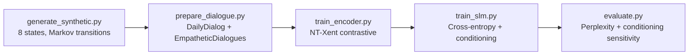

# Training

This page covers the full training pipeline: data generation, the TCN
encoder's contrastive phase, the SLM's language-model phase, and evaluation.

!!! tip "Pre-trained checkpoints"
    A demo checkpoint is shipped with the repository so you can skip
    training entirely — see the [Quickstart](quickstart.md). Read on if you
    want to train from scratch, compare runs, or modify the objectives.

## Pipeline overview { #pipeline }



All steps are exposed both as `make` targets and as Poetry entry points.

## One-command end-to-end { #one-command }

```bash
make train-all
```

Runs data generation → encoder training → SLM training → evaluation in
sequence. Expected wall-clock on a modern laptop CPU: ~2.5 hours. On a
single RTX 4090: ~5 minutes.

## Step 1 — Synthetic data generation { #step-1 }

```bash
make generate-data
# or
poetry run i3-generate-data \
    --output data/synthetic/ \
    --n-sessions 10000 \
    --seed 42
```

The generator samples **eight user states** with a Markov transition matrix
and emits interaction traces (keystroke intervals, message composition
latencies, edit counts) consistent with each state. Output layout:

```
data/synthetic/
├── train.jsonl            80% of sessions
├── val.jsonl              10%
├── test.jsonl             10%
└── manifest.json          state counts, seeds, generator version
```

!!! note "Why synthetic?"
    Real keystroke corpora with consent are small and noisy. Synthetic data
    gives us full ground truth (which state produced which session) for the
    contrastive objective. See
    [ADR 0002 — TCN over LSTM/Transformer](../adr/0002-tcn-over-lstm-transformer.md).

## Step 2 — Encoder (TCN, NT-Xent) { #step-2 }

```bash
make train-encoder
# or
poetry run i3-train-encoder \
    --config configs/default.yaml \
    --data data/synthetic/ \
    --out checkpoints/tcn.pt \
    --epochs 40
```

### Objective

Augmented views of the same session pull together, different sessions push
apart. The NT-Xent loss with temperature \(\tau\) over a batch of \(2N\)
augmented views is:

\[
\mathcal{L}_\text{NT-Xent} = -\frac{1}{2N}\sum_{i=1}^{2N}
    \log \frac
        { \exp\!\big(\mathrm{sim}(z_i, z_{j(i)}) / \tau \big) }
        { \sum_{k \neq i} \exp\!\big(\mathrm{sim}(z_i, z_k) / \tau\big) }
\]

where \(z_i = f_\theta(x_i)\) is the encoder output, \(j(i)\) is the
positive-pair index, and \(\mathrm{sim}(u,v) = u^\top v / (\|u\|\|v\|)\).

### Augmentations

- **Temporal crop** — random sub-window of the session.
- **Feature jitter** — Gaussian noise on keystroke-interval features
  (\(\sigma = 0.05 \cdot \sigma_\text{feat}\)).
- **Random mask** — drop one feature group per view.

### Hyperparameter table

| Hyperparameter | Default | Range | Notes |
|:---------------|--------:|:------|:------|
| `contrastive_tau`        | 0.07 | 0.05–0.2 | Lower = sharper |
| `batch_size`             | 256  | 64–1024 | 2N views → keep memory |
| `lr`                     | 3e-4 | 1e-4–1e-3 | AdamW |
| `weight_decay`           | 1e-4 | — | |
| `warmup_steps`           | 500  | — | Cosine warmup, custom scheduler |
| `dropout`                | 0.1  | 0–0.3 | |

## Step 3 — SLM (cross-entropy + conditioning) { #step-3 }

```bash
make train-slm
# or
poetry run i3-train-slm \
    --config configs/default.yaml \
    --encoder checkpoints/tcn.pt \
    --data data/dialogue/ \
    --out checkpoints/slm.pt \
    --epochs 8
```

### Objective

Standard next-token cross-entropy, but with **every transformer block
receiving the user-state conditioning tokens** via cross-attention:

\[
\mathcal{L}_\text{LM}(\theta; x, c) = -\sum_{t=1}^{T}
    \log p_\theta\!\left(x_t \mid x_{<t}, c\right)
\]

where \(c = \text{ConditioningProjector}([a; u]) \in \mathbb{R}^{4 \times 256}\)
projects the concatenation of the 8-dim adaptation vector \(a\) and the
64-dim user-state embedding \(u\) to four conditioning tokens.

!!! note "Why four tokens?"
    Empirically, one token loses style/tone granularity; eight doubles
    memory with negligible perplexity gain. See
    [ADR 0001 — Custom SLM](../adr/0001-custom-slm-over-huggingface.md)
    and the [research note on cross-attention](../research/cross_attention.md).

### Conditioning ablation

The evaluator supports three conditioning modes for comparison:

| Mode | Flag | Description |
|:-----|:-----|:-----------|
| `full`    | default | All 4 tokens, every layer |
| `prefix`  | `--conditioning prefix` | Tokens as prompt prefix only |
| `none`    | `--conditioning none`   | Baseline, no conditioning |

Compared perplexities on the validation split are reported by `make evaluate`.

## Step 4 — Evaluation { #step-4 }

```bash
make evaluate
# or
poetry run i3-evaluate \
    --config configs/default.yaml \
    --checkpoint checkpoints/slm.pt \
    --data data/dialogue/test.jsonl
```

Reports include:

- **Validation perplexity** — overall and per user-state bucket.
- **Conditioning sensitivity** — \(\Delta\text{ppl}\) across the three
  ablation modes above.
- **Adaptation vector diversity** — average pairwise cosine distance
  between conditioning tokens across users (high diversity → the model
  uses the signal).
- **Edge budget check** — INT8 size and P50/P95/P99 generation latency.

Example output:

```
============================================================
  I³ Evaluation — checkpoints/slm.pt
============================================================
validation_ppl        18.42
ppl_by_state          mean 18.10  std 1.22
conditioning_none     21.95    (+19.2%)
conditioning_prefix   19.87    (+7.9%)
conditioning_full     18.42    baseline
int8_size_mb          6.94
latency_ms_p50        143
latency_ms_p95        181
latency_ms_p99        205
============================================================
```

## Reproducibility { #repro }

Every script accepts `--seed`, writes its config snapshot into the
checkpoint, and records the git commit hash in `manifest.json`. To
reproduce a training run exactly:

```bash
poetry run i3-train-slm \
    --checkpoint checkpoints/slm.pt \
    --resume-from-manifest
```

## Further reading { #further }

- [Research: Contrastive loss](../research/contrastive_loss.md) — the
  full derivation of NT-Xent and our view-construction choices.
- [Research: Cross-attention](../research/cross_attention.md) — why
  per-layer cross-attention beats prompt prefixing.
- [Model Card](../model_card.md) — training data, metrics, and ethical
  considerations for the shipped SLM.
