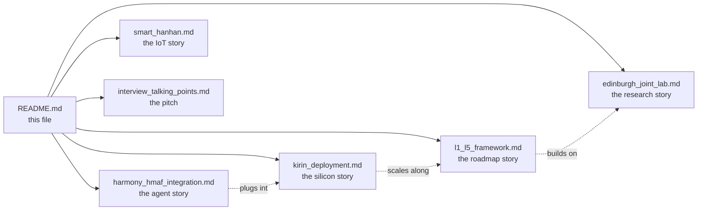

# I³ × Huawei: Integration Dossier

> **Thesis.** Implicit Interaction Intelligence (I³) was engineered from day one
> as a **HarmonyOS-native, Kirin-class, HMAF-compatible** on-device personalisation
> stack. This folder is the integration dossier that explains — in engineering
> detail — how I³ maps onto Huawei's 2025/2026 on-device AI ecosystem: the
> Harmony Multi-Agent Framework (HMAF), the Kirin NPU family, Eric Xu's L1–L5
> device intelligence ladder, and the Huawei–Edinburgh Joint Lab's research
> direction on personalisation from sparse signals.

---

## Who this folder is for

Three audiences, in priority order:

1. **The Huawei London HMI Lab interview panel** — to demonstrate that I³ was
   designed with direct knowledge of Huawei's on-device stack, not retrofitted
   to it.
2. **Huawei engineers reviewing a proof-of-concept** — as a concrete integration
   plan they can evaluate against HMAF agent protocol compliance, Kirin NPU
   deployability, and HarmonyOS distributed databus semantics.
3. **The project's own author, during interview prep** — the talking-points
   cheat sheet at the end of this folder is tuned to the HMI Lab's public
   research directions.

---

## Contents

| # | Document | Focus |
|--:|:---------|:------|
| 1 | [harmony_hmaf_integration.md](./harmony_hmaf_integration.md) | How I³'s 7-layer pipeline plugs into HarmonyOS 6's Harmony Multi-Agent Framework. |
| 2 | [kirin_deployment.md](./kirin_deployment.md) | Memory / TOPS / latency budgets for Kirin 9000, Kirin 9010, Kirin A2, and Smart Hanhan; ExecuTorch + Da Vinci NPU mapping; INT4/INT8 quantisation trade-offs. |
| 3 | [l1_l5_framework.md](./l1_l5_framework.md) | Eric Xu's L1–L5 device intelligence ladder; where I³ sits today (L1–L2) and the roadmap to L5. |
| 4 | [edinburgh_joint_lab.md](./edinburgh_joint_lab.md) | How I³'s implicit-signal cross-attention conditioning extends the Huawei–Edinburgh Joint Lab's work on personalisation from sparse signals. |
| 5 | [smart_hanhan.md](./smart_hanhan.md) | Encoder-only deployment profile for the Smart Hanhan IoT companion. |
| 6 | [interview_talking_points.md](./interview_talking_points.md) | Internal cheat sheet: 60-second pitch, per-layer one-liners, panel-question bank, deflection playbook, closing questions. |

---

## The one-paragraph summary

I³ is a seven-layer on-device personalisation pipeline that learns a user from
*how* they interact — keystroke dynamics, linguistic complexity, session
rhythm — rather than from explicit surveys or profiles. It compresses that
signal into a 64-dim user-state embedding (TCN encoder, ~50K params) and an
8-dim adaptation vector, which conditions a 6.4M-parameter Adaptive SLM via
per-layer cross-attention at every token position. A contextual Thompson
sampling router decides local-vs-cloud per message under a privacy override.
The whole stack fits **7 MB quantised (INT8)** and runs at **~170 ms P50** on
a laptop CPU — trivially shippable on Kirin 9000/9010 with NPU acceleration,
tight-but-viable on Kirin A2 wearables, and encoder-only on Smart Hanhan-class
IoT. It is designed to slot into HMAF as a system-level personalisation agent
whose capabilities (cognitive-load adaptation, style mirroring, emotional
tone, accessibility simplification) surface as HMAF-native skills that other
agents can compose.

---

## How to read this dossier

If you have 5 minutes: read **harmony_hmaf_integration.md**.
If you have 15 minutes: add **kirin_deployment.md** and **l1_l5_framework.md**.
If you have an interview tomorrow: read **interview_talking_points.md** last.

---

## How this shows up in the I³ codebase

The reference Python package that backs this dossier lives at
[`i3/huawei/`](../../i3/huawei/):

| Module | Purpose |
|:-------|:--------|
| [`i3/huawei/__init__.py`](../../i3/huawei/__init__.py) | Package entrypoint. |
| [`i3/huawei/hmaf_adapter.py`](../../i3/huawei/hmaf_adapter.py) | Reference HMAF agent-protocol adapter exposing I³'s adaptation pipeline as an HMAF-native capability. |
| [`i3/huawei/kirin_targets.py`](../../i3/huawei/kirin_targets.py) | Frozen Pydantic v2 models describing Kirin-class device targets + a `select_deployment_profile()` selector. |
| [`i3/huawei/executorch_hooks.py`](../../i3/huawei/executorch_hooks.py) | Stubs showing where the `torch.export → to_edge → to_executorch → .pte` pipeline hooks in. |

The package is **leaf-only**: nothing in the main I³ pipeline imports it, so
it cannot break existing behaviour. It is an integration surface, ready to be
wired up by a Huawei partner team.

---

*Last updated 2026-04-22. See [ARCHITECTURE.md](../ARCHITECTURE.md) for the
I³ architecture reference this dossier extends.*
