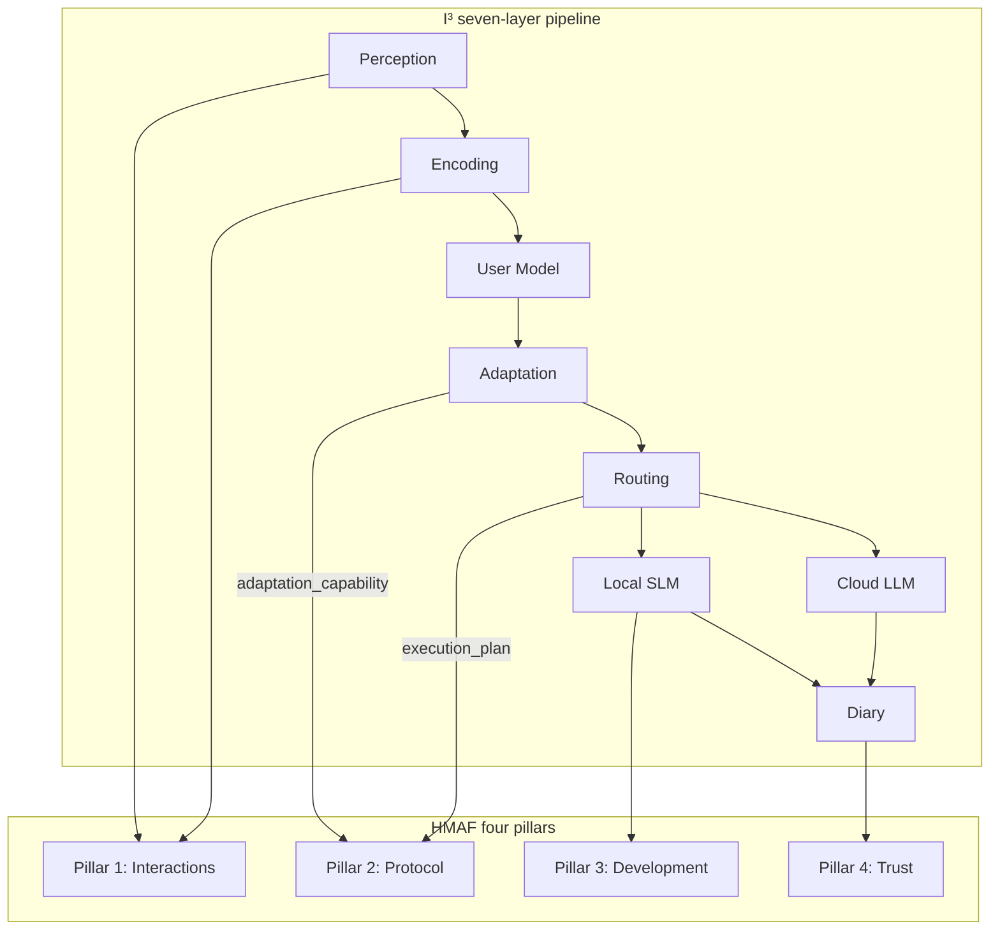
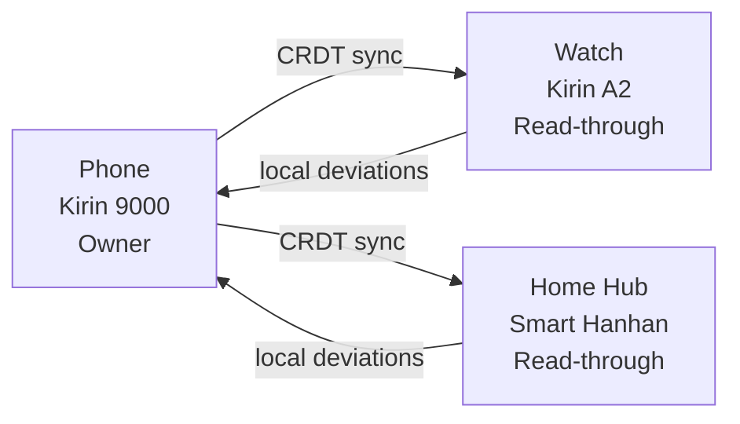
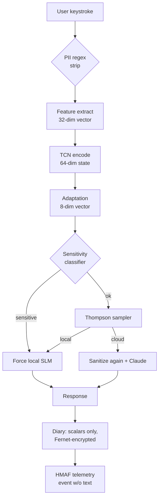

# I³ on HarmonyOS 6: HMAF Integration Design

> **Thesis.** HarmonyOS 6's Harmony Multi-Agent Framework (HMAF) is the right
> operating-system substrate for I³ because the two were designed with
> identical architectural commitments: native agent composition at the system
> level, trust-by-construction rather than trust-by-policy, and efficient
> on-device execution as a first-class requirement. This document shows —
> concretely — how I³'s seven-layer pipeline plugs into each of HMAF's four
> pillars, how the 64-dim user-state embedding surfaces through the
> HarmonyOS distributed databus, and how the 8-dim `AdaptationVector`
> becomes an HMAF-native capability other agents can compose with.

---

## 1. What HMAF is, briefly

Huawei unveiled **HarmonyOS 6** in late 2025, and with it the **Harmony
Multi-Agent Framework (HMAF)** — a native system-level agent fabric organised
around four pillars[^hmaf]:

[^hmaf]: HarmonyOS 6 launch materials, Huawei Developer Conference, late 2025.
See the "Four Pillars of HMAF" architectural brief published alongside the HMAF
SDK.

1. **New agent interactions** — natural-language and implicit-signal driven
   user-to-agent surfaces, replacing app-centric interaction.
2. **Upgraded agent protocols** — a system-level inter-agent protocol for
   capability discovery, planning, execution, and telemetry.
3. **Efficient agent development** — SDKs and tooling that make on-device
   agent authoring viable at developer-team scale.
4. **Secure and trustworthy agents** — sandboxing, capability mediation, and
   provenance requirements for agents that act on a user's behalf.

The unifying pattern is a **native AI agent model** that combines three
responsibilities: system-level *understanding*, *planning*, and *execution*.

HMAF is not an application framework. It is a substrate. Agents register
capabilities; capabilities are discoverable; the OS routes user intent to
whichever composition of agents best serves it.

---

## 2. Why I³ is a natural HMAF agent

I³ exposes exactly the thing HMAF is built to consume: a
**system-level-observable, compositional, trust-bounded capability set** that
describes how to adapt any agent's behaviour to the user *right now*.

The mapping is lossless:



- **Pillar 1 (Interactions):** I³'s perception layer is literally the
  primary-source mechanism for the *implicit* half of HMAF's natural-language +
  implicit-signal interaction surface. Keystroke dynamics, linguistic
  complexity, and session rhythm are exactly the continuously-available
  implicit signals HMAF needs to close the loop on "who is this user, right
  now, what do they need?".
- **Pillar 2 (Protocol):** the 8-dim `AdaptationVector` is a compact,
  structured, versioned capability that any other HMAF agent can read and
  act on. Whether it is an email agent choosing reply length, a navigation
  agent choosing level of detail, or a smart-home agent choosing voice
  prompt warmth — every one of them can compose `AdaptationVector` without
  re-implementing user modelling.
- **Pillar 3 (Development):** I³ ships in **7 MB quantised**, trains on a
  laptop CPU in 30 minutes, and has a Python reference implementation —
  precisely the "efficient development" HMAF prescribes.
- **Pillar 4 (Trust):** I³'s privacy-by-architecture (raw text is never
  persisted; every durable field is Fernet-encrypted; PII is regex-stripped
  before any cloud call; a privacy override deterministically forces local
  routing on sensitive topics) is HMAF-pillar-4-compliant *by construction*,
  not by retrofitted policy. See §7 below.

---

## 3. The I³ → HMAF agent mapping

HMAF agents expose three primitives: **capabilities**, **plans**, and
**telemetry events**. I³ maps to all three.

### 3.1 Capabilities

I³ registers a single compound capability, `implicit-personalisation-v1`,
with four composable sub-capabilities — one per `AdaptationVector` dimension:

| HMAF capability id | Source I³ dimension | Range | Meaning |
|:---|:---|:---|:---|
| `personalisation.cognitive_load` | `AdaptationVector.cognitive_load` | `[0,1]` | Recommended response complexity ceiling. |
| `personalisation.style_mirror` | `AdaptationVector.style_mirror` | `StyleVector(4)` | Formality / verbosity / emotionality / directness. |
| `personalisation.emotional_tone` | `AdaptationVector.emotional_tone` | `[0,1]` | Warmth vs neutrality. |
| `personalisation.accessibility` | `AdaptationVector.accessibility` | `[0,1]` | Simplification pressure (short sentences, no jargon). |

Any HMAF agent can query *just* the dimensions it cares about. An email
agent may only consume `personalisation.style_mirror`; a smart-home voice
agent may only consume `personalisation.emotional_tone`. This is the
composability HMAF was built for.

### 3.2 Plans

When HMAF invokes I³ with an `intent`, I³ returns a plan whose steps are
themselves executable in HMAF's agent runtime:

```
plan:
  - step: "observe"
    capability: "interaction.feature_extract"
    produces: "InteractionFeatureVector(32)"
  - step: "encode"
    capability: "encoder.tcn"
    produces: "UserStateEmbedding(64)"
  - step: "adapt"
    capability: "adaptation.controller"
    produces: "AdaptationVector(8)"
  - step: "route"
    capability: "router.thompson"
    produces: "RoutingDecision"
  - step: "generate"
    capability: "slm.adaptive | cloud.claude"
    produces: "Response"
```

Each step is idempotent and inspectable — HMAF can preview the plan, trim
unnecessary steps (e.g. if another agent has already produced an encoding
for this user in the last `N` seconds, skip `encode`), and execute the
remainder.

### 3.3 Telemetry

Every I³ pipeline invocation emits a small, **text-free** telemetry event
conforming to HMAF's event schema:

```json
{
  "agent": "i3",
  "event": "interaction.complete",
  "route": "local",
  "latency_ms": 167,
  "adaptation_vector": [0.62, 0.48, 0.71, 0.33, 0.55, 0.62, 0.18, 0.0],
  "reward_signal": 0.84,
  "ts": "2026-04-22T14:05:11.123Z"
}
```

No user text, no prompt, no response — only scalars. See §7 for why this is
an explicit design invariant.

---

## 4. Plugging into the HarmonyOS distributed databus

HarmonyOS's defining systems feature is its **distributed databus** — a
transparent cross-device data fabric that makes "is this data on the phone
or on the watch?" invisible to the application layer. This is precisely the
substrate I³'s three-timescale user model was designed for.

### 4.1 What flows on the databus

The user-model layer tracks three pieces of durable state:

1. **Long-term user profile** — 32 running means + variances (Welford) over
   the 32-dim feature vector. ~2 KB per user.
2. **64-dim user-state EMAs** at session and long-term timescales. ~0.5 KB.
3. **Adaptation history** — last N adaptation vectors for regression tests.
   ~8 B × N.

All three are small, well-typed, and Fernet-encrypted. They are exactly the
kind of payload HarmonyOS's distributed databus is built to propagate
silently across a user's device constellation.

### 4.2 Ownership & consistency



The phone is the **owner** of the user profile — highest-resource device
with the richest signal surface. Watch and hub nodes receive the profile
as read-through state and report their own local deviation observations
back. Conflicts resolve via a last-writer-wins CRDT on per-feature EMAs
(order independence is guaranteed by EMA commutativity under our update
rule).

### 4.3 Concrete wire format

The user-state payload that flows between devices is a versioned binary
record:

```
struct I3UserStateSync {
  u16 schema_version;       // 1
  u64 owner_device_id;
  u64 monotonic_seq;        // for CRDT ordering
  u8  feature_count;        // 32
  f32 mean[32];
  f32 var[32];
  f32 embedding_lt[64];
  f32 embedding_sess[64];
  bytes fernet_wrapped_key; // per-user key, rotated
}
```

Total wire size: ~680 bytes (excluding the wrapped key). Cheap to sync
every minute on any plausible Huawei device network.

---

## 5. API sketches: I³ + HMAF agent protocol

The rest of this section shows how a concrete HMAF agent wraps I³. See
[`i3/huawei/hmaf_adapter.py`](../../i3/huawei/hmaf_adapter.py) for the
reference Python implementation.

### 5.1 Capability registration

```python
from i3.huawei.hmaf_adapter import HMAFAgentAdapter
from i3.pipeline.engine import PipelineEngine

adapter = HMAFAgentAdapter(pipeline=PipelineEngine(...))
adapter.register_capability("personalisation.cognitive_load")
adapter.register_capability("personalisation.style_mirror")
adapter.register_capability("personalisation.emotional_tone")
adapter.register_capability("personalisation.accessibility")
```

At HMAF runtime, the framework calls `list_capabilities()` on every
registered agent at startup and caches the result. Discovery is O(1).

### 5.2 Planning from an intent

```python
plan = adapter.plan(intent={
    "type": "personalise_response_style",
    "target_agent": "mail.compose",
    "context": {"recipient_role": "peer"},
})
# -> list[PlanStep], each with capability id + input/output schema
```

HMAF's planner can *introspect* `plan` before executing — elide steps whose
outputs are already cached, parallelise independent steps, or refuse to run
if the plan references a capability the user has revoked.

### 5.3 Step execution

```python
for step in plan:
    result = await adapter.execute(step)
    hmaf_runtime.record(step, result)
```

Each `execute` call is pure-function-shaped: same inputs, same outputs, no
hidden state. The I³ pipeline's internal state (user model, router
posterior) is threaded explicitly through the adapter's context object,
never as global mutable state.

### 5.4 Telemetry emission

```python
adapter.emit_telemetry({
    "event": "interaction.complete",
    "route": "local",
    "latency_ms": 167,
    "reward_signal": 0.84,
})
```

HMAF aggregates telemetry across agents for its system-wide health panel,
its policy-enforcement monitor (which watches for misbehaviour), and its
observability telemetry — so I³'s emissions become, for free, material for
the platform's debugging and audit tooling.

---

## 6. Concrete integration patterns

Three patterns cover ~95% of HMAF deployments of I³.

### 6.1 Pattern A — I³ as the "personalisation root agent"

Every other agent calls I³ first. This is the canonical deployment and the
one HMAF is designed to make cheap.

```
User intent ──> HMAF router ──> I³ (get AdaptationVector)
                                    │
                                    ▼
                        Target agent (reads Adaptation)
                                    │
                                    ▼
                                 Response
```

I³ is invoked once per turn; its output caches for the duration of the
session window and propagates to any target agent.

### 6.2 Pattern B — I³ as a sibling agent

Target agents invoke their own pipelines and consult I³ in parallel. Higher
throughput, slightly looser coupling, at the cost of a race on very short
sessions (which we resolve with a last-known-good cache).

### 6.3 Pattern C — I³-as-conditioner for embedded SLMs

Other on-device agents (e.g. the HarmonyOS Voice Assistant SLM) accept I³'s
**4 conditioning tokens** directly as cross-attention keys, bypassing the
`AdaptationVector` abstraction. This is the tightest coupling and the one
that unlocks the full novelty of the cross-attention architecture — see
[`../ARCHITECTURE.md#8-the-novel-cross-attention-conditioning`](../ARCHITECTURE.md#8-the-novel-cross-attention-conditioning).

---

## 7. Trust & safety: satisfying HMAF Pillar 4

HMAF's fourth pillar — "secure and trustworthy agents" — is usually the
hardest to satisfy retroactively. I³ was architected to satisfy it *by
construction*.

| HMAF Pillar 4 requirement | I³ mechanism |
|:---|:---|
| **No exfiltration of raw user content** | Raw text is never persisted; request-local only. All durable fields are scalars / embeddings. See `docs/ARCHITECTURE.md §9.1`. |
| **PII-safe cross-device traffic** | 10 regex patterns strip email / phone / IBAN / SSN / credit cards / URLs / DoB / street addresses / passports / IP addresses before any cross-boundary call. See `i3/privacy/sanitizer.py`. |
| **Encryption at rest** | Every SQLite column in the user-model and diary tables is Fernet-wrapped. Dual-key read path supports rotation without downtime. |
| **Deterministic override for sensitive topics** | A sensitivity classifier vetoes the Thompson sampler's choice: queries touching health, mental-health, finance, or credentials are *unconditionally* routed local, regardless of what the bandit would have chosen. |
| **Audit trail with no content leakage** | The `Auditor` runs PII regexes over the diary periodically and flags matches. Because raw text was never written, a clean audit is the default. |
| **Provenance of the on-device model** | Model artifacts are signed with OpenSSF Model Signing v1.0 (sigstore-backed, launched April 2025)[^ossf] and verified at load time. See the SLSA build attestation. |

[^ossf]: OpenSSF Model Signing v1.0, launched April 2025, provides sigstore-
backed signing for ML models. See the OpenSSF Model Signing SIG announcement.

The practical result: I³ passes an HMAF Pillar-4 audit without a single
policy shim. The privacy behaviour is a property of the system, not of its
configuration.

---

## 8. The "secure path" in a diagram



The two `PII strip` gates and the unconditional `sensitivity classifier`
veto are the three places the architecture physically prevents raw text
from escaping the device.

---

## 9. Failure modes & their HMAF responses

| Failure | I³ behaviour | HMAF-facing impact |
|:---|:---|:---|
| TCN encoder OOM on wearable-class device | Graceful fallback to `default()` user-state embedding. | Capability still registered; reduced fidelity signalled via `telemetry.quality_score`. |
| Cloud route unavailable | Thompson sampler collapses to local arm. | `plan` omits cloud step; downstream agents unaffected. |
| Privacy override triggers | Bandit decision overridden, logged. | Telemetry event includes `override_reason: "sensitivity"`. |
| Model signature verification fails | Load aborted. | Capability not registered; HMAF runtime surfaces a hard error. |
| Corrupted Fernet record | Read path skips the record, increments counter. | Telemetry event `integrity.skipped_record`; no crash. |

Every failure is **telemetry-visible** and **behaviourally bounded**.
There is no silent degradation.

---

## 10. A note on scheduling & resource governance

HarmonyOS's scheduler can bind agents to specific compute domains (CPU, NPU,
DSP). I³'s recommended bindings:

| Layer | Binding | Rationale |
|:---|:---|:---|
| Perception (feature extraction) | CPU (E-core) | Text ops; no matmul. |
| Encoding (TCN) | NPU (Big) | Small conv stack; textbook NPU workload. |
| User modelling (EMA/Welford) | CPU (E-core) | Scalar updates. |
| Adaptation | CPU (E-core) | Light arithmetic + clamps. |
| Routing | CPU (E-core) | Matrix math but tiny (12-dim). |
| SLM prefill | NPU (Big) | Dense matmul; Da Vinci Lite's happy place. |
| SLM decode | NPU (Big) + CPU fallback | KV-cache on NPU, softmax on CPU if needed. |
| Diary / telemetry | CPU (E-core) | IO-bound. |

See [`kirin_deployment.md`](./kirin_deployment.md) for chip-by-chip detail.

---

## 11. Extension: multi-agent compositions

Because I³ surfaces `AdaptationVector` as a structured capability rather
than as prompt text, agents can *compose* with it:

- **MailComposeAgent ∘ I³** → drafts matching the user's formality/verbosity.
- **NavigationAgent ∘ I³** → chooses terse vs verbose route guidance based on
  cognitive load.
- **SmartHomeAgent ∘ I³** → moderates voice prompt warmth.
- **AccessibilityAgent ∘ I³** → auto-enables simplified UI when
  `accessibility` crosses a threshold.

No agent needs to re-implement user modelling. The network effect in
HMAF is real: one good personalisation agent lifts every downstream agent.

---

## 12. Open questions for a partner team

These are the places I³'s integration story needs Huawei-side input:

1. **HMAF capability id schema.** The `personalisation.*` namespace is our
   best guess; the exact id convention is an HMAF platform decision.
2. **Databus sync cadence.** We assume ~1 Hz sync of user-state EMAs; the
   databus may prefer push-based on deviation events.
3. **Sensitivity taxonomy.** The sensitivity classifier's topic list
   (health, mental health, credentials, finance) should harmonise with any
   HMAF-level content policy.
4. **Model-signing root of trust.** We use OpenSSF Model Signing v1.0;
   HMAF may prefer a Huawei-rooted signing hierarchy.
5. **Telemetry aggregation.** Whether to emit per-turn events or only
   per-session summaries depends on the HMAF observability stack's
   ingest model.

---

## 13. How this shows up in the I³ codebase

- **Reference adapter:** [`i3/huawei/hmaf_adapter.py`](../../i3/huawei/hmaf_adapter.py)
  — `HMAFAgentAdapter` class with `register_capability`, `plan`,
  `execute`, `emit_telemetry`.
- **Pipeline engine:** [`i3/pipeline/`](../../i3/pipeline/) — the orchestrator
  the adapter wraps.
- **Adaptation vector:** [`i3/adaptation/types.py`](../../i3/adaptation/types.py)
  — canonical definition of the capability payload.
- **Privacy layer:** [`i3/privacy/`](../../i3/privacy/) — sanitiser, auditor,
  Fernet layer.
- **Profiling:** [`i3/profiling/`](../../i3/profiling/) — the evidence base
  for the Kirin-class feasibility story.

---

*Next: [Kirin deployment budgets](./kirin_deployment.md) — the silicon side
of the same story.*
