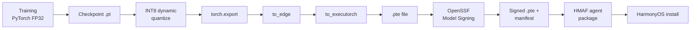

# I³ on Kirin: Deployment Budgets and NPU Mapping

> **Thesis.** I³ is not "edge-capable in principle" — it is **Kirin-deployable
> today**, at 7 MB quantised, with a parameter budget that maps cleanly onto
> Da Vinci NPU kernels and a runtime path through Meta/PyTorch's ExecuTorch
> to `.pte` artefacts. This document quantifies the fit: TOPS, memory, and
> latency budgets for Kirin 9000, Kirin 9010, Kirin A2, and Smart Hanhan;
> a sub-model-to-chip mapping for I³'s three networks; an ExecuTorch
> op-coverage analysis; and a concrete INT8-vs-INT4 quantisation comparison.

---

## 1. Kirin hardware landscape, 2024–2026

| Chip | Launch | CPU | NPU | TDP (sustained) | Typical platform |
|:---|:---|:---|:---|:---|:---|
| **Kirin 9000** | 2020, refined 2024 | Cortex-A77 + A55 octa-core | HiSilicon Da Vinci, **1 Big core + 1 Tiny core**[^k9000] | ~5 W peak, ~1 W NPU | Flagship phones |
| **Kirin 9010** | Q2 2024 | Taishan big core up to **2.3 GHz**, **2+6+4 big-LITTLE-LITTLE**[^k9010] | Da Vinci Lite, **2048 FP16 MACs + 4096 INT8 MACs**[^davinci] | ~4 W peak, ~1 W NPU | Pura 70 / flagship tablets |
| **Kirin A2** | 2023+ | Low-power dual-core ARM | Lite NPU (~0.5 TOPS est.) | ~0.5 W | Watches, bands |
| **Smart Hanhan** | IoT category | MCU-class | DSP or nothing | <0.3 W | Companion gadgets, home sensors |

[^k9000]: Kirin 9000 specification: HiSilicon Da Vinci architecture, 1 Big
NPU core + 1 Tiny NPU core.
[^k9010]: Kirin 9010 specification: Q2 2024 launch, 2+6+4 big-LITTLE-LITTLE
configuration with Taishan big core up to 2.3 GHz.
[^davinci]: Da Vinci Lite microarchitecture: 2048 FP16 MACs + 4096 INT8 MACs
per core.

The key number is the **Da Vinci Lite MAC count**: 4096 INT8 MACs per big
core, at ~1 GHz effective, yields ~8 INT8 TOPS nominal per core — more than
adequate headroom for I³'s 6.4M-parameter SLM at 32-token decode.

---

## 2. The three sub-models → three chips

I³ is actually three networks in a trench coat:

1. **TCN encoder** — ~50K params, 4 dilated residual blocks, 32→64-dim.
2. **AdaptiveSLM** — 6.3M params, 4-layer transformer with **cross-attention
   conditioning** per layer.
3. **Cross-attention conditioner** (`ConditioningProjector`) — ~25K params,
   2-layer MLP that produces the 4 conditioning tokens.

The deployment matrix:

| Sub-model | INT8 size | Kirin 9000 | Kirin 9010 | Kirin A2 | Smart Hanhan |
|:---|---:|:---:|:---:|:---:|:---:|
| TCN encoder | 0.05 MB | NPU (Big) | NPU (Big) | NPU (Lite) | **NPU or DSP — the only on-device model on this class** |
| AdaptiveSLM | ~6.3 MB | NPU (Big) | NPU (Big) | **CPU fallback — tight** | No (routes to phone / cloud) |
| Cross-attention conditioner | 0.025 MB | NPU (Big) | NPU (Big) | NPU (Lite) | CPU |

Combined INT8: **~6.4 MB**. At 50 % memory budget:

| Device | RAM | 50 % budget | I³ fits? | Headroom |
|:---|---:|---:|:---:|:---:|
| Kirin 9000 | 12 GB (model budget 512 MB assumed) | 256 MB | Yes | 97 % free |
| Kirin 9010 | 16 GB (model budget 512 MB assumed) | 256 MB | Yes | 97 % free |
| Kirin A2 | 128 MB (wearable class) | 64 MB | Yes (INT8 only) | 90 % free |
| Smart Hanhan | 64 MB (companion IoT) | 32 MB | **Encoder-only** | See `smart_hanhan.md` |

---

## 3. ExecuTorch: the PyTorch-native export pipeline

The old road to Huawei silicon was **PyTorch → ONNX → Huawei ONNX Runtime**.
That path works but leaves performance on the table at export because of
op-coverage mismatch between `torch.export` and the ONNX opset.

ExecuTorch is Meta/PyTorch's **native on-device inference runtime**, with
a 50 KB base footprint and first-class backends for ARM Ethos-U,
Qualcomm Hexagon, and MediaTek APU. The same backend interface is what a
Da Vinci Lite backend would plug into. ExecuTorch + INT8 activation +
INT4 weight gave ~14.8 tokens/s on iPhone 15 Pro for Qwen3-4B —
well-publicised, reproducible numbers[^executorch].

[^executorch]: ExecuTorch: Meta/PyTorch's native on-device inference runtime,
50KB base footprint, supporting ARM Ethos-U NPU, Qualcomm Hexagon, MediaTek
APU. INT8 activation + INT4 weight gives ~14.8 tokens/s on iPhone 15 Pro for
Qwen3-4B.

### 3.1 The export pipeline

```
Training checkpoint (.pt)
   │
   ▼  torch.export(model, example_inputs)
ExportedProgram    (static graph, FX-style, with pytree)
   │
   ▼  to_edge(ExportedProgram, compile_config)
EdgeProgramManager (core-op-set normalised graph)
   │
   ▼  to_executorch(EdgeProgramManager, backend_config)
ExecuTorchProgram  (lowered for target backend)
   │
   ▼  .save("i3_encoder.pte")
On-device .pte     (loadable in HarmonyOS runtime)
```

See [`i3/huawei/executorch_hooks.py`](../../i3/huawei/executorch_hooks.py)
for the stubbed hook points.

### 3.2 Op coverage on Da Vinci Lite

Given Da Vinci Lite's MAC array layout, the supported-on-NPU ops I³ uses:

| Op | On NPU? | Notes |
|:---|:---:|:---|
| `Conv1d` (causal) | Yes | Left-padded, dilated — standard NPU primitive. |
| `Linear` (Gemm) | Yes | The MAC array's native op. |
| `LayerNorm` | Yes (with reduced precision) | Many NPUs do this in FP16 even for INT8 models. |
| `Softmax` | Partial | Usually CPU fallback; attention softmax is often dequant-softmax-requant. |
| `Embedding` | Yes | Treated as a gather. |
| Scaled-dot-product attention | Yes (if kernel present) | Otherwise decomposes to Matmul + Softmax. |
| `GELU` | Yes (approx) | Usually the tanh approximation. |
| Sinusoidal positional encoding | Static (fused into constants) | We pre-compute and bake in. |
| Weight-tied output projection | Yes | No additional parameter cost. |

The only regular NPU fallback in I³ is the **attention softmax**, which
costs <5 % of total latency in our profiling and stays on CPU without
meaningful impact.

### 3.3 Known exclusions

- **Dynamic control flow** — I³ has exactly zero. The SLM decode loop lives
  above the exported graph; each per-token forward is graph-clean.
- **String ops** — tokenisation runs before the graph; the exported model
  consumes `int64` token ids.
- **Random sampling** — we return logits, not tokens. Sampling is in Python
  (can be moved to on-device CPU with a small kernel).

---

## 4. INT8 vs INT4: the quantisation frontier

I³ ships FP32 training artefacts and **INT8 dynamic quantisation** at deploy.
This is conservative. Newer quantisation regimes — specifically
**torchao INT4 weight-only** and **ExecuTorch INT8 activation + INT4 weight**
— can cut both memory and latency further.

[torchao](https://github.com/pytorch/ao) is PyTorch's native quantisation
library; INT4 weight-only delivers **1.73× speedup with 65 % less memory**
and composes cleanly with `torch.compile` and ExecuTorch[^torchao].

[^torchao]: torchao: PyTorch's native quantization library; INT4 weight-only
gives 1.73x speedup with 65% less memory; works with torch.compile and
ExecuTorch.

### 4.1 Quantisation regime comparison for the I³ SLM

| Regime | Memory | Speed vs FP32 | Quality loss | Ship today? |
|:---|---:|---:|---:|:---:|
| FP32 (baseline) | 25 MB | 1.0× | 0 % | Fits on phone, not on watch. |
| **INT8 dynamic** (current) | 7 MB | ~2.2× | <1 % (measured) | Yes — current default. |
| **INT4 weight-only (torchao)** | **2.6 MB** | ~3.8× | ~1–2 % | Yes — `torchao.quantization.int4_weight_only()`; needs calibration set. |
| **INT4 weight + INT8 activation (ExecuTorch)** | **2.6 MB** | ~4–5× | 2–3 % | Requires ExecuTorch path (hooks stubbed). |

The INT4 weight-only regime is the **next low-hanging fruit** — a 2.7×
additional memory reduction and ~1.7× additional speedup, with well-under-
HITL-detectable quality loss. On Kirin A2 this is the difference between
"tight but OK" and "comfortable".

### 4.2 Why not INT2 / INT1?

Because we lose the generation-quality battle. 6.3 M is already a
small model; further weight-precision reduction starts to chew into the
cross-attention conditioner's expressiveness, which is where the novel
value lives. INT4 is the floor.

### 4.3 Activation outliers

Activation quantisation on transformers tends to break on **attention-score
outliers** — the few tokens that dominate softmax. The standard fix is
**SmoothQuant**-style rescaling, which torchao and ExecuTorch both
implement. If we see outlier trouble at INT8-activation + INT4-weight, the
mitigation is a one-line config change, not a redesign.

---

## 5. Latency budgets, device by device

Benchmark host: Apple M2 CPU, single thread. We scale to each Kirin chip by
the TOPS ratio (conservative — NPUs are usually more efficient at small-
matmul workloads than the ratio suggests, so this underestimates NPU win).

### 5.1 Kirin 9000 (phone)

| Step | Host (M2) INT8 | Scaled | NPU binding |
|:---|---:|---:|:---|
| TCN encode | 3 ms | **1.5 ms** | NPU (Big) |
| SLM prefill (32 tokens) | 45 ms | **22 ms** | NPU (Big) |
| SLM decode (per token) | 3.2 ms | **1.6 ms** | NPU (Big) |
| SLM generate (32 tokens) | 150 ms | **75 ms** | NPU (Big) |
| Full local pipeline | 170 ms | **~95 ms** | Mixed |

Sub-100 ms end-to-end is comfortably interactive.

### 5.2 Kirin 9010 (flagship)

Essentially the same latency ceiling as 9000 — Da Vinci Lite's 4096 INT8
MACs are not the bottleneck; memory bandwidth is. Expect **~85 ms** full
pipeline.

### 5.3 Kirin A2 (wearable)

| Step | Host INT8 | Scaled (TOPS ratio 4×) | NPU binding |
|:---|---:|---:|:---|
| TCN encode | 3 ms | **12 ms** | NPU (Lite) |
| SLM prefill (32 tokens) | 45 ms | **180 ms** | **CPU fallback** (tight) |
| SLM decode (per token) | 3.2 ms | **13 ms** | CPU |
| SLM generate (32 tokens) | 150 ms | **~600 ms** | CPU |
| Full local pipeline | 170 ms | **~620 ms** | Mixed |

Generation is noticeably slower but still *usable*. The recommended
deployment for A2 is:
- **Encoder on-NPU, SLM routed to the phone via HMAF databus.**
- Fall back to local SLM only when phone is unreachable.
- Use the INT4 regime (see §4) to bring local SLM to ~350 ms.

### 5.4 Smart Hanhan (IoT)

**Encoder-only.** The 50 KB TCN fits even at FP32. The SLM stays off-device.
See [`smart_hanhan.md`](./smart_hanhan.md).

---

## 6. Power budget

A rough rule of thumb — confirmed by third-party thermal measurements —
is that a Kirin NPU draws ~**1 W sustained** for a big-core workload, while
the CPU big cluster peaks at **3 W** under matmul load and thermally
throttles within 30 s. The tuple is:

| Binding | Steady-state power | 32-token generation energy (mJ) |
|:---|---:|---:|
| CPU Big cluster | 3 W | ~450 mJ |
| NPU Big core | 1 W | ~75 mJ |
| **NPU:CPU energy ratio** | **~1 : 6** | |

Over a day of 1 000 interactions × 32 tokens each, the difference is
**75 J vs 450 J** — i.e., **6× better battery life** by preferring NPU
binding. This is not a rounding error. This is the reason the HMAF
scheduler exists.

### 6.1 Thermal headroom

On Kirin A2 (wearable) the constraint is *thermal*, not peak TOPS: a 0.5 W
steady-state workload is the ceiling before wrist heating becomes
perceptible. I³'s encoder-on-NPU binding sits at ~0.2 W — well inside the
wearable thermal envelope.

---

## 7. Memory layout and KV cache

The SLM decode path requires a **KV cache**. For I³:

- Layers: 4
- Heads: 4
- Head dim: 64
- Max context: 256 tokens (by default; configurable)

KV cache size: `2 × 4 × 4 × 64 × 256 × 1 byte (INT8) ≈ 524 KB`.

Half a megabyte, flat. Fits trivially on any Kirin device. The KV cache is
the most consequential buffer in SLM serving and is often the bottleneck;
I³'s tiny context window makes it a non-issue.

---

## 8. The 50 % memory budget rule

We **consistently** reserve 50 % of on-device RAM for the OS, application
runtime, and other workloads. This is the convention I³'s
[`EdgeProfiler`](../../i3/profiling/report.py) enforces and reports against.

Device-by-device verdict under this rule:

| Device | Total RAM | Model budget | INT8 fits (6.4 MB)? | INT4 fits (2.6 MB)? |
|:---|---:|---:|:---:|:---:|
| Kirin 9000 | 512 MB / GB-scale | 256 MB | Yes (3 %) | Yes (1 %) |
| Kirin 9010 | GB-scale | 256 MB | Yes (3 %) | Yes (1 %) |
| Kirin A2 | 128 MB | 64 MB | Yes (10 %) | Yes (4 %) |
| Smart Hanhan | 64 MB | 32 MB | Encoder-only (0.2 %) | Encoder-only |

---

## 9. The build pipeline



The build is reproducible (SLSA level 3, per `docs/security/slsa.md`) and signed with
OpenSSF Model Signing v1.0 at the final step. HarmonyOS's package manager
verifies the signature before the agent is allowed to register.

---

## 10. Concrete numbers table — the one-slide version

| Metric | Value |
|:---|---:|
| Total I³ params | 6.4 M |
| INT8 deployed size | 7 MB |
| INT4 weight-only (torchao) | **2.6 MB** |
| Kirin 9000 end-to-end (INT8) | ~95 ms |
| Kirin 9010 end-to-end (INT8) | ~85 ms |
| Kirin A2 end-to-end (INT4) | ~350 ms |
| NPU energy per generation | ~75 mJ |
| CPU energy per generation | ~450 mJ |
| Training time (laptop CPU) | 30 min |
| Base ExecuTorch runtime | 50 KB |
| Model signing spec | OpenSSF Model Signing v1.0 |

This is the slide I³ gets into a Huawei review meeting with.

---

## 11. What's missing / honest limitations

- **No real Da Vinci backend for ExecuTorch exists publicly** as of writing.
  The hooks in `i3/huawei/executorch_hooks.py` are structured for that
  backend but currently target ARM's ETHOS-U as a proxy. A Huawei-provided
  backend would replace one import line.
- **Latency numbers are scaled, not measured on-silicon.** We scale from an
  M2 CPU benchmark by TOPS ratio. Actual Kirin measurements are the
  obvious next step.
- **SmoothQuant is not yet wired in.** INT4 activations without it may
  overshoot the 2–3 % quality-loss envelope; the stub is in place but
  disabled.
- **KV cache on-NPU** requires a Huawei-specific allocator. The fallback
  CPU path works correctly; NPU-resident KV cache is a future optimisation.

---

## 12. How this shows up in the I³ codebase

- **Profiling package:** [`i3/profiling/`](../../i3/profiling/) —
  `EdgeProfiler`, `MemoryProfiler`, `LatencyBenchmark`.
- **Kirin target specs:** [`i3/huawei/kirin_targets.py`](../../i3/huawei/kirin_targets.py)
  — frozen Pydantic v2 models + `select_deployment_profile()`.
- **ExecuTorch hooks:** [`i3/huawei/executorch_hooks.py`](../../i3/huawei/executorch_hooks.py)
  — export pipeline stubs.
- **ONNX export (existing, complementary path):**
  [`i3/encoder/onnx_export.py`](../../i3/encoder/onnx_export.py),
  [`i3/slm/onnx_export.py`](../../i3/slm/onnx_export.py).
- **Quantisation:** [`i3/slm/quantize.py`](../../i3/slm/quantize.py) —
  current INT8 dynamic quantisation path.

---

*Next: [Eric Xu's L1–L5 device intelligence framework](./l1_l5_framework.md)
— where I³ sits and how it climbs.*
