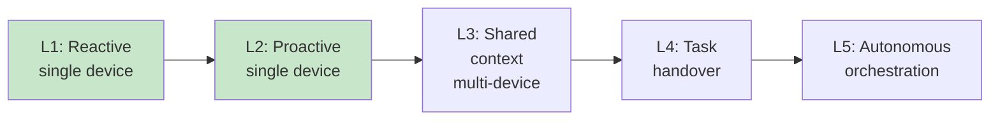
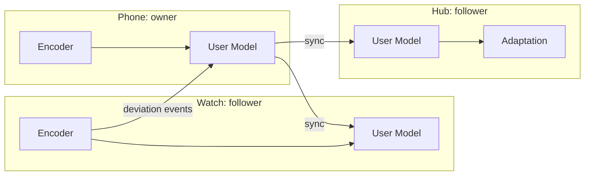

# Eric Xu's L1–L5 Device Intelligence Framework and I³'s Climb

> **Thesis.** Huawei's rotating chairman Eric Xu articulated a five-level
> ladder of on-device intelligence — L1 (reactive) through L5 (autonomous
> multi-device orchestration) — that matches the SAE ladder for autonomous
> driving in its ambition and structure. I³ today sits solidly at **L1–L2**:
> it observes, models, and proactively adapts, all on one device. This
> document situates I³ on the ladder, explains why L1–L2 is already
> meaningfully valuable, and sketches — with engineering specificity — the
> work required for L3, L4, and L5 ascent, level by level.

---

## 1. The L1–L5 framework

The framework articulates a progression from reactive device behaviour to
autonomous, cross-device, user-goal-pursuing agent constellations:

| Level | One-line definition |
|:---:|:---|
| **L1** | Reactive on-device intelligence — the device responds to explicit input, within its own memory of that user. |
| **L2** | Proactive single-device intelligence — the device anticipates and adapts using a persistent model of the user, still within a single device. |
| **L3** | Cross-device context sharing — multiple devices of the same user coordinate their *understanding* of the user, but still each execute independently. |
| **L4** | Device-to-device task handover — devices not only share context but migrate *tasks* between themselves under user or agent direction. |
| **L5** | Autonomous multi-device orchestration — the device constellation pursues user goals without per-step human direction, delegating and coordinating across the entire fabric. |

The direct analogy with SAE autonomous driving is intentional: the ladder
encodes **the shifting of initiative from human to system**. At L1, the
human is the orchestrator; at L5, the system is.

The green boxes are where I³ sits today.

---

## 2. Where I³ is: L1–L2

### 2.1 L1 capabilities I³ already delivers

At L1 the device:

- Observes the user's input in the moment.
- Maintains some short-term memory (a session).
- Responds reactively, using that memory.

I³ does all three:

- **Observation.** The `interaction/` layer extracts a 32-dim feature vector
  from the current keystroke event — dynamics, content, complexity, session.
- **Session memory.** The user model's session-timescale EMA (α = 0.3,
  horizon ~5–10 messages) is the explicit short-term memory.
- **Reactive response.** The `AdaptiveSLM` generates a response conditioned
  on the 4 cross-attention tokens derived from the current user state.

L1 is **table stakes**. Most chatbots check this box. I³ goes further.

### 2.2 L2 capabilities I³ already delivers

At L2 the device:

- Maintains a *persistent* model of the user across sessions.
- Anticipates based on that model, not merely reacts to the moment.
- Adapts its behaviour — not just its content — to the inferred state.

I³ does all three:

- **Persistent model.** The long-term user profile (Welford online
  statistics over 32 features, plus a long-term 64-dim embedding EMA with
  α = 0.1, horizon ~30 sessions) is the persistent user model, Fernet-
  encrypted and SQLite-resident.
- **Anticipation.** The `DeviationMetrics` compute z-scores of *today's*
  behaviour against the *long-term baseline*, so the system reacts to
  *deviation from normal for this user*, not absolute thresholds.
- **Behavioural adaptation.** The `AdaptationVector` doesn't merely change
  wording — it changes response complexity, verbosity, warmth, and
  simplification level. All four adapters read the long-term profile.

L2 is where the novelty lives. The **accessibility adapter** — which looks
for *concurrent* elevation in correction rate, IKI variance, and pause
ratio *without* a rise in linguistic complexity, a marker for motor or
cognitive difficulty — is a genuine L2 capability that most production
assistants don't have.

### 2.3 Why L1–L2 is non-trivial

Plenty of systems claim L2. The test is: **does the persistent user model
actually change the system's behaviour in a way you can measure without
being told?** The conditioning-sensitivity test in `evaluate.py` answers
this question — it measures the KL divergence between next-token
distributions under different `AdaptationVectors`. A system with a
persistent user model that doesn't actually flow through to generation is
L1 with extra storage. I³ passes the test.

---

## 3. L3: cross-device context sharing

### 3.1 Capability definition

**L3: the user's device constellation shares a synchronised understanding
of the user.** The watch knows the user is under cognitive load because
the phone observed it two minutes ago; the home hub's voice prompt gets
warmer because this morning's emails were terse and clipped.

Critically, at L3 each device still **executes independently**. The watch
isn't running the phone's reply; it's running its own, informed by the
phone's observations.

### 3.2 HMAF primitives used

- **Distributed databus.** The primary delivery mechanism for user-state
  sync. HarmonyOS's databus is designed to make location-transparent
  data access trivial.
- **Capability registration.** Each device registers I³'s
  `personalisation.*` capabilities locally, but the *source of truth* for
  the underlying state is the user-designated owner device.
- **Agent-to-agent protocol.** A watch-local HMAF agent reads
  `personalisation.cognitive_load` from whichever device has the
  freshest reading.

### 3.3 I³ extensions required

Concrete engineering work:

1. **Serialisation:** the `I3UserStateSync` wire format (see
   `harmony_hmaf_integration.md §4.3`). ~680 B; already designed, not yet
   implemented.
2. **Conflict resolution:** CRDT on per-feature Welford statistics. Because
   Welford is associative and commutative in "batch-merge" form, this is
   exact (not eventual) — two devices can each Welford-update and merge
   losslessly.
3. **Privacy envelope:** per-user symmetric key, derived from a user
   keyring that is never transmitted in the clear. Re-key on device
   add/remove.
4. **Device-role metadata:** each device self-identifies as owner /
   follower / peer, persisted in the database with timestamps for
   last-sync and last-update.

### 3.4 Privacy implications

L3 *expands* the privacy surface — data now flows between devices — which
**increases** the pressure on the privacy-by-architecture guarantees that
are already load-bearing at L1–L2:

- **The sync payload contains no raw text.** All that crosses the databus
  is scalars and embeddings.
- **The databus itself is HarmonyOS-encrypted** at the transport layer.
  We layer Fernet on top of it for in-app confidentiality.
- **Key distribution requires a secure enrolment flow.** This is the
  expensive engineering line-item, and HarmonyOS's device-pairing protocol
  is the right surface to plug into.
- **The user can revoke any follower device instantly.** Revocation
  triggers a re-key; stale devices' stored state becomes
  cryptographically inaccessible.

---

## 4. L4: device-to-device task handover

### 4.1 Capability definition

**L4: tasks — not just data — migrate between devices.** The user starts
drafting an email on the phone, walks upstairs, and continues on the
tablet without breaking stride. The drafting *state*, the *adaptation
context*, and the *model session* move with the task.

### 4.2 HMAF primitives used

- **Agent protocol with serialisable execution state.** An HMAF `plan` is
  already introspectable; L4 requires that a *partially-executed* plan is
  also serialisable.
- **Distributed file system for ephemeral task state.** HarmonyOS's
  cross-device file system lets devices read-write a shared work-in-
  progress artefact.
- **Agent trust delegation.** The receiving device's agent must accept
  the originating agent's intermediate state without re-running
  everything.

### 4.3 I³ extensions required

1. **Session checkpoint format.** A serialisable snapshot of:
   - Current session-timescale embedding.
   - Last N `InteractionFeatureVector` events (for TCN receptive field).
   - Current `AdaptationVector`.
   - Router's accumulated context for this session.

   Estimated size: ~8 KB. Fits in any HarmonyOS ephemeral store.

2. **Model handover policy.** If the handoff is phone→tablet, both devices
   run the full stack and the tablet picks up where the phone left off.
   If the handoff is phone→watch, the watch runs encoder-only and
   delegates generation back to the phone — "handover" here is partial,
   the inference graph spans two devices.

3. **Continuity SLAs.** The handover protocol targets <500 ms end-to-end
   handoff latency — below the threshold at which a user perceives a
   break in interaction.

4. **Routing policy refit.** The Thompson sampling router's posterior is
   handed over, not reset. Otherwise the receiving device would cold-start
   and would spam its local SLM arm until the posterior learned again.

### 4.4 Privacy implications

The handover itself is a **new egress point** for state that used to be
strictly device-local. Mitigations:

- **Handover requires explicit user co-location** (a HarmonyOS pairing gesture
  or proximity token), never just network availability.
- **The session checkpoint is encrypted end-to-end** with the recipient
  device's public key.
- **Handover events produce auditable telemetry** with source/target
  device ids.

---

## 5. L5: autonomous multi-device orchestration

### 5.1 Capability definition

**L5: the device constellation pursues user goals autonomously.** The user
says "plan my weekend", and the device fabric — phone, tablet, watch, home
hub, car head-unit — *coordinates* across calendar, maps, smart home,
music, voice prompts. Each device contributes its own strength; none
waits for human direction at each substep.

This is the level at which "device intelligence" and "multi-agent AI"
converge. HMAF is the framework that makes L5 a realistic target rather
than an aspirational one.

### 5.2 HMAF primitives used

- **Agent composition.** HMAF's agent-to-agent protocol is the glue. I³
  is one of many agents in the composition.
- **Goal-level planning.** At L5, HMAF's planner takes a user goal (not a
  user intent — a step up in abstraction) and decomposes it into a
  distributed plan whose steps are agent calls whose inputs are each
  other's outputs.
- **Credit assignment for learning.** With many agents contributing to a
  user's satisfaction, the reward signal for each must be inferred. This
  is a multi-agent RL problem in its own right.

### 5.3 I³ extensions required

1. **Goal-conditioned adaptation.** The `AdaptationVector` at L5 is not
   just user-state-conditioned but also **goal-conditioned** — adaptation
   for "plan my weekend" looks different from adaptation for "draft an
   email". Two options:
   - Additional input dimensions to the `AdaptationController`.
   - A separate `GoalVector` combined via FiLM-style modulation.

2. **Cross-agent reward shaping.** I³'s Thompson sampler today learns a
   per-arm reward from scalar signals (edits, follow-ups, thumbs). At L5
   it must learn a *contribution-to-goal* reward, which requires HMAF's
   planner to attribute credit back.

3. **Adaptation propagation with conflict resolution.** If the home hub
   and the phone disagree on the user's current cognitive load (because
   the user was typing fast on the phone but stammering to the hub), I³
   needs a merge function. We propose a **variance-weighted mean**:
   devices with tighter posterior variance on cognitive-load get more
   weight.

4. **Long-horizon memory.** Session-timescale memory is not enough at L5.
   A weekly / monthly / annual timescale is probably needed for
   goal-pursuit tasks that span days.

### 5.4 Privacy implications

At L5 the privacy surface is at its largest:

- **Many more agents observe signals.** Minimisation: each agent receives
  only the slice of the adaptation vector it needs. No agent gets the full
  user state by default.
- **Long-horizon memory means long-horizon breach risk.** Mitigation:
  forward-secret key rotation at the weekly scale, such that breach of a
  current key does not compromise earlier encrypted state.
- **User consent must be goal-level, not per-agent.** The UX challenge is
  to make a goal-level consent (e.g. "plan my weekend") comprehensibly
  bound the set of agents invoked, without defaulting to "all agents
  always on".
- **Opt-out must remain per-agent.** A user who revokes I³ specifically
  must see the device fabric gracefully degrade — other agents continue
  to function, just without personalisation.

---

## 6. The climb summary table

| Level | What I³ does today | L3 additions | L4 additions | L5 additions |
|:---:|:---|:---|:---|:---|
| **L1** | Feature extraction, per-message reactive SLM | | | |
| **L2** | Three-timescale persistent user model, adaptation, routing | | | |
| **L3** | | User-state sync wire format, CRDT merge, device-role metadata, per-user key | | |
| **L4** | | | Session checkpoint format, model handover policy, continuity SLA, router posterior handoff | |
| **L5** | | | | Goal-conditioned adaptation, cross-agent reward shaping, variance-weighted adaptation merge, long-horizon memory |

Each column builds on the previous. Nothing is speculative; every item
names a concrete engineering deliverable with a sized payload and a
privacy argument.

---

## 7. Why the order matters

There is a temptation, common in product roadmaps, to leap from L2 to L5
and hand-wave the middle. This is a mistake because **privacy-by-
architecture compounds sequentially**. L3's wire format informs L4's
session checkpoint informs L5's goal-conditioned propagation. Do L3
wrong — put raw text on the wire, skip the CRDT, punt on revocation —
and the whole tower downstream inherits a broken foundation.

I³'s current L1–L2 codebase has privacy properties that hold under audit
*today*. The L3–L5 extensions described here maintain those properties by
**inheritance**. The right order is bottom-up, and the right discipline is
that each level's privacy story is *at least as strong as* the previous
level's.

---

## 8. Honest self-assessment

| Claim | Evidence |
|:---|:---|
| I³ is at L1 | Yes — `interaction/` and `slm/` deliver it. |
| I³ is at L2 | Yes — `user_model/` and `adaptation/` deliver it, and `evaluate.py`'s conditioning-sensitivity test demonstrates the persistent-model → generation path. |
| I³ is at L3 | **No.** Single-device only today. |
| I³ has L3 *designed* | Yes — wire format, CRDT, key model specified in `harmony_hmaf_integration.md`. |
| I³ has L4 designed | Partially — handover protocol is sketched; session-checkpoint format is not formalised. |
| I³ has L5 designed | High-level only — reward shaping and goal-conditioned adaptation are research-grade questions. |

The honesty matters. A project that claims L4 without having thought
about session-checkpoint CRDTs has not earned the claim; a project that
claims L5 without a plan for multi-agent credit assignment is selling
something.

---

## 9. Research hooks

Each of L3, L4, L5 is a research programme in its own right.
For the Edinburgh Joint Lab's interests specifically:

- **L3 ↔ personalisation from sparse signals.** CRDT-merging per-feature
  Welford statistics across devices = "how do we fuse personalisation
  signals from heterogeneous sources under a tight privacy budget?". This
  is a direct match for the Lab's published research direction.
- **L4 ↔ continual learning.** Handover without forgetting = a continual-
  learning problem. The router's posterior is small and cheap to transfer;
  the user-state embedding is richer and more fragile.
- **L5 ↔ multi-agent RL with shared user models.** This is a green-field
  research direction where HMAF-as-a-platform would let you collect data
  at a scale academia rarely reaches.

See [`edinburgh_joint_lab.md`](./edinburgh_joint_lab.md) for a deeper read.

---

## 10. How this shows up in the I³ codebase

- **L1 evidence:** [`i3/interaction/`](../../i3/interaction/),
  [`i3/slm/`](../../i3/slm/).
- **L2 evidence:** [`i3/user_model/`](../../i3/user_model/),
  [`i3/adaptation/`](../../i3/adaptation/).
- **L3 design artefacts:** [`harmony_hmaf_integration.md §4`](./harmony_hmaf_integration.md#4-plugging-into-the-harmonyos-distributed-databus).
- **L4 design artefacts:** this document, §4.
- **L5 design artefacts:** this document, §5; research direction in
  [`edinburgh_joint_lab.md`](./edinburgh_joint_lab.md).

---

*Next: [the Edinburgh Joint Lab research direction](./edinburgh_joint_lab.md)
— the research context for the climb.*
