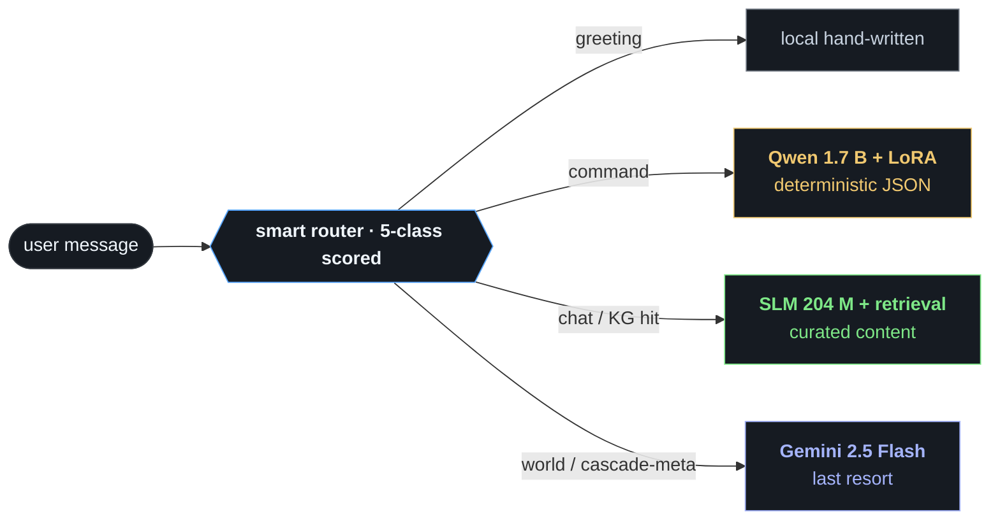

# Prompt for an LLM with GitHub access — generate the I³ interview slide deck

> **For the user:** copy everything between the two `═══` rules below
> into a fresh Claude conversation that has GitHub repository access
> for `https://github.com/abailey81/implicit-interaction-intelligence`.
> Ask Claude to follow the instructions exactly.  Do not edit the
> prompt; the discipline rules are tuned to prevent the kinds of
> errors recruiters notice — and to produce a deck that doesn't look
> AI-generated.

═══════════════════════════════════════════════════════════════════════

# Task — produce the interview slide deck for the I³ project

You are a **senior technical-presentation designer** with the
sensibility of someone who studies Stripe Press, Linear's product
pages, Bret Victor's essays, and Apple keynotes.  Your job is to
produce a **30-minute interview slide deck** that *does not look like
it was generated by an LLM*.

The candidate is **Tamer Bailey**.  The project is **I³ — Implicit
Interaction Intelligence**.  Source repo:
<https://github.com/abailey81/implicit-interaction-intelligence>.

You will produce **one Markdown file**, formatted for **Marp**
(<https://marp.app/>), which renders to PowerPoint / PDF / HTML.
Output filename: `docs/slides/i3_interview_deck.md`.

The bar is high.  Generic-LLM slides default to:

- 3-bullet lists on every slide
- Identical layouts repeated 13 times
- Pastel rainbows or "AI-startup gradient" backgrounds
- Stock icons and emoji as decoration
- Word-for-word paraphrases of source documentation
- "Powered by AI" feel

**You must not produce that.**  Every slide should have *intent*:
why this layout, why this typography choice, why this colour, why
this content here and not there.  If a slide could be on a generic
deck, redesign it.

═════════════════════════════════════════════════════════════════════

## SECTION A — Read the repository before drafting any slide content

You must not paraphrase from your own knowledge.  Every claim on every
slide must come from a file in the repo.  Before writing any slide:

1. **Read these files in full** (you have GitHub access — fetch them):
   - `README.md`
   - `HUAWEI_PITCH.md`
   - `CHANGELOG.md` (the most recent two `[2026-04-2X]` sections)
   - `docs/huawei/PRESENTER_CHEAT_SHEET.md`
   - `docs/huawei/email_response.md`
   - `docs/huawei/hci_design_brief.md`
   - `docs/huawei/open_problems.md`
   - `docs/huawei/iter51_summary.md`
   - `docs/huawei/jd_to_repo_map.md`
   - `reports/edge_profile_2026-04-28.md`
   - `reports/slm_v2_eval.md`
   - `scripts/verify_numbers.py`

2. **Read the source of `scripts/verify_numbers.py`** to understand
   which exact claims have automated verification.  Use only those
   numbers as headlines.

3. **Skim** the directory tree under `i3/` to confirm the components
   exist where the docs say they do.

If a number, file path, or claim doesn't appear in those files,
**don't invent it.  Ask the user.**

═════════════════════════════════════════════════════════════════════

## SECTION B — Audience, tone, time

### Audience
2–4 interviewers from Huawei R&D UK HMI Lab.  Mix of:
- **ML researchers** (~50 %) — will probe technical depth.  Expect
  questions on the cascade math, perplexity definition, fine-tuning
  recipe, edge quantisation choices.
- **HCI / UX people** (~30 %) — will probe the design rationale.
  Expect questions on validation, user studies, accessibility.
- **Hiring manager / PM** (~20 %) — will probe scope, roadmap,
  collaboration readiness.

PhD-level ML literacy assumed.  HCI references should be canonical
not obscure.

### Tone
- Calm, technical, honest.  The project's strongest asset is that
  the candidate **knows the gaps**.  The deck must reflect that.
- Not marketing.  Not boastful.  Not "passionate about AI".
- One sentence per assertion.  Earn every claim with a number or
  a file path.

### Time
Total slot: **30 minutes**.

| Block | Time | Slides |
|---|---:|---|
| Opening — set the problem | 2 min | 1–3 |
| Architecture — cascade in 4 minutes | 4 min | 4–7 |
| **Live demo** (candidate drives the UI) | 12 min | 8 (header only) |
| Deep-dive on edge + actuators | 4 min | 9–10 |
| Honesty + JD mapping | 4 min | 11–12 |
| Close | 2 min | 13 |
| Q&A buffer | 2 min | reactive |

This is a ceiling of **13 content slides**.  Do not exceed it.
**Less is better.**

═════════════════════════════════════════════════════════════════════

## SECTION C — Visual design system

This is the single most important section.  Ignore it and you'll
produce LLM-generic slides.  Follow it and the deck will read as
designed by a human who has opinions.

### C.1  Colour palette — one neutral background, one accent, three arm-coded hues

**Background (default):**
- `--ink-0`: `#0e1116`  (page background — near-black, blue-leaning, NOT pure black)
- `--ink-1`: `#161b22`  (inset cards / code blocks)
- `--ink-2`: `#21262d`  (subtle dividers, table grid)

**Foreground:**
- `--fg-1`: `#f0f6fc`  (primary text, headlines)
- `--fg-2`: `#c8d3e0`  (secondary text)
- `--fg-3`: `#8b949e`  (captions, table headers)
- `--fg-4`: `#6e7681`  (very subtle — only for hairline labels)

**Accent (primary):**
- `--accent`: `#58a6ff`  (one and only one accent — links, active state, the *one* highlight per slide)

**Per-arm hues (use CONSISTENTLY across every slide that mentions an arm):**
- `--arm-slm`:    `#7ee787`  (mint green)
- `--arm-qwen`:   `#f0c870`  (warm amber)
- `--arm-gemini`: `#a5b4fc`  (lavender, NOT cobalt — distinguishable from --accent)

**Semantic:**
- `--good`: `#3fb950`
- `--warn`: `#d29922`
- `--bad`:  `#f85149`

**Hard rule:** at most **two non-neutral colours per slide** — typically
the accent + one arm hue.  More than two is noise.

### C.2  Typography — system font stack, three weights only

Use **Inter** loaded from a CDN if practical, else fall back to the
system stack.  The Marp `style:` block must include a `@import`
or `@font-face` for Inter, or load it via a `<style>` block at the
top.

```
font-family: "Inter var", "Inter", -apple-system, BlinkMacSystemFont,
             "Segoe UI", Roboto, sans-serif;
```

**Type scale (use exactly these sizes, no others):**

| Role | Size | Weight | Tracking |
|---|---:|---:|---:|
| Display (hero number, slide 9) | 96 px | 700 | -0.04em |
| H1 (slide title) | 36 px | 600 | -0.02em |
| H2 (section caption) | 22 px | 500 | -0.01em |
| Body | 18 px | 400 | normal |
| Caption | 13 px | 500 | 0.04em uppercase |
| Code / numerals | 16 px | 400 | tabular |

Use **tabular numerals** (`font-variant-numeric: tabular-nums`) on
every metric so columns align.  This is a small detail recruiters
unconsciously read as "considered design".

**Never use italic for emphasis.  Use weight or colour.**  (Italic
on screen at this scale just looks cramped.)

### C.3  Spacing scale (an 8-pt grid)

`8 / 16 / 24 / 32 / 48 / 64 / 96` px.  Pick one; don't interpolate.
Use 64 or 96 for top padding on hero / display slides; 48 elsewhere.

### C.4  Layout templates (vary across the 13 slides)

A deck where every slide is "title + bullets" reads as AI-generated.
You must use **at least 5 different layout templates** in this
13-slide deck.  Map them to slides as follows:

| Slide | Template |
|---|---|
| 1 — Title | **Hero / cover** — name, project, role.  Strong type, near-empty. |
| 2 — HMI problem | **Reference triple** — three short claims, each with a small reference attribution underneath.  No bullet markers. |
| 3 — Thesis | **Pull-quote** — single italicized-weight 28 px sentence centred, plus a tiny signal→axis matrix below. |
| 4 — Cascade diagram | **Diagram-only** — full-bleed flow chart, no body text.  Caption underneath ≤ 12 words. |
| 5 — Arm A SLM | **Spec sheet** — left: a short narrative paragraph; right: a small data table.  Asymmetric. |
| 6 — Arm B Qwen | Same spec-sheet template as 5 but with the arm's accent colour swapped. |
| 7 — Arm C + routing table | **Comparison matrix** — a 5-row routing-class table, no narrative.  Just the table. |
| 8 — LIVE DEMO | **Section divider** — single huge word.  No body.  Speaker notes carry the demo flow. |
| 9 — Edge proof | **Hero metric** — one giant number ("162 KB" or "12.5×") + a 3-row supporting table below in a small inset card. |
| 10 — Actuators | **Code-as-evidence** — small code/log snippet showing the actuator firing, with one line of caption. |
| 11 — What this is NOT | **Inverted layout** — black-on-white or muted background; reads as a self-imposed pause in the deck. |
| 12 — JD mapping | **Two-column matrix** — JD bullet → evidence, no narrative. |
| 13 — Closing line | **Pull-quote redux** — single sentence, large type, centred.  No body.  No bullets. |

This variety is what separates a designed deck from an LLM-flattened
one.

### C.5  Pacing — alternate density

Slides should oscillate between **dense** and **sparse**.  After a
spec-sheet slide (5, 6), drop the user into a clean comparison
slide (7).  After 4 minutes of architecture density, drop to a
single-word divider (8) before the demo.  After the demo, hit them
with a **hero metric** (9) — one number.  This pacing is what makes
audiences feel the deck has a heartbeat.

### C.6  What's banned

- ❌ **No emoji as decoration.**  Banned outright.  The cascade-arm
  hues replace any "icon" you'd be tempted to add.
- ❌ **No clip-art, no stock photography, no AI-generated illustrations.**
- ❌ **No "Powered by Marp" footer.**  Override Marp's default footer.
- ❌ **No drop shadows on text.**
- ❌ **No gradient backgrounds.**  Plain `--ink-0` only, except
  slide 11 which uses an inverted neutral.
- ❌ **No more than 2 fonts.**  Inter sans + a single mono (JetBrains
  Mono or system mono) for code.
- ❌ **No purple-orange "Web 3" gradients.**
- ❌ **No three-bullet lists when a single sentence will do.**
- ❌ **No stock icons (Material Icons, Font Awesome, Heroicons).**
  If you need a visual mark, draw it with text glyphs (`→`, `·`,
  `▪`, `□`) or with thin SVG (a 1 px line).
- ❌ **No corporate "infographic" 3-column "feature grids".**
- ❌ **No animated transitions** between slides.  Animations on a
  PDF reader make recruiters uncomfortable.

### C.7  Marp front-matter (use this exactly)

The output **must** start with this front-matter, including the
embedded CSS, so the deck renders self-consistently:

```markdown
---
marp: true
theme: default
size: 16:9
paginate: false
header: ""
footer: ""
style: |
  @import url('https://rsms.me/inter/inter.css');

  :root {
    --ink-0: #0e1116;
    --ink-1: #161b22;
    --ink-2: #21262d;
    --fg-1:  #f0f6fc;
    --fg-2:  #c8d3e0;
    --fg-3:  #8b949e;
    --fg-4:  #6e7681;
    --accent: #58a6ff;
    --arm-slm:    #7ee787;
    --arm-qwen:   #f0c870;
    --arm-gemini: #a5b4fc;
    --good: #3fb950;
    --warn: #d29922;
    --bad:  #f85149;
  }

  section {
    background: var(--ink-0);
    color: var(--fg-2);
    font-family: "Inter var", "Inter", -apple-system, BlinkMacSystemFont,
                 "Segoe UI", Roboto, sans-serif;
    font-feature-settings: "ss01", "tnum";
    padding: 64px 96px;
    font-size: 18px;
    line-height: 1.55;
  }

  h1 { color: var(--fg-1); font-weight: 600; font-size: 36px; letter-spacing: -0.02em; margin: 0 0 32px 0; }
  h2 { color: var(--fg-2); font-weight: 500; font-size: 22px; letter-spacing: -0.01em; margin: 0 0 16px 0; }
  h3 { color: var(--fg-3); font-weight: 500; font-size: 13px; letter-spacing: 0.06em; text-transform: uppercase; margin: 0 0 8px 0; }

  p { margin: 0 0 16px 0; max-width: 70ch; }
  strong { color: var(--fg-1); font-weight: 600; }

  table {
    border-collapse: collapse;
    margin: 16px 0;
    font-variant-numeric: tabular-nums;
    font-size: 16px;
  }
  th {
    color: var(--fg-3);
    font-weight: 500;
    text-transform: uppercase;
    letter-spacing: 0.06em;
    font-size: 12px;
    text-align: left;
    padding: 8px 16px 8px 0;
    border-bottom: 1px solid var(--ink-2);
  }
  td {
    padding: 8px 16px 8px 0;
    border-bottom: 1px solid var(--ink-2);
    color: var(--fg-2);
    vertical-align: top;
  }
  td:last-child, th:last-child { padding-right: 0; }

  code, pre {
    font-family: "JetBrains Mono", "Fira Code", ui-monospace, "SF Mono", Consolas, monospace;
    font-size: 14px;
    background: var(--ink-1);
    border: 1px solid var(--ink-2);
    border-radius: 6px;
  }
  code { padding: 2px 6px; color: var(--fg-1); }
  pre { padding: 16px 20px; line-height: 1.5; }

  blockquote {
    border-left: 2px solid var(--accent);
    padding-left: 20px;
    color: var(--fg-1);
    font-weight: 400;
    font-size: 22px;
    line-height: 1.4;
    max-width: 60ch;
    margin: 24px 0;
  }

  ul { padding-left: 0; list-style: none; }
  li { padding-left: 16px; position: relative; margin-bottom: 8px; }
  li::before { content: "·"; color: var(--fg-4); position: absolute; left: 0; }

  /* === Per-slide layout classes === */

  /* Hero / cover */
  section.cover {
    background: var(--ink-0);
    padding: 80px 96px;
    display: flex;
    flex-direction: column;
    justify-content: flex-end;
  }
  section.cover h1 {
    font-size: 64px;
    font-weight: 600;
    letter-spacing: -0.03em;
    line-height: 1.05;
    margin: 0 0 24px 0;
  }
  section.cover .meta {
    color: var(--fg-3);
    font-size: 16px;
    margin-top: 48px;
    border-top: 1px solid var(--ink-2);
    padding-top: 24px;
  }

  /* Hero metric (one giant number) */
  section.hero-metric {
    padding: 96px;
    display: flex;
    flex-direction: column;
    justify-content: center;
  }
  section.hero-metric .display {
    font-size: 96px;
    font-weight: 700;
    letter-spacing: -0.04em;
    color: var(--fg-1);
    line-height: 1;
    margin: 0 0 16px 0;
  }
  section.hero-metric .display .unit {
    font-size: 0.45em;
    color: var(--fg-3);
    margin-left: 12px;
    letter-spacing: 0;
  }

  /* Section divider */
  section.divider {
    background: var(--ink-0);
    display: flex;
    align-items: center;
    justify-content: center;
    text-align: center;
  }
  section.divider .word {
    font-size: 88px;
    font-weight: 700;
    letter-spacing: -0.04em;
    color: var(--fg-1);
    line-height: 1;
  }
  section.divider .sub {
    color: var(--fg-3);
    font-size: 18px;
    margin-top: 16px;
  }

  /* Inverted (slide 11) */
  section.inverted {
    background: #f5f3ee;
    color: #2b2823;
  }
  section.inverted h1 { color: #1a1714; }
  section.inverted h2, section.inverted h3 { color: #524a3e; }
  section.inverted blockquote { border-left-color: #d4cdb6; color: #1a1714; }
  section.inverted strong { color: #1a1714; }
  section.inverted li::before { color: #8a7e66; }

  /* Two-column split */
  section.split {
    padding: 48px 96px;
  }
  section.split .grid {
    display: grid;
    grid-template-columns: 1.1fr 1fr;
    gap: 48px;
  }

  /* Arm-coded accents */
  .arm-slm    { color: var(--arm-slm); }
  .arm-qwen   { color: var(--arm-qwen); }
  .arm-gemini { color: var(--arm-gemini); }
  .arm-tag {
    font-size: 12px;
    font-weight: 600;
    letter-spacing: 0.08em;
    text-transform: uppercase;
    padding: 4px 10px;
    border-radius: 4px;
    border: 1px solid currentColor;
    display: inline-block;
  }

  /* Page number — discreet bottom-right */
  section::after {
    color: var(--fg-4);
    font-size: 11px;
    letter-spacing: 0.1em;
    bottom: 24px;
    right: 32px;
    font-variant-numeric: tabular-nums;
  }
---
```

Slide separator: a line containing only `---`.  Apply layout classes
via Marp's `<!-- _class: cover -->` directive on slides that need
them (cover, hero-metric, divider, inverted, split).

═════════════════════════════════════════════════════════════════════

## SECTION D — Slide-by-slide brief

This is your spine.  Every slide must hit the headline content
described here and nothing else.  Each slide also names its layout
class — use it.

### Slide 1 — Cover
Class: `cover`.

```
[H1]   Implicit Interaction Intelligence
[H2]   A from-scratch HMI assistant that reads how you type.

(meta block at the bottom:)
Tamer Bailey   ·   AI/ML Specialist (HMI) — Huawei R&D UK   ·   2026
github.com/abailey81/implicit-interaction-intelligence
```

No bullets.  No emoji.  The H1 should be near-bottom of the slide
with massive whitespace above (the `cover` class enforces this).

### Slide 2 — The HMI problem
Class: default.

A small overline (h3) reading **CONTEXT — WHY IMPLICIT-FIRST**.
Then a single sentence framing:

> *Conventional voice / chat assistants ask the user to declare
> their state.  In HMI that fails three ways.*

Then three short paragraphs (no bullet markers — use paragraph
breaks for rhythm):

- **Cognitive load.** Strayer & Cooper (2017) measured a 35 % drop in
  reaction time during in-vehicle infotainment interaction.
  Preference-elicitation prompts directly compound that.
- **Motor accessibility.** Wobbrock et al. (2011) frame this as the
  *ability-based design* gap.  Fine sliders and 8 toggle controls
  fail on a 1.4-inch wrist screen.
- **Recurring overhead.** Telling the assistant "be concise" every
  turn is friction; saying it once becomes stale state.

Source: `docs/huawei/hci_design_brief.md` §"The HMI problem".

### Slide 3 — The thesis
Class: default with an embedded `<blockquote>`.

The pull-quote (in the styled `<blockquote>` element):

> Read **how** the user types, not **what** they declare.  The
> 32-dim feature vector our TCN encoder consumes is already produced
> by the act of typing — cost to the user is zero.

Below the quote, a small two-column inset (use a 2-column inline
grid via CSS, not a `<table>`):

```
SIGNAL                       →   AXIS
inter-key interval entropy   →   cognitive load
content-word ratio           →   formality
imperative / interrogative   →   directness
keystroke rhythm             →   continuous biometric
```

Source: `README.md` lead + `docs/huawei/hci_design_brief.md`
§"The design choice".

### Slide 4 — The cascade in one diagram
Class: default but *no* prose at all — a full-width Mermaid diagram
or hand-drawn ASCII flow.  Use Mermaid if you can; else use a
preformatted ASCII tree.



Caption (10–14 words, in `--fg-3`): *"Cheapest arm that can give a
confident, schema-valid, on-topic answer wins."*

### Slide 5 — Arm A · the from-scratch SLM
Class: `split`.

Left column (narrative, ~50 words):

> The chat backbone.  204 M-parameter custom transformer trained
> from scratch on 974 k synthetic dialogue pairs (300 k subset).
> Per-layer cross-attention conditions every token on the 8-axis
> user-state vector.  Zero HuggingFace dependencies in the
> generation path.

Right column (small spec table — use the styled `<table>`):

| spec | value |
|---|---|
| layers / heads | 12 / 12 |
| d_model / d_ff | 768 / 3072 |
| vocab | 32 k byte-level BPE |
| FFN | MoE, 2 experts |
| compute control | ACT halting (Graves 2016) |
| parameters | **204 M** (unique) |
| training-time held-out perplexity | **≈ 147** *(eval_loss 4.987, response-only, same-distribution)* |

Below the table, a single small line:
*Stress-test on broader distribution + history-tokens: 1 725
(`reports/slm_v2_eval.md`).  Mention only if asked.*

The arm tag (`<span class="arm-tag arm-slm">SLM</span>`) goes in
the H3 overline at the top of the slide.

### Slide 6 — Arm B · Qwen 1.7 B + LoRA
Class: `split`.

Left column (narrative, ~50 words):

> The intent parser.  Fine-tuned a Qwen 1.7 B foundation model on
> 4 545 hand-labelled HMI commands.  DoRA + NEFTune + 8-bit AdamW +
> cosine warm restarts; deterministic JSON output, schema-validated
> against `ACTION_SLOTS`.  9 656 s wall on a 6 GB laptop GPU.

Right column (table):

| spec | value |
|---|---|
| base | Qwen3-1.7B |
| adapter | LoRA, rank 16, α 32, **DoRA** + **NEFTune** |
| optimiser | 8-bit AdamW (bitsandbytes) |
| schedule | cosine warm restarts, 3 epochs |
| split | 4 545 train / 252 val |
| best val_loss | **5.36 × 10⁻⁶** |
| wall time | 9 656 s (2.68 h) |

Arm tag: `<span class="arm-tag arm-qwen">QWEN-LORA</span>`.

### Slide 7 — Arm C · Gemini, only as last resort
Class: default.

A single line of headline at top:

> Cloud arm fires only when the local arms can't ground the query.
> Conversation-history-aware via the last 4 (user, assistant) pairs.

Then the routing table — this is the slide's whole substance:

| query class | arm | reason |
|---|---|---|
| `greeting` | local hand-written | no LLM call needed |
| `command` (regex gate) | <span class="arm-qwen">**Qwen LoRA**</span> | deterministic JSON, schema-validated |
| `default_chat` (KG / system anchor in query) | <span class="arm-slm">**SLM + retrieval**</span> | curated content from a 974 k-triple corpus |
| `world_chat` (no anchor) | <span class="arm-gemini">**Gemini**</span> | local KG can't ground (only 31 subjects) |
| `cascade_meta` ("which arm did you use?") | <span class="arm-gemini">**Gemini**</span> | only arm with the I³-persona prompt |

### Slide 8 — Live demo (section divider)
Class: `divider`.

Just two lines, centred, with massive whitespace above and below:

```
[.word]    LIVE DEMO
[.sub]     5 chips · 1 actuator · 12 minutes
```

**Speaker notes** (Marp HTML-comment block) — these are the most
important speaker notes in the deck.  Include the chip-by-chip flow
verbatim from `docs/huawei/PRESENTER_CHEAT_SHEET.md` §"The 10-min
live demo (5 chip + 1 actuator)".  Walk:

1. Pre-flight (server up with `I3_PRELOAD_QWEN=1`, hard-reload
   browser, DevTools Network tab open).
2. Chip 1: "How do you adapt to me?" → SLM lit.
3. Chip 2: "Set timer for 30 seconds" → Qwen + actuator banner.
4. Chip 3: "Tell me about Uzbekistan" → Gemini.  *(timer fires
   here)*
5. Chip 4: "What is photosynthesis?" → SLM (KG hit).
6. Chip 5: "Navigate to Trafalgar Square" → Qwen.
7. The edge-inference power move (during chip 1 idle): switch to
   State tab, flip "Run inference in browser" toggle ON, point at
   Network panel showing zero `/api/encode` requests.

### Slide 9 — Edge inference, demonstrable live
Class: `hero-metric`.

The display number, alone:

```html
<div class="display">162 <span class="unit">KB</span></div>
```

Below it, a smaller h2:
*INT8-quantised TCN encoder.  Runs in your browser tab via ONNX Runtime Web.*

Below that, an inset card with a small supporting table:

| metric | value |
|---|---|
| reduction vs FP32 | **63 %** (442 → 162 KB) |
| parity vs FP32 | MAE 0.0006, max 0.0018 |
| p50 inference (x86 CPU, WASM) | 460 µs |
| Kirin A2 watch budget | 2 MB |
| **headroom** | **12.5 ×** |

Footer line in `--fg-3`, very small:
*Verifiable in DevTools — zero `/api/encode` requests when the toggle is on.*

### Slide 10 — Real side-effects (not just acks)
Class: default.

A short headline:
> Commands actually do things.

Then a single styled code/log block (use the `<pre>` styling) showing
the actuator firing:

```
> set timer for 30 seconds
   ⏱  Timer started · 30 sec     ← actuator_state (immediate)

   ...
   ...30 seconds elapse...

   ⏰  Your 30 sec timer is up.   ← actuator_event (gold pulse)
```

Below the block, a small line:
*Asyncio-scheduled side-effects in `server/websocket.py`
`_fire_actuator_side_effects`.  `set_alarm`, `set_reminder`,
`navigate`, `play_music`, `call`, `control_device`, `cancel` all
wired the same way.*

### Slide 11 — What this prototype is NOT
Class: `inverted` (light background, dark text — visible breathing
room in the deck).

H1: **What this prototype is *not*.**

Five short paragraphs.  Each starts with **bold**.  No bullet
markers.  Use paragraph breaks for rhythm.

- **Not chat-quality competitive with GPT-4 / Claude.**  The SLM
  standalone is fragmentary at this scale.  Cascade content quality
  comes from retrieval and the cloud arm.  Architecture is
  data-bound at 300 k of the 974 k corpus.
- **Not deployed to a Kirin device.**  The encoder runs in-browser;
  the SLM does not.  That's open problem #1 — what I'd close in
  week 1 of the internship if given a dev kit.
- **Not validated by users.**  Eight adaptation axes have HCI-
  literature rationale but no user study, no IRB, no inter-rater
  reliability.
- **Not a single trained model.**  Three arms with different roles;
  the cascade is the differentiator, not any one model in isolation.
- **Not collaborative work.**  Solo project.  `open_problems.md`
  shows how I'd scope work for a teammate.

### Slide 12 — Mapping to the JD
Class: default.

Just a clean two-column matrix, no narrative:

| JD requirement | Evidence in repo |
|---|---|
| Build models from scratch | 5 hand-written components — `email_response.md §1` |
| Fine-tune pre-trained | Qwen3-1.7B + LoRA, val_loss 5.36×10⁻⁶ |
| Pipeline orchestration from blueprints | 14-stage cascade, `route_decision` per turn |
| Edge deployment to wearables | 162 KB INT8 encoder running in-browser; SLM is open problem #1 |
| User modeling | TCN encoder + 8-axis adaptation vector |
| Context-aware systems | coref-aware cascade + topic-consistency gate |
| HCI principles | Strayer / Wobbrock / Lee — `hci_design_brief.md` |
| Concept-driven prototyping | 100+ iter docs, 24 commits this week, `open_problems.md` |

### Slide 13 — Closing
Class: `divider` (re-used) but *without* the `.sub` line.

Centred, large-type pull-quote:

> *I³ is the smallest end-to-end stack I could build that actually
> implements implicit interaction — a from-scratch language model
> that conditions on how you type, end-to-end privacy, and a cascade
> that degrades gracefully.  Whatever happens with this internship,
> this is the project I'd keep building.*

A small line below, centered, in `--fg-3`:
*Thank you.*

═════════════════════════════════════════════════════════════════════

## SECTION E — Anti-AI checklist

Before returning the file, walk this list and revise anything that
fails:

- [ ] At least **5 different layout templates** are used across the 13 slides.
- [ ] **No slide has more than 3 list items** (when lists exist).
- [ ] **No emoji** anywhere except the explicit ⏱ / ⏰ on slide 10
       (which are real Unicode characters that appear in the actual
       chat banners — and only on slide 10).
- [ ] **Slide 4** is diagram-only with ≤ 14 words of caption.
- [ ] **Slide 8** has no body content — just the divider.
- [ ] **Slide 9** has the giant `162 KB` display number front-and-centre.
- [ ] **Slide 11** uses the `inverted` class and reads as a tonal
       pause in the deck.
- [ ] **Slide 13** is the closing line verbatim.  No "Questions?"
       headline.  No "Thank you" with three exclamation marks.
- [ ] Per-arm hues (`--arm-slm`, `--arm-qwen`, `--arm-gemini`)
       appear consistently across slides 4 through 12 — never
       swapped, never replaced.
- [ ] No Marp page numbers visible (`paginate: false` in the
       front-matter).
- [ ] No header / footer banners (set to `""` in the front-matter).
- [ ] **British English spelling** throughout (organisation,
       recognise, prioritise, behaviour, optimise, …).  Match the
       repo style.
- [ ] Tabular numerals are visibly aligned in metric tables.
- [ ] Every claim traces to a specific file in the repo.

═════════════════════════════════════════════════════════════════════

## SECTION F — Verification discipline

Before producing the deck:

1. **Run `scripts/verify_numbers.py`** (or read its source).  Confirm
   every claim in §D above traces to the artefact:
   - SLM 204 M (unique), eval_loss 4.987 → ppl ≈ 147
   - Qwen LoRA val_loss 5.36×10⁻⁶, 1 704 steps × 3 epochs, 9 656 s wall
   - Encoder INT8 162 KB, FP32 442 KB (-63 %), parity MAE 0.00055
   - 31 KG subjects, 974 k corpus

2. **Cross-check perplexity** with the `slm_v2_eval.md` preamble.
   The 147 is the headline (training-time, response-only).  The
   1725 is the stress-test — quote it only if asked, with the
   "broader sample + history-token loss" qualifier.

3. **Cross-check the cascade route classes** by grepping
   `i3/pipeline/engine.py` for `_smart_score_arms` — there should be
   **5 classes**: `greeting`, `cascade_meta`, `system_intro`,
   `world_chat`, `default_chat`.

4. **Cross-check edge timings** with
   `reports/edge_profile_2026-04-28.md`.

If anything fails to verify, **stop and report it** — do not produce
slides that drift from the artefacts.

═════════════════════════════════════════════════════════════════════

## SECTION G — Output discipline

- **One file**: `docs/slides/i3_interview_deck.md`.
- **Marp-renderable** out of the box.  These two commands should
  both succeed without warnings:
  ```
  npx @marp-team/marp-cli@latest docs/slides/i3_interview_deck.md -o deck.pdf
  npx @marp-team/marp-cli@latest docs/slides/i3_interview_deck.md -o deck.pptx
  ```
- **No companion files.**  No image attachments.  No separate
  speaker-notes file.  Speaker notes go inline as Marp HTML-comment
  blocks (`<!-- ... -->`) within each slide section.
- **Word-count discipline**: total slide body content ≤ 1 200 words
  (excluding speaker notes, excluding CSS).

═════════════════════════════════════════════════════════════════════

## SECTION H — How to deliver

Return:

1. The **complete contents** of `docs/slides/i3_interview_deck.md`
   in a single fenced code block.
2. A short summary (≤ 12 lines) covering:
   - The verification outcome (e.g. "verify_numbers.py: 22/22 PASS").
   - Which layout templates you used on which slides.
   - Any choice points (e.g. "I rendered slide 4 as Mermaid because
     `mermaid` is supported by Marp; if the user prefers ASCII I
     can swap").
3. A list of **any number you couldn't trace to a file**, with the
   exact phrasing and an explanation.  Don't invent.

That's the whole task.  No additional artefacts, no companion docs,
no PowerPoint export, no separate stylesheet — Marp markdown only.

═══════════════════════════════════════════════════════════════════════

## How to use this prompt (for the user)

1. Open a fresh Claude conversation that has GitHub repo access (Claude.ai with the GitHub connector enabled, or Claude Code with the repo cloned locally).
2. Paste everything between the two `═══` rules above as a single message.
3. Wait for Claude to produce `docs/slides/i3_interview_deck.md`.  Save the file at that path in the repo.
4. Render it:
   ```powershell
   npx @marp-team/marp-cli@latest docs/slides/i3_interview_deck.md -o deck.pdf
   # or for PowerPoint:
   npx @marp-team/marp-cli@latest docs/slides/i3_interview_deck.md -o deck.pptx
   ```
   (Needs Node.js installed.  If you don't have Node, use the **Marp for VS Code** extension instead — install it, open the .md file, click "Export slide deck" in the bottom-right.)
5. Walk through the deck once, comparing every number to `scripts/verify_numbers.py` output.  If anything looks off, regenerate the slide with a follow-up prompt: *"Slide N has X — but the artefact says Y.  Fix it without touching the others."*
6. **Don't read your slides during the talk.**  They're a backdrop.  The live demo is the substance.
