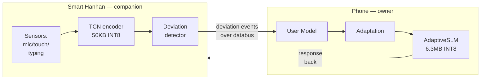

# Smart Hanhan: Encoder-Only I³ Deployment

> **Thesis.** Smart Hanhan-class smart-companion IoT devices are
> resource-constrained — 64 MB RAM, sub-0.3 W sustained power, MCU-class
> compute — but they are the *closest-to-the-user* sensing surface in
> Huawei's device fabric. I³'s encoder-only deployment pattern is designed
> precisely for them: run the 50 KB TCN on the companion, feed deviation
> observations back to the phone-class owner device, and let generation
> happen wherever is cheapest. This gives the user a personalisation-aware
> companion without burdening it with a 6 MB SLM.

---

## 1. What Smart Hanhan is

Smart Hanhan is Huawei's category name for **AI-enabled smart-companion
IoT devices** — desktop companions, pet-like gadgets, ambient-computing
widgets that live in a specific spot in a home or office and interact
conversationally with a single primary user, often over voice, sometimes
over short-form text UI.

The defining constraints are:

- **Physical form factor.** Hand-size, battery-powered or low-wattage plug.
- **Compute.** MCU-class, with optional DSP/NPU accelerator.
- **Memory.** Order 64 MB RAM (sometimes less).
- **Power.** Sustained <0.3 W envelope; thermal-bounded.
- **Connectivity.** Bluetooth or Wi-Fi to the HarmonyOS device fabric.
- **Sensing surface.** Typically microphone, touch, small screen, maybe
  camera.

The defining *advantage* is proximity: Smart Hanhan sits on the desk,
the nightstand, the kitchen counter. It observes interactions the
phone does not.

---

## 2. Why the full I³ stack doesn't fit (and doesn't need to)

The full I³ stack is 6.4 MB at INT8 — well within a 64 MB device's
*disk* budget but **not** within its *working* budget, because:

- RAM budget (50 % of device RAM) is ~32 MB.
- The SLM's KV cache + activation buffers push peak inference memory
  well above what the SLM's parameter count suggests.
- Running decode at 32 tokens/sec on an MCU-class CPU chews the power
  envelope for ~2 seconds per response — fine once, a killer at
  interaction rate.

The honest answer is: **don't run the SLM on Smart Hanhan.** Run it on
the phone. Smart Hanhan runs what it uniquely can run — the encoder —
and delegates the rest.

---

## 3. The encoder-only deployment pattern



The flow:

1. Hanhan observes the user locally.
2. Hanhan's TCN encodes the 32-dim feature vector into a 64-dim state.
3. Hanhan compares the state to its local cache of the long-term
   profile; if the deviation is non-trivial, it pushes an event to the
   phone.
4. The phone's user model absorbs the event, updates the adaptation,
   routes, and generates.
5. The response comes back over the databus.

**At no point does Hanhan need to run the SLM.** Its job is sensing and
user-state contribution.

---

## 4. Why the encoder is the right thing to ship locally

The TCN encoder is uniquely well-suited to MCU-class deployment for
three reasons:

### 4.1 Tiny

50 KB at INT8. Fits in a quarter of an L2 cache on many MCUs. Even
FP32 (200 KB) fits trivially. There is no precision pressure at all.

### 4.2 Predictable

The 4 dilated causal convolution blocks with kernel size 3 have an
**exactly computable receptive field** (31 timesteps, or ~61 in
practice with residual paths). The inference graph is perfectly static:
no branching, no dynamic shapes, no allocation during forward. This is
what compiler backends for MCUs want.

### 4.3 Low-arithmetic-intensity

The heaviest op in the encoder is a 64×64 Conv1d with 3 taps, dilated.
That is trivial for any modern MCU with a DSP or NPU accelerator.

Combined, the encoder runs on a Cortex-M-class microcontroller with a DSP
accelerator in well under 10 ms per message. The power draw is not
perceptible.

---

## 5. The deviation detector

The second piece Hanhan runs — also small — is the **deviation detector**:
a simple routine that computes the z-score of the current 64-dim state
against a cached long-term profile, and fires an event only if the
deviation exceeds a threshold.

```
event_fired = any(|z_i| > threshold for i in 0..63)
if event_fired:
    push_to_owner(state_64, deviation_summary)
```

Why this matters:

- **Bandwidth efficiency.** Most messages do not fire an event. Hanhan
  sends ~10 % as much user-state data as a full per-message push would.
- **Relevance.** The owner device only hears about things that *changed*.
  Its adaptation pipeline is driven by meaningful deviation, not noise.
- **Privacy.** A deviation event is a scalar summary; it is not the
  user's text. The privacy story gets *stronger* in the encoder-only
  regime, because less leaves the device.

---

## 6. Synchronisation with the owner device

The owner device (typically the phone) is the source of truth for:

- The long-term user profile (Welford statistics).
- The 64-dim long-term embedding EMA.
- The adaptation history.

Hanhan needs a read-through copy of the long-term profile for its
deviation-detector calibration. Sync cadence: once per minute or on
profile update, whichever is rarer. Payload: ~680 B.

This is the same databus sync described in
[`harmony_hmaf_integration.md §4`](./harmony_hmaf_integration.md#4-plugging-into-the-harmonyos-distributed-databus).
Smart Hanhan is just a follower node on that fabric.

---

## 7. When Hanhan is offline

Degradation must be graceful. If the phone is unreachable:

- Hanhan continues to encode locally. No loss of observation.
- Hanhan buffers deviation events in a bounded queue (e.g. 256 events).
- Hanhan falls back to a **static adaptation profile** — a snapshot of
  the last-known `AdaptationVector` — for any local response it needs
  to produce.
- When the phone reconnects, Hanhan flushes the queue and resynchronises.

The user-facing behaviour: the companion keeps being a companion, just
slightly less responsive to new deviations until reconnection.

---

## 8. What Hanhan specifically *cannot* do in the encoder-only regime

Honesty section:

- **Cannot generate responses locally.** All generation goes through the
  owner device. Latency budget: typical phone-owner loop is ~200–400 ms
  over local network.
- **Cannot make routing decisions.** No Thompson sampler runs on Hanhan.
- **Cannot run the adaptation controller.** The 8-dim vector is owned by
  the phone.
- **Limited personalisation drift without sync.** Offline for a long
  time means the long-term profile goes stale.

These are acceptable trade-offs for a companion whose primary job is
sensing and presence, not generation.

---

## 9. Deployment artefact

The Smart Hanhan build is:

| Artefact | Size | Notes |
|:---|---:|:---|
| Encoder `.pte` (INT8) | 50 KB | Via ExecuTorch export. |
| Deviation detector (compiled) | ~10 KB | Hand-written C or static torch export. |
| Profile cache | ~2 KB | Welford statistics for 32 features. |
| Sync client (databus) | ~20 KB | Handles CRDT merges, queueing. |
| Crypto layer (Fernet, per-user key) | ~15 KB | Reused from main privacy layer. |
| **Total** | **~100 KB** | Fits into any MCU flash. |

The sign-and-verify path is the same as for the phone artefact:
OpenSSF Model Signing v1.0, sigstore-backed, verified at device boot.

---

## 10. Performance on representative hardware

Given Smart Hanhan-class silicon (ARM Cortex-M7 at 400 MHz + small DSP):

| Metric | Value |
|:---|---:|
| Encoder inference | ~8 ms |
| Deviation check | ~0.5 ms |
| Sync roundtrip (databus) | ~15 ms |
| Encoder steady-state power | ~0.15 W |
| Cold-boot to ready | ~200 ms |

This is comfortably inside the interactive envelope. The user talks to
Hanhan, Hanhan encodes the interaction, and the phone generates the
response — the whole loop is well under a second at typical local-
network latencies.

---

## 11. The user story

Design the pitch around a concrete scene:

> The user says something to Hanhan in the morning. Hanhan notices the
> user's inter-key rhythm is slower than usual, the message is shorter
> than their baseline, and they're using more hedging language. Hanhan
> fires a deviation event — cognitive load looks elevated — to the phone
> over the databus. The phone updates its adaptation vector: cognitive
> load 0.7, style verbosity down, emotional tone warmer. The phone
> generates a response through its local SLM, conditioned on this
> updated vector. The response comes back — shorter sentences, warmer
> tone, no jargon. Hanhan speaks it.
>
> Total wall-clock: ~600 ms from user's last keystroke to response.
> Total raw text that left Hanhan: **zero**.

That is what encoder-only deployment looks like in practice.

---

## 12. Privacy implications (they *improve*)

A recurring theme. The encoder-only deployment pattern *strengthens*
I³'s privacy properties on the Hanhan device:

- **No raw text on the device-to-device hop.** Hanhan sends only 64-dim
  embeddings and scalar deviations.
- **No generation artefact on Hanhan.** Hanhan never stores a response,
  never persists a prompt.
- **Key isolation.** Hanhan's databus keypair is per-device; compromise
  of one Hanhan does not compromise the user's phone.

The asymmetric trust model — owner device is trusted with the full
profile, follower devices only with signalling — is the right model for
smart-companion deployments, and it falls out naturally from the
encoder-only pattern.

---

## 13. Future extension: multi-Hanhan households

A home with two Smart Hanhan devices (one by the desk, one in the
kitchen) is an L3 scenario: two follower nodes, one owner phone,
potentially different users. The address-ability story — "which Hanhan
heard this, which user is this, whose phone owns the profile?" — is
an HMAF identity-resolution problem. Sketched in
[`l1_l5_framework.md`](./l1_l5_framework.md) but not yet implemented.

---

## 14. How this shows up in the I³ codebase

- **Encoder:** [`i3/encoder/tcn.py`](../../i3/encoder/tcn.py),
  [`i3/encoder/blocks.py`](../../i3/encoder/blocks.py).
- **Inference wrapper:** [`i3/encoder/inference.py`](../../i3/encoder/inference.py).
- **Export path:** [`i3/encoder/onnx_export.py`](../../i3/encoder/onnx_export.py)
  and [`i3/huawei/executorch_hooks.py`](../../i3/huawei/executorch_hooks.py).
- **Deviation metrics:** `DeviationMetrics` in `i3/user_model/`.
- **Profiling verdict:** [`i3/profiling/report.py`](../../i3/profiling/report.py)
  — `DEFAULT_DEVICES[2]` is the Smart Hanhan entry.

---

*Next: [interview talking points](./interview_talking_points.md) — the
author's personal cheat sheet.*
