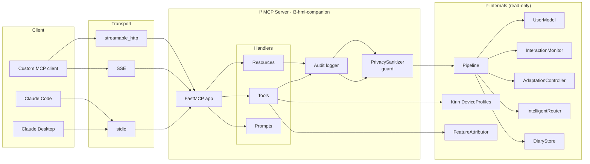

# Model Context Protocol (MCP) Integration

> **Status:** Accepted
> **Spec compatibility:** [`2024-11-05`](https://modelcontextprotocol.io/specification) and later
> **Package:** `i3.mcp`
> **Server name:** `i3-hmi-companion`

## 1. What is MCP?

The **Model Context Protocol (MCP)** is Anthropic's open standard for
connecting AI assistants to data sources and tools. It was
[announced by Anthropic](https://www.anthropic.com/news/model-context-protocol)
in November 2024 alongside an official Python SDK (the `mcp` package on
PyPI) and reference servers. MCP defines a small, transport-agnostic
JSON-RPC 2.0 protocol with three primitives:

* **Tools** — functions a client (e.g. Claude) can invoke.
* **Resources** — read-only pieces of data identified by a URI that the
  client can pull on demand.
* **Prompts** — parameterised prompt templates that the client can
  instantiate.

Servers expose these primitives over one of three transports — `stdio`,
`sse` (HTTP + Server-Sent Events), or the newer `streamable-http` — and
clients (Claude Desktop, Claude Code, or any custom application) connect
in a uniform way. The protocol is intentionally narrow: an MCP client
is a consumer of capabilities, never a free-form RPC peer. This is a
key property we rely on for the I³ security model: even a fully-
compromised MCP client cannot ask us to generate text, write to the
diary, or mutate user state — it can only call the read-only tools we
register.

For I³, MCP is the most direct integration path with Claude. Rather
than speaking our bespoke WebSocket API, Claude can pull aggregated
user-state metrics, adaptation vectors, and device profiles through a
standards-compliant server and reason about them. This document
describes the server we ship, how to integrate with it, and the
privacy and threat-model guarantees that bind what it can do.

## 2. Architecture

The I³ MCP server is a thin facade over a handful of I³ subsystems. It
is read-only by design: every handler either returns a constant
(e.g. device profiles, ADR index), a cached aggregate (feature vector,
adaptation vector, session metadata), or a derived explanation
(feature attribution). Nothing generates new text; nothing persists
state.



Every call follows the same pattern:

1. The request enters through one of the three transports.
2. The FastMCP app dispatches to the matching tool / resource / prompt
   handler.
3. The handler audit-logs at `INFO` with only the `user_id` (never the
   argument payload, never any user text).
4. The handler gathers aggregated metrics from the pipeline.
5. The `PrivacySanitizer` guard serialises the payload to JSON and
   scans for PII. Any detection raises — the server refuses to emit
   suspect data rather than silently leaking it.
6. The handler returns a JSON-serialisable dict / list / string.

## 3. Tool / Resource / Prompt catalog

The server registers **7 tools**, **5 resources**, and **2 prompts**,
for a total of **14 capabilities**.

### Tools

| Name | Signature | Purpose |
| :-- | :-- | :-- |
| `get_user_adaptation_vector` | `(user_id: str) -> AdaptationVector` | Return the current 8-dim `AdaptationVector` — cognitive load, style mirror, emotional tone, accessibility. |
| `get_user_state_embedding` | `(user_id: str) -> list[float]` | Return the 64-dim L2-normalised encoder embedding representing the current session state. |
| `get_feature_vector` | `(user_id: str) -> InteractionFeatureVector` | Return the last 32-dim aggregated feature vector. Keystroke dynamics + content metrics + session dynamics + deviation z-scores. **Never** raw text. |
| `get_session_metadata` | `(user_id: str, session_id: str) -> dict` | Aggregated session statistics: length, message count, route distribution, dominant emotion. **Never** text. |
| `get_device_profile` | `(target: str) -> DeviceProfile` | One of `kirin_9000 \| kirin_9010 \| kirin_a2 \| smart_hanhan`. |
| `route_recommendation` | `(context: RoutingContext) -> RoutingDecision` | Ask the contextual Thompson-sampling bandit for a route without actually generating. |
| `explain_adaptation` | `(user_id: str) -> dict` | Feature-attribution breakdown of why the `AdaptationVector` is what it is. Falls back to a magnitude heuristic when the differentiable adaptation head isn't wired up. |

### Resources

| URI template | Content |
| :-- | :-- |
| `i3://users/{user_id}/profile` | Three-timescale EMAs + variance stats. Embeddings base64-encoded. No raw text. |
| `i3://users/{user_id}/diary` | List of recent diary entries — topics, adaptation, route, latency. No text. |
| `i3://devices/kirin/{id}` | Full `DeviceProfile` JSON. |
| `i3://architecture/layers` | The 7-layer I³ architecture as structured JSON. |
| `i3://adrs` | Index of all Architecture Decision Records. |

### Prompts

| Name | Parameter | Purpose |
| :-- | :-- | :-- |
| `adaptation_summary` | `user_id` | "Summarise the user's current adaptation state in 2 sentences." |
| `troubleshoot_high_load` | `user_id` | "Given the user's current cognitive load and recent deviations, suggest simpler response strategies." |

## 4. Privacy notes

Privacy is an architectural invariant in I³ — see
[ADR-0004 · Privacy by architecture](../adr/0004-privacy-by-architecture.md).
The MCP server preserves that invariant in three complementary ways:

1. **No raw-text access path.** The server is constructed with a
   reference to the `Pipeline`, but only calls its aggregated-state
   accessors. The pipeline itself writes embeddings + scalars to the
   diary store; raw text is consumed transiently and discarded. There
   is therefore no code path by which an MCP tool could obtain raw
   user text, even if a handler were replaced by a malicious one (the
   pipeline would refuse).
2. **PrivacySanitizer in the request path.** Every payload is
   serialised to JSON and passed through
   `i3.privacy.sanitizer.PrivacySanitizer`. If PII is detected
   (email, phone, SSN, address, URL, DOB, credit card, IP — see the
   sanitizer source for the full list), the server raises a
   `RuntimeError` and refuses to emit the payload. This is
   defense-in-depth, not the primary control.
3. **Audit logging.** Every invocation emits exactly one `INFO` log
   line with the tool name and, at most, the `user_id`. Argument
   payloads are **never** logged. The same `mcp_call` marker appears
   for resources and prompts, so compliance review can reconstruct
   every question Claude asked without ever seeing the answers.

In short: the server can tell Claude the user is showing a high
cognitive-load signal and suggest a simpler response tone. It cannot
tell Claude what the user actually typed.

## 5. Integration guides

### 5.1 Claude Desktop

1. Install the MCP SDK and I³ in the environment Python will run from:

   ```bash
   pip install "mcp[cli]>=1.0"
   ```

2. Copy the snippet from `configs/mcp_server_config.json` into your
   Claude Desktop MCP config file:

   * **macOS:** `~/Library/Application Support/Claude/mcp_servers.json`
   * **Linux:** `~/.config/claude/mcp_servers.json`
   * **Windows:** `%APPDATA%\Claude\mcp_servers.json`

   The snippet adds one entry under `mcpServers`:

   ```json
   {
     "mcpServers": {
       "i3-hmi-companion": {
         "command": "python",
         "args": ["-m", "scripts.run_mcp_server", "--transport", "stdio"],
         "cwd": "${HOME}/implicit-interaction-intelligence"
       }
     }
   }
   ```

3. Restart Claude Desktop. The I³ tools should now appear in the tool
   palette and Claude can invoke them during conversation.

### 5.2 Claude Code (CLI)

Claude Code consumes the same config file. After editing it, run
`claude` from any working directory — `i3-hmi-companion` will be
available as an MCP provider with no additional steps. Inside a
Claude Code session, ask Claude to
`use the i3 MCP to pull the user's current adaptation state`.

### 5.3 Custom Python client

```python
import asyncio
from mcp import ClientSession, StdioServerParameters
from mcp.client.stdio import stdio_client


async def main() -> None:
    params = StdioServerParameters(
        command="python",
        args=["-m", "scripts.run_mcp_server", "--transport", "stdio"],
    )
    async with stdio_client(params) as (read, write):
        async with ClientSession(read, write) as session:
            await session.initialize()
            tools = await session.list_tools()
            print([t.name for t in tools.tools])
            result = await session.call_tool(
                "get_device_profile", {"target": "kirin_9010"}
            )
            print(result)


asyncio.run(main())
```

See `scripts/demos/mcp_client_smoke.py` for the exact smoke-test we run in CI.

### 5.4 Docker (stdio inside container)

The `docker/Dockerfile.mcp` at the repo root builds a tiny image that runs
only the MCP server over stdio. Because stdio-based MCP clients
spawn the server as a child process, the container is expected to run
one connection and exit — don't deploy it behind a reverse proxy.

```bash
docker build -f docker/Dockerfile.mcp -t i3-mcp:latest .

# Connect from a host-side MCP client that can exec into a container:
mcp-client exec docker run -i --rm i3-mcp:latest
```

For a long-running SSE deployment instead, pass `--transport sse
--port 8765` to the entrypoint and expose port `8765`. (The stdio
image shown above is intentionally minimal.)

## 6. Threat model

An MCP client that connects to the I³ server is treated as
**untrusted**: we assume it could be a compromised Claude Desktop
instance, a malicious custom client impersonating Claude, or a
man-in-the-middle on an HTTP transport.

| Threat | Control |
| :-- | :-- |
| Client extracts raw user text. | No code path reads raw text. Every handler returns aggregated metrics sourced from the user model / feature store / diary, all of which the pipeline populates without retaining raw text past the boundary. |
| Client exfiltrates PII via an aggregated payload. | `PrivacySanitizer` scans every outgoing payload and refuses to emit on detection. |
| Client attempts to *mutate* state (e.g. update the bandit, delete diary entries). | The server registers only read-only tools. There is no MCP tool that calls `update_reward`, `save_state`, `end_session`, `log_exchange`, or any other mutating pipeline method. |
| Client floods the server with requests. | Each handler is O(1) over an in-memory aggregate, or a single SQLite read. Transport-level rate limiting is expected at the reverse proxy for SSE / streamable-http deployments. |
| Client impersonates a user. | The server trusts the `user_id` argument. Authentication is the caller's responsibility — for Claude Desktop, only the logged-in OS user can spawn the server via stdio, providing implicit authentication. For SSE / HTTP deployments, put an authenticated proxy in front. |
| Argument injection in structured JSON. | All tool arguments are typed via the `mcp` SDK schemas and coerced (`float()`, `int()`, `bool()`) before reaching pipeline code. No arbitrary eval / exec. |
| Log injection via `user_id`. | The audit logger interpolates `user_id` via `%s` — Python's logging does not format log records as executable code. |

Key invariant: **the server reads; it never writes, and it never
generates text.** If a future capability requires writing (e.g. an
`end_session` tool), it must ship behind an explicit opt-in flag and a
separate ADR.

## 7. Example session walk-through

A user is talking to Claude through Claude Desktop. Claude has been
told, via the system prompt, that it can inspect the I³ MCP server to
better adapt its responses. The user has just asked a long, hedged
question.

1. Claude calls **`get_user_adaptation_vector(user_id="u_42")`**. The
   server returns `{cognitive_load: 0.31, emotional_tone: 0.22,
   accessibility: 0.0, style_mirror: {formality: 0.48, verbosity:
   0.69, emotionality: 0.52, directness: 0.35}}`. This tells Claude
   the user is currently operating below their baseline complexity
   and emotional distress signals are elevated.
2. Claude calls **`explain_adaptation(user_id="u_42")`**. The server
   returns a ranked list of features: `backspace_ratio=0.62`,
   `iki_deviation=1.4`, `length_trend=-0.7`, `engagement_velocity=
   0.22`, and so on. Claude notices the user is editing more than
   usual and typing slower.
3. Claude calls the **`troubleshoot_high_load`** prompt template and
   instantiates it to steer its own subsequent reasoning.
4. Claude replies to the user with shorter sentences, a warmer
   register, and two concrete follow-up questions instead of five.

At no point did Claude see the user's raw text through MCP — the
cross-attention-conditioned SLM still saw the text, but the
adaptation *reasoning* Claude applied was built entirely on
aggregated signals. That is exactly the privacy posture I³ was built
to enable.

## 8. Versioning and spec compatibility

The server is tested against the MCP specification dated
[`2024-11-05`](https://modelcontextprotocol.io/specification) and
later. The SDK floor is `mcp[cli] >= 1.0` — earlier versions lacked
the high-level `FastMCP` helper and the streamable-HTTP transport.
The server's `version` field is populated from `pyproject.toml` so
clients can pin specific server releases.

## 9. Operational runbook

### 9.1 Starting and stopping

Under Claude Desktop the server is managed for you — it is spawned
when Claude starts and receives a `SIGTERM` when Claude exits.
Because the stdio transport ties the lifetime of the server to the
lifetime of a single client connection, no manual start/stop is
typically required.

For SSE or streamable-HTTP deployments, run under a process
supervisor that understands graceful shutdown semantics:

```bash
python -m scripts.run_mcp_server --transport sse --host 0.0.0.0 --port 8765
```

On `SIGTERM` the Uvicorn worker drains in-flight HTTP requests and
then exits; SSE sessions are closed cleanly. If the supervisor sends
`SIGKILL` instead, the only externally-visible side effect is that
SSE clients will need to re-subscribe — the server holds no durable
state of its own, so there is nothing to corrupt.

### 9.2 Observability

Every MCP invocation emits exactly one line of the shape

```
INFO i3.mcp.server mcp_call tool=<name> user_id=<uid>
```

These lines are the canonical audit trail. When the I³ OpenTelemetry
layer is active (see ADR-0007), the same events are also emitted as
structured attributes on the enclosing request span. The
`mcp_privacy_violation` error-level log line is the single indicator
you need to watch for in production; any occurrence means a payload
was rejected because the sanitizer detected PII upstream, which
should not happen under normal operation.

### 9.3 Failure modes

| Symptom | Likely cause | Resolution |
| :-- | :-- | :-- |
| `RuntimeError: Install mcp: pip install mcp[cli]` on startup | `mcp` package missing from the environment Claude spawns the server from. | Install `mcp[cli]>=1.0` in that environment (check Claude Desktop's `PATH` and `cwd` settings). |
| Tools return `{"error": "pipeline_unavailable"}` | Server was started with `--no-pipeline` or the configured pipeline failed to initialise. | Remove `--no-pipeline` or inspect stderr for the pipeline initialisation error. |
| Tools return `{"error": "user_model_unavailable"}` | No user model exists for that `user_id` yet (the user has never interacted with I³ through the pipeline). | Drive a session through the I³ WebSocket API first; MCP tools are observational, not constructive. |
| `mcp_privacy_violation` in the log | A payload contained something the sanitizer flagged as PII. | Inspect the upstream feature extractor or diary store; this indicates an I³ invariant violation, not an MCP bug. |

### 9.4 Environment variables

| Variable | Purpose | Default |
| :-- | :-- | :-- |
| `I3_MCP_LOG_LEVEL` | Python log level for the MCP server process. | `INFO` |
| `I3_MCP_NAME` | Override the advertised MCP server name. | `i3-hmi-companion` |
| `PYTHONUNBUFFERED` | Ensure logs are flushed immediately under stdio. | `1` (set in the config snippet) |

## 10. Extending the server

Adding a new MCP capability means registering a new tool, resource,
or prompt. The contract is strict: any new handler must honour the
four guarantees from §4 (no raw text, sanitizer guard, audit log,
read-only semantics). Concretely:

1. Add a private method to `I3MCPServer` — `_tool_foo`, `_resource_bar`,
   or `_prompt_baz`. Type-annotate every argument and the return value.
   Use Google-style docstrings.
2. Call `self._audit(<name>, user_id)` at the start of the handler.
3. Assemble the payload out of aggregated state only.
4. Wrap the return value in `self._guard_payload(payload, label=...)`.
5. Register the handler in `_register_tools` / `_register_resources`
   / `_register_prompts`.
6. Add a unit test in `tests/test_mcp_server.py` that asserts both
   the happy path and the privacy guard behaviour.

If the new capability requires mutating state, it must first pass
ADR review. The current position (documented here for posterity) is
that write-capable MCP tools materially change the threat model and
we will not ship them without an explicit opt-in at the pipeline
layer and a separate ADR.

## 11. Why MCP, specifically?

Claude can already talk to I³ through our WebSocket API. MCP is not
a replacement for that API — it is a *Claude-side* integration
surface. The distinction matters:

* The WebSocket API is the primary runtime for the companion:
  bidirectional, latency-sensitive, carries the interaction events
  that drive the whole adaptation loop.
* MCP, in contrast, is the surface Claude uses when *Claude itself*
  wants to know something about a user's current state. It is
  request/response, read-only, and designed for the agent's
  metacognitive loop: "Before I answer, let me check how this user
  is doing today."

Using MCP lets a Claude agent participate in the same adaptation
story as the local SLM without us having to teach the agent a custom
protocol. Every Claude model, every Claude-based product, every
third-party MCP client, speaks the same protocol — which is
precisely the promise that made MCP worth adopting.

## 12. Future work

* Replace the magnitude-heuristic fallback in `explain_adaptation`
  with the full integrated-gradients path from
  `i3.interpretability.FeatureAttributor` once the adaptation head
  exposes a differentiable interface.
* Add an optional `session_summary` prompt once the diary summariser
  has a PII-safe output layer.
* Add SSE deployment metrics to the OpenTelemetry pipeline (counters
  for tool invocations per minute) — currently logged at `INFO` only.
* Publish a signed MCP server manifest once the wider MCP ecosystem
  standardises on model-signing for MCP plugins.

## 10. References

* Anthropic. *Introducing the Model Context Protocol* (Nov 2024).
  <https://www.anthropic.com/news/model-context-protocol>
* Model Context Protocol specification.
  <https://modelcontextprotocol.io/specification>
* Python SDK.
  <https://github.com/modelcontextprotocol/python-sdk>
* ADR-0004 · Privacy by architecture
  ([../adr/0004-privacy-by-architecture.md](../adr/0004-privacy-by-architecture.md)).
* Sundararajan, M., Taly, A., & Yan, Q. (2017). *Axiomatic
  Attribution for Deep Networks.* ICML 2017. — the method behind
  `explain_adaptation` when the full IG pathway is enabled.
