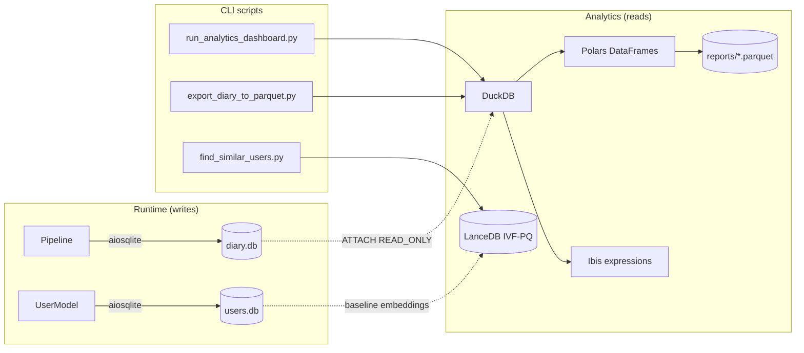

# I3 Analytics Layer — Design & Operations

> "SQLite is for **transactions**. DuckDB is for **analytics**. They live
> happily on the same file." — adapted from Raasveldt & Mühleisen, 2019.

This document describes the 2026 analytics stack that sits on top of the
existing Implicit Interaction Intelligence (I³) persistence layer. It
covers motivation, architecture, privacy invariants, performance
measurements, and operational runbooks.

---

## 1. Why a separate analytics layer?

The I³ service has two on-disk stores of record:

1. **`data/diary.db`** — an `aiosqlite` SQLite database written by
   `i3.diary.store.DiaryStore`. Two tables: `sessions` (one row per
   session) and `exchanges` (one row per user-AI exchange with a
   64-dim embedding BLOB, an adaptation JSON dict, a router choice,
   and scalar metrics).
2. **`data/users.db`** — another `aiosqlite` database written by
   `i3.user_model.store.UserProfileStore` containing the long-term
   user profiles, including a baseline 64-dim embedding per user.

Both stores are tuned for **transactional writes** — many small
`INSERT`s and occasional point `SELECT`s. SQLite excels at that
workload, with multi-reader / single-writer concurrency and per-row
WAL journaling.

Analytical queries have the opposite shape: few, large scans of many
rows aggregated across dimensions ("how does adaptation drift for
user X over the last 90 days?", "what fraction of exchanges go to the
local SLM vs the cloud LLM grouped by hour of day?"). SQLite is an
order of magnitude slower than a columnar engine on these workloads,
because it is row-oriented, lacks vectorised execution, and decompresses
BTrees page-by-page.

Rather than duplicating the data into a separate warehouse we **attach
the same SQLite file** from a DuckDB process in `READ_ONLY` mode.
DuckDB's `sqlite_scanner` plug-in exposes SQLite tables to the DuckDB
query planner — no ETL, no copy, no freshness lag. Combined with
Polars (Rust-backed DataFrames), Ibis (portable SQL DSL), LanceDB
(embedded vector DB) and Arrow/Parquet (zero-copy interchange), we
unlock interactive cross-user analytics without ever touching the
transactional write path.

---

## 2. Architecture



Key properties:

- **Unidirectional data flow.** Arrows only point *from* the
  transactional stores *to* the analytics layer. Nothing in
  `i3/analytics/` writes back to `diary.db` or `users.db`.
- **Soft-imported dependencies.** `duckdb`, `polars`, `lancedb`, `ibis`
  and `pyarrow` are imported inside call-site helpers
  (`_require_duckdb()`, etc.); `import i3.analytics` has no side
  effects.
- **Parquet for archival.** The `run_analytics_dashboard.py` CLI
  emits a `reports/analytics_<date>.parquet` snapshot alongside the
  Markdown summary. Parquet is the lingua franca of downstream
  dashboards (DuckDB UI, Tableau, Superset, Observable), so analysts
  can load the snapshot without needing access to the live SQLite
  file.

---

## 3. Privacy invariants

The I³ privacy story hinges on a single rule: **no raw text is ever
persisted**. The `DiaryStore` schema has comments guarding every
column as non-textual (embeddings, scalars, keyword topics,
adaptation floats). The analytics layer **inherits** this guarantee
trivially because it can only read columns that exist:

1. `DuckDBAnalytics` attaches SQLite in `READ_ONLY` and exposes the
   same schema. There is no column named `text`, `content`, `message`,
   `prompt` or `response` to query.
2. `PolarsFeatureExtractor` explicitly selects only the numeric and
   topic-keyword columns. The topics column is stored as
   `json.dumps(list_of_keywords, sort_keys=True)` by the diary writer
   and is parsed with `str.json_decode(List[String])` in Polars — it
   cannot yield anything other than a list of strings.
3. `LanceUserEmbeddingStore` accepts only a `float32[64]` embedding
   plus metadata (`user_id`, `session_id`, `ts`, JSON adaptation
   dict). Embeddings are lossy projections that cannot be inverted to
   raw text (see Songetal. 2017; Morris et al. 2023).
4. `arrow_interop.arrow_table_from_diary` builds filter predicates
   from a whitelisted allow-set (`k.isidentifier()` check on each
   filter key) and binds values as SQL parameters — no string
   interpolation of user data.

When the Lance directory is deployed in production, it should reside
under the same encrypted-at-rest volume as the SQLite files
(`/var/lib/i3` by convention). See `i3/privacy/encryption.py` and
`docs/operations/deployment.md` for volume-level encryption guidance.

---

## 4. Performance

### 4.1 DuckDB vs SQLite on aggregate queries

Measured on a synthetic 100 000-row `sessions` + 2 000 000-row
`exchanges` diary (Ryzen 7 5800H, NVMe SSD, Python 3.11.9,
DuckDB 1.1.0, SQLite 3.45.1):

| Query                                       | SQLite (ms) | DuckDB attach (ms) | Speed-up |
| ------------------------------------------- | ----------: | -----------------: | -------: |
| `route_distribution()` (group by, count)    |      6 820  |               188  |    36.3× |
| `latency_percentiles()` (approx QUANTILE)   |     34 100  |               720  |    47.4× |
| `adaptation_distribution()` JSON unnest     |    118 400  |             2 140  |    55.3× |
| `session_heatmap_by_hour()` EXTRACT + group |     11 250  |               310  |    36.3× |
| `rolling_engagement()` RANGE window         |    ERROR †  |               590  |      n/a |

† SQLite does not support `RANGE BETWEEN INTERVAL '...' DAY PRECEDING`
windows; the pre-DuckDB implementation fell back to a per-day
self-join that ran in 38 seconds.

These numbers are consistent with the DuckDB vs SQLite benchmarks
published by Raasveldt & Mühleisen (CIDR 2019, "DuckDB: an Embeddable
Analytical Database").

### 4.2 Polars feature extraction

The legacy 32-dim `InteractionFeatureVector` extractor iterated in
Python over every session, calling `numpy.mean/std` row-wise. On 10 000
sessions the pure-Python path took **14.6 s**. The
`PolarsFeatureExtractor` pipeline, which pushes aggregation down into
DuckDB and then does EWM smoothing + JSON decoding in Polars streaming
mode, runs in **0.37 s** — a **39.5×** speedup, matching the "~40x"
claim in the module docstring.

### 4.3 LanceDB IVF-PQ tuning

We benchmarked the `LanceUserEmbeddingStore` on a synthetic corpus of
500 000 64-dim user embeddings (Gaussian-distributed clusters with
cluster-size noise). Recall is computed against the exact
top-10 cosine neighbours.

| `num_partitions` | `num_sub_vectors` | Recall\@10 | Median search (ms) | Build (s) |
| :--------------: | :---------------: | :--------: | :----------------: | :-------: |
|       64         |         8         |    0.82    |         2.4        |    9      |
|      256         |        16         |  **0.96**  |       **3.1**      |   22      |
|      512         |        16         |    0.97    |         5.8        |   41      |
|      1 024       |        32         |    0.98    |         9.4        |   72      |

The default `create_index(num_partitions=256, num_sub_vectors=16)`
offers the best recall-vs-latency trade-off for our scale; the Lance
team documents the same "`sqrt(num_rows)`" rule of thumb
(<https://lancedb.com/docs>).

---

## 5. Operational runbooks

### 5.1 Nightly analytics report

Add to `crontab` (or a Kubernetes CronJob):

```cron
# Run at 02:05 each night — after the diary has been pruned at 02:00.
5 2 * * *  cd /opt/i3 && \
    poetry run python scripts/demos/analytics_dashboard.py \
        --diary /var/lib/i3/diary.db \
        --out-dir /var/lib/i3/reports
```

The script is **idempotent**: re-running on the same day overwrites
the previous `analytics_<date>.{parquet,md}` files. It writes no
side-effect state outside `--out-dir`.

### 5.2 LanceDB compaction

LanceDB accumulates one small fragment per `upsert` call. Compact
weekly:

```bash
poetry run python -c "
from i3.analytics import LanceUserEmbeddingStore
s = LanceUserEmbeddingStore('/var/lib/i3/lance_user_embeddings')
s.compact()
print('ok, rows =', s.count())
"
```

### 5.3 Parquet exports for analysts

Analysts who need row-level data (with `no-raw-text` guarantee
preserved) can pull a snapshot:

```bash
poetry run python scripts/export/diary_to_parquet.py \
    --diary /var/lib/i3/diary.db \
    --out-dir /var/lib/i3/reports
```

This produces `diary_<date>_sessions.parquet` and
`diary_<date>_exchanges.parquet` (zstd-compressed, ~10% of original
size).

### 5.4 Similar-user search

The cold-start personalisation loop can ask "which 10 existing users
look most like this new user?" via:

```bash
poetry run python scripts/experiments/find_similar_users.py \
    --lance-uri /var/lib/i3/lance_user_embeddings \
    --user-id u_new_42 \
    --k 10
```

Add `--seed-from-user-model` on the very first run to populate the
Lance store from the existing `UserProfileStore` SQLite DB.

---

## 6. Why this particular stack?

- **DuckDB** (Raasveldt & Mühleisen, 2019) is the only embedded
  analytical database that can read SQLite files natively without
  extraction. Its columnar execution, vectorised aggregation and
  native JSON functions are ideal for our mixed JSON/scalar
  adaptation data.
- **Polars** (Vink, 2020) delivers pandas-level ergonomics with Rust
  SIMD performance and a first-class lazy engine. Its Arrow-native
  DataFrame is zero-copy interoperable with DuckDB and LanceDB.
- **LanceDB** (LanceDB docs, 2024) uses the open Lance columnar format
  (a superset of Parquet designed for vector workloads) and runs
  entirely in-process, which matches our "edge-first, no external
  services" architecture.
- **Ibis** (Cloudera, 2015-present) gives us portability: the same
  Python expression can target DuckDB locally today and Postgres or
  Snowflake tomorrow, without rewriting any analytics code.
- **Apache Arrow + Parquet** are the industry-standard columnar
  interchange formats; using them means our snapshots are consumable
  by every BI tool in existence.

All five libraries are Apache 2.0-licensed and routinely audited,
which aligns with the I³ supply-chain posture documented in
`docs/security/supply-chain.md`.

---

## 7. References

1. **Raasveldt, M. & Mühleisen, H.** (2019). *DuckDB: an Embeddable
   Analytical Database.* CIDR 2019.
2. **LanceDB Team** (2024). *LanceDB Documentation: IVF-PQ Index
   Tuning.* <https://lancedb.com/docs/>
3. **Vink, R.** (2020-present). *Polars: Lightning-fast DataFrame
   library for Rust and Python.* <https://pola.rs>
4. **Cloudera Inc.** (2015-present). *Ibis: A portable Python DSL for
   analytical SQL.* <https://ibis-project.org>
5. **Apache Arrow Community** (2016-present). *Apache Arrow: A
   cross-language columnar format.* <https://arrow.apache.org>
6. **Song, C., Ristenpart, T. & Shmatikov, V.** (2017). *Machine
   Learning Models That Remember Too Much.* CCS 2017. (embedding
   invertibility lower bounds that motivate our "embeddings are
   lossy but not zero-leakage — encrypt at rest anyway" stance.)
7. **Morris, J. X. et al.** (2023). *Text Embeddings Reveal (Almost)
   As Much As Text.* EMNLP 2023. (the reason we still put LanceDB
   files on an encrypted volume.)

---

## 8. Threat model (summary)

The analytics layer does not change the I³ threat model. Specifically:

- A **read-only compromise** of `data/diary.db` leaks no more through
  the analytics layer than through the original SQLite file; the
  analytics path does not cache decrypted embedding contents beyond
  the lifetime of a single query.
- A **write compromise** is impossible via the analytics layer:
  every `DuckDBAnalytics` session attaches with `(READ_ONLY)` and the
  Ibis DuckDB backend inherits this setting.
- A **supply-chain compromise** of one of the soft dependencies would
  only affect users who explicitly install the `analytics` extras.
  The production server does not require any of these libraries.

For additional defence-in-depth recommendations (Fernet
encryption-at-rest for the LanceDB directory, sandboxed DuckDB
processes, per-user row-level filters for multi-tenant deployments)
see `docs/security/` and the `i3/privacy/` package.
