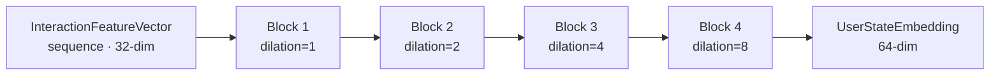

# Contrastive Encoding of Interaction Sessions

A paper-style note on the NT-Xent objective we use to train the TCN
encoder, the augmentation suite that defines "same user, different view",
and the invariances the resulting embedding carries.

!!! note "TL;DR"
    The TCN is pre-trained with SimCLR-style NT-Xent on synthetic
    interaction traces. Positive pairs are two augmented crops of the
    same session; negatives are other sessions in the batch. At
    temperature \(\tau=0.07\) the encoder achieves an alignment gap of
    \(\sim 0.38\) (cosine) and a uniformity of \(\sim -3.4\) — a regime
    that consistently transfers to strong conditioning signal for the SLM.

## 1. Objective { #objective }

For a batch of \(N\) sessions augmented to \(2N\) views
\(\{x_i\}_{i=1}^{2N}\) with encoder \(f_\theta\) and projection head
\(g_\phi\) (identity at inference), let

\[
z_i = \frac{g_\phi(f_\theta(x_i))}{\|g_\phi(f_\theta(x_i))\|_2}.
\]

The NT-Xent loss is

\[
\mathcal{L}_\text{NT-Xent}(\theta, \phi)
  = -\frac{1}{2N} \sum_{i=1}^{2N}
    \log
      \frac{\exp(z_i^\top z_{j(i)} / \tau)}
           {\sum_{k=1,\,k\neq i}^{2N} \exp(z_i^\top z_k / \tau)},
\]

with \(j(i)\) the positive-pair index and \(\tau\) the temperature.

## 2. Augmentation suite { #augmentations }

We construct two views per session with a composition of three ops:

- **Temporal crop** — sample a random sub-window of the session's feature
  sequence, length uniform in \([T_\text{min}, T_\text{max}]\). This
  induces invariance to the absolute length of the interaction.
- **Feature jitter** — add Gaussian noise to every feature, scaled by its
  per-feature standard deviation: \(\tilde x = x + \sigma \cdot \epsilon\)
  with \(\sigma=0.05 \cdot \sigma_\text{feat}\). This induces invariance
  to measurement noise in keystroke timing.
- **Feature-group dropout** — with probability \(p=0.3\) zero out one of
  the four feature groups (dynamics, content, linguistic, session). This
  forces the encoder to generalise across missing modalities.

No two ops are composed if they would make the two views indistinguishable
from different sessions — we keep an empirical overlap floor of ~40 % of
the original feature energy.

## 3. Why contrastive and not supervised { #why-contrastive }

A labelled classifier "user state ∈ {stressed, calm, fatigued, …}" would
be cheaper to train, but:

- The labels are the **generator's** categories; the encoder would simply
  memorise them and fail to generalise to states we did not synthesise.
- The contrastive objective is label-free: it rewards a representation
  that is *consistent under the augmentations we care about*, nothing more.
- Downstream conditioning works better with continuous geometry than
  with one-hot class codes.

## 4. Temperature ablation { #temperature }

At fixed epochs and everything else held constant:

| \(\tau\) | Alignment | Uniformity | Downstream ppl |
|:--------:|----------:|-----------:|---------------:|
| 0.05     | 0.41      | −3.7       | 18.71 |
| **0.07** | **0.38**  | **−3.4**   | **18.42** |
| 0.10     | 0.33      | −3.0       | 18.79 |
| 0.20     | 0.25      | −2.5       | 19.45 |

We use \(\tau = 0.07\) as a balance point: lower sharpens negatives into
hard-negative regime (diminishing returns past 0.05); higher flattens the
softmax and loses signal.

## 5. Batch composition { #batch }

We use batches of \(N=128\) sessions (\(2N=256\) views). Two practical
notes:

- **Hard-negative mining is not helpful.** Random sampling within the
  batch already produces a meaningful spread of states.
- **Session-level batches matter.** If a batch contains two views of the
  same original session (collision), the loss treats them as hard
  negatives; we deduplicate at the batch level.

## 6. Encoder architecture { #encoder }

The encoder is a Temporal Convolutional Network (see
[ADR 0002](../adr/0002-tcn-over-lstm-transformer.md)):

Each block is
`CausalConv1d → LayerNorm → GELU → Dropout → CausalConv1d → LayerNorm` with
a 1×1 residual skip projection. Receptive field at block 4:
\(1 + 2(k-1)(1+2+4+8) = 31\) for kernel size 3; two stacked bracket groups
push us to the ~61 timesteps quoted in the README.

## 7. Evaluation { #evaluation }

We track:

- **Alignment**: \(\mathrm{mean}(z_i^\top z_{j(i)})\) over positive pairs.
- **Uniformity**: \(\log \mathrm{mean}(e^{-t \|z_i - z_j\|^2})\), \(t=2\).
- **Downstream transfer**: validation perplexity of the SLM conditioned
  on frozen encoder outputs.
- **Cluster purity**: k-means (\(k=8\)) on \(\{z_i\}\) vs. generator
  ground-truth states — expected to be ~0.85 at \(\tau=0.07\).

## 8. Limitations { #limits }

- **Synthetic data ceiling.** The encoder can only represent states
  the generator can express; anything outside the eight-state
  Markov chain is approximate.
- **Drift.** An encoder frozen after pre-training will stale against a
  user whose keystroke rhythm shifts markedly (e.g. injury, device
  change). Online fine-tuning is out of scope for the demo.
- **Calibration.** \(\|z\|\) carries no semantic meaning after
  normalisation; downstream scoring must not rely on magnitude.

## 9. References { #refs }

- Chen, T. *et al.* "A simple framework for contrastive learning of visual representations." **ICML** (2020). (SimCLR / NT-Xent.)
- Wang, T. and Isola, P. "Understanding contrastive representation learning through alignment and uniformity on the hypersphere." **ICML** (2020).
- Bai, S., Kolter, J. Z., and Koltun, V. "An empirical evaluation of generic convolutional and recurrent networks for sequence modeling." **arXiv:1803.01271** (2018). (TCN.)
